# アーキテクチャ

本書は、転記系（様式自動作成1）と事前レビュー系の2系統について、読み手が「何をしている処理か」「どのデータが次に渡るか」「どこで人間確認（HITL）が入るか」を追えるようにまとめる。

関数名は実装を追跡するために併記するが、まずは図と各節冒頭の説明を読む。詳細な関数表やデータ構造は、コードを読むときの索引として使う。

## 現行システムの全体像

現行の NuRO AI Platform は、以下の 2 系統を同一バックエンド（FastAPI）で提供している。

1. 転記系（様式自動作成1 / N対1）－ 複数資料 → MRC1/MRC2 様式 Excel
2. 事前レビュー系（NuRO 向け）－ 転記済み mappings → AI 指摘（ReviewItem）

読み方の目安：

- 全体の流れだけ把握したい場合は、この章と A-1 / B-2 の Mermaid 図を見る。
- 転記で止まった理由を調べる場合は A-7 の HITL を見る。
- どの関数を直せばよいか探す場合は A-2 / B-3 の関数表を見る。
- dict の中身を確認したい場合だけ、後半の「データ構造リファレンス」を見る。

主要用語：

- `mappings`: Excel のどのセルに何を書いたかを表す一覧。レビューや画面表示の基本入力。
- `merged`: 複数資料から抽出した値を、業務処理しやすい1つの辞書に統合したもの。
- `pending_questions`: 自動確定できず、人間に確認する質問。blocking があると Excel 書き込み前に止める。
- `CaseCostModel`: 工数・費用・整合チェックをまとめた案件原価モデル。最終書き込みの正本になる。
- `ReviewItem`: レビューAIが出す1件の指摘。

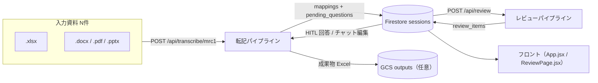

---

# A. 転記系（様式自動作成1 / N対1）

転記系が行うことは大きく5つ。

1. アップロード資料を読み、資料種別付きの `SourceDocument` にする。
2. Gemini で各資料から候補値を抽出する。
3. 複数資料の候補を `merged` に統合し、矛盾や不確実性を `pending_questions` に分ける。
4. 工数・費用・整合チェックは決定論カーネルで計算し、`CaseCostModel` にまとめる。
5. blocking な確認事項がなければ Excel に書き込み、Firestore/GCS に保存する。

## A-0. 入口・ジョブ管理（api/routes/transcribe.py）

この段階は「重い転記処理を安全に開始するための受付」。ファイル名・サイズ・engine 指定・画面で選んだ炉型や費目を検証し、すぐに `job_id` を返して、実処理はバックグラウンドに渡す。

入力関数（先に追う順）：

| 段階 | 関数 | 役割説明 | 入力例 | 出力例 |
|---|---|---|---|---|
| 受付前処理 | `_clean_preselection_text()` | 画面から送られてきた事前選択文字列（例：「 計画 」などの前後の余分なスペースや表記の揺れ）を、システムで正しく認識できるようにキレイにお掃除（トリム）します。 | `" 計画 "` | `"計画"` |
| 受付前処理 | `_build_user_preselections()` | ユーザーが画面で事前に選んだ条件（炉型、計画/実績、費目）を、転記先のExcel（MRC1）に直接書き込めるきれいなキーと値のセット（辞書）に変換します。 | `plan_actual='計画'` | `{'炉型': 'BWR', '計画実績区分': '計画'}` |
| 受付本体 | `transcribe_mrc1()` | 転記処理の入り口（受付）です。アップロードされたファイルのサイズや指定エンジンをチェックし、問題なければ即時に「受付伝票番号（job_id）」を返して、重い転記処理をバックグラウンドに開始します。 | `files, engine='frameB', engine='legacy'` | `{job_id, status}` |
| 非同期実行 | `_run_transcription_pipeline()` | バックグラウンドでの実質的な処理責任者です。アップロード資料の読み込み、AIによる抽出、マージ、決定論計算、そしてExcelへの書き出しまで、転記のすべての裏側処理を順番通りに指揮・実行します。 | `job_id, source_files` | `job_store[job_id].result` |
| 状態取得 | `_json_safe()` | パイプラインの処理途中のデータやエラーメッセージの中に、Python のシステム固有のデータ型が混ざっていても、Webブラウザへ安全に応答できるように一般的なJSONテキストの形に整形します。 | `job_store payload` | `dict` |
| 進捗照会 | `get_job_status()` | 画面からの進捗問い合わせAPIです。「現在 70% 完了」などの進捗率（progress）や、処理が完了したかどうかのジョブ状態（status）をリアルタイムに確認して返します。 | `job_id` | `job status payload` |
| 成果物取得 | `download_job_result()` | 転記とExcel生成がすべて完了した際に、生成された成果物のExcelファイル（.xlsx）を、ユーザーがクリックしてローカルPCにダウンロードできるようにファイルとして返却します。 | `job_id` | `job status FileResponse` |

## A-1. パイプライン全体フロー

下図は、アップロード資料が `SourceDocument` → `extraction dict` → `merged` → `CaseCostModel` → Excel/mappings へ変わる流れを示す。途中で blocking な `pending_questions` が出ると、Excel 生成前で止まり、人間回答待ちになる。

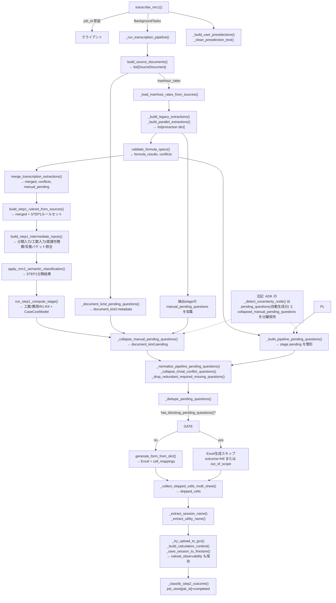

ADK エンジン指定時は `run_transcription_workflow()` が同じ段階を Workflow node 列として実行する（A-6）。legacy と ADK は読み取り・抽出・検算・マージ・Step1 業務ステージ・HITL・書き込み payload の処理をそろえているが、pending の最終公開形は異なる。legacy は route 側で `_build_pipeline_pending_questions()` と各正規化 helper を通し、ADK は `_detect_uncertainty_node()` が `pending_questions`、`collapsed_manual_pending_questions`、`workflow_status` を state に積む。

実入力確認メモ（`data/inbox/dev_inputs`）：

- PDF 見積は実行時に Document AI 経路へ入り、scalar 抽出が `document_ai_scalar_extraction` として metadata に落ちる。
- 号機や工系は工程表 Excel から拾われる一方、歩掛 Excel の一部は `document_kind=不明` のまま残り得るため、資料種別確認の HITL は現行フロー上も必要である。

## A-2. ステージ関数と入出力

この表は実装調査用の索引。通常は「段階」と「出力」を見れば、その処理が何を作って次に渡しているかが分かる。関数（モジュール）は、修正箇所を探すときに使う。

※本ドキュメントにおけるモジュール名やパス（例：`transcriber/`）は、実際のコード内では `apps/backend/app/agents/transcriber/` のように `app/agents/` 以下に配置されています。また、APIルーター側（`api/routes/...`）で定義されているプライベート関数名（`_` プレフィックスあり）と、各レイヤー実装（`agents/transcriber/...` 等）で定義されているグローバル関数名（`_` なし）とで表記が異なる場合がありますが、同一の処理を指しています。

| # | 段階 | 関数（モジュール） | 入力 | 出力 / 役割説明 |
|---|---|---|---|---|
| 1 | 資料化 | `build_source_documents()` (`agents/transcriber/source_loader.py`) | `file_contents: list[(name, bytes)]`, `temp_dir` | `list[SourceDocument]`：アップロードされたPDFやExcelなどの資料を読み、中身や補助的な情報を集めた「共通の資料セット（SourceDocument）」を生成します。 |
| 1a | 資料種別 HITL | `_document_kind_pending_questions()` (`api/routes/transcribe.py`) | `source_docs` | `list[pending_question]`：「何の資料か（見積書なのか、歩掛なのか）」難しい・わからないものがあったとき、人間に確認する画面用の質問を自動作成します。 |
| 2 | 歩掛準備 | `_load_manhour_rates_from_sources()` (`api/routes/transcribe.py`) | `source_docs` | `list`：基準日額（人工単価）の束を、資料を読み込む前に事前にロードする下準備の関数です（m進化はNull-start原則に従い、空リスト `[]` を返却します）。 |
| 3 | legacy 抽出ラッパ | `_build_legacy_extractions()` (`api/routes/transcribe.py`) | `source_docs`, `frame`, `manhour_rates`, `rule_context` | `list[extraction dict]`：古いエンジン（legacy）を使って、すべての資料から必要なデータ（先名、件名、工事明細など）をAIで一斉に取り出す（抽出する）ための全体関数を呼び出します。 |
| 4 | 並列抽出 | `build_parallel_extractions()` (`agents/transcriber/parallel_extraction.py`) | `source_docs`, `sheet_names=(MRC1,MRC2)`, `frame`, `map_doc_func`, `manhour_rates`, `rule_context` | `list[extraction dict]`：たくさんの資料を、並列（マルチスレッド）で同時に処理を走らせて処理時間を短縮します。 |
| 2a | シート統合 | `build_combined_extraction()` (`agents/transcriber/extraction_builder.py`) | 1枚の SourceDocument から、複数の異なるシートや種類から抽出したデータを、扱いやすい1つのまとまった「データシート」に統合します。 | `{source_file, document_kind, data, _metadata, formula_specs, manual_pending_questions}`：1枚の資料の中から、複数の異なるシートや種類から抽出したデータを、扱いやすい1つのまとまった「データシート」に統合します。 |
| 2b | LLM mapping | `_map_doc_for_transcription()` → `map_to_schema_from_doc()` (`agents/data_extractor/mapper.py`) | `doc`, `sheet`, `frame`, `manhour_rates` | `{extracted_data, field_metadata, formula_specs, manual_pending_questions}`：資料の生のテキストを、転記先のExcelの枠組み（スキーマ）に合わせたきれいなデータの形にマッピングしてAIに並べさせます。Gemini制限時は `_empty_mapping_result` で空全文を内包しています。 |
| 3 | 計算仕様検証 | `validate_formula_specs()` (`agents/transcriber/formula_validation.py`) | `extractions` の `formula_specs` | `{formula_results, conflicts}`：AIが資料から抜き出してきた計算式（「数量 × 単価」など）を、Pythonで実際に厳密に計算し直してみて、AIが主張する計算結果と矛盾がないかを検算（ダブルチェック）します。 |
| 4 | N対1マージ | `merge_transcription_extractions()` (`agents/transcriber/merge_stage.py`) | `extractions`, `source_docs`, `business_overrides_func` | `MergeStageResult(merged, conflicts, manual_pending_questions)`：複数の資料から抽出したデータ（例：資料Aの先名、資料Bの工数）を1つの「統合データ（Merged）」に合流させる。値が食い違う場合は「食い違い（Conflict）」として自動通知します。 |
| 4a | 業務補正 | `_apply_mrc1_business_overrides()` | `merged`, `user_preselections` | 事前選択値の入力、費目正規化、全体工期の仮設定。ユーザーが画面で事前に選んでいた条件（炉型、計画実績など）や、一律で決まっている初期の業務ルールを割り込ませて上書き・補正します。 |
| 5 | ルールセット抽出 | `build_step1_ruleset_from_sources()` (`agents/transcriber/ruleset_binding_stage.py`) | `merged`, `source_docs` | `Step1RulesetBindingStageResult(merged+STEP1ルールセット, manual_pending_questions)`：転記先実績データに基づき、適合する「ルールセット（歩掛マスタや費用配賦の契約ルール）」を自動で引き当て、計算の根拠や想定プロファイルを作成します。 |
| 6 | 中間入力 | `build_step1_intermediate_inputs()` (`agents/transcriber/intermediate_input_stage.py`) | `merged` | `STEP1分類入力` / `STEP1工数入力` / `直課労務費` / `写像バケット照合`：次の「AI分類」や「決定論計算」ステージがすぐにデータを処理するように、専用のデータ構造（中間入力）に整理して盛り付けます。 |
| 7 | 意味分類 | `apply_mrc1_semantic_classification()` (`agents/transcriber/classification_stage.py`) | `merged`（`STEP1分類入力`） | `STEP1分類結果`：抜き出された工事明細（例：配管を縮退するなど）に対して、確度が0.75未満の時は保留します。AIを使って（配管）、AI などの業務カテゴリ（タクソノミー）に正しく割り振ります。 |
| 8 | 決定論計算 | `run_step1_compute_stage()` (`agents/transcriber/compute_stage.py`) | `merged`, `frame` | `Step1ComputeStageResult(merged, conflicts, manual_pending_questions, case_cost_model)`：整理されたデータを使って、作業員の工数（人日・人時）と費用を四則演算し、保存数値の合計の一貫性（R1〜R4, RANGE）をチェックした「案件原価モデル（CaseCostModel）」を組み上げます。 |
| 9 | 書込 payload | `build_form_generation_payload()` (`agents/transcriber/write_stage.py`) | `merged`, `case_cost_model` | `(input_data, source_metadata)`：計算が終わったキレイなデータを受け取り、最終的なExcel書き出し準備（form_generation）に渡せるように、Excelシートごとの書き込みデータ（ペイロード）に整列し直します。 |
| 10 | HITL集約 | `_build_pipeline_pending_questions()` / `_normalize_pipeline_pending_questions()` / `_collapse_trivial_conflict_questions()` / `_drop_redundant_required_missing_questions()` / `_collapse_manual_pending_questions()` / `_dedupe_pending_questions()` | `stage_pending, conflicts, formula_results, schema` | 単一形式の `pending_questions`：各ステージで生じたすべての確認事項（食い違い、未入力、計算ミス、資料不明など）をすべて集め、同型質問をまとめたり最終的な視覚的正規化状を生成したして、人が見やすい「最終的な確認質問リスト」を一本化します。 |
| 11 | 書込ゲート | `has_blocking_pending_questions()` (`core/gap_model.py`) | `pending_questions` | `True` なら Excel 書込をスキップ：蓄積された質問の中に、人間が回答しないとこれ以上進めてはいけない「進行止め」な質問が残っていないかを確認し、残っていれば書き込みをストップさせます。 |
| 12 | 書込 | `generate_form_from_dict()` (`pipelines/form_generation_pipeline.py`) | `input_data`, `source_metadata`, テンプレート、`frame` | `(cell_mappings, processed_sheets)` + Excel ファイル：進行止めの質問がすべて解決したら、テンプレートとなる白紙のExcelファイルを開き、決定されたた mappings（データ）に従って実際のセル座標にきれいに記載して成果物Excelを完成させます。 |
| 13 | 完了整形 | `_collect_skipped_cells_multi_sheet()` (`api/routes/transcribe.py`) | `frame`, `["MRC1", "MRC2"]` | `skipped_cells`：転記先のセル座標をキレイに記述して成果物Excelを完成させます。書き込みが禁止されているセル（writable: false の属性）を事前にスキップリストとして集め、上書きをしないようバックグラウンドで処理します。 |
| 14 | 永続化 | `_try_upload_to_gcs()` / `_save_session_to_firestore()` / `_build_calculation_context()` | `output_path`, `cell_mappings`, `pending_questions`, `merged` | 完成したExcelをクラウドストレージ（GCS）にアップロード。そのセッション用の計算文脈（calculation_context）を一括でFirestoreデータベースに安全に保存（永続化）します。 |
| 15 | 入力補助/前処理 | `_apply_cost_allocation_to_rows()` (`api/routes/transcribe.py`) | `list[dict]`：費用配賦ルール（按分）に従って、共通の間接費や全体の労務費やエリアごとに各機器の行データに費用を割り当てます。 |
| 16 | 出力・正規化 | `_build_list_response_schema()` (`agents/data_extractor/pdf_generic_extractor.py`) | `list`項目の`item_fields` | `dict`：AIが一度に複数の行データを送き出される際に、AI（Gemini）が迷わずに様式表示の（スキーマ）の指示書を自動で生成します。 |
| 17 | 出力・正規化 | `_document_ai_scalar_extraction()` (`agents/data_extractor/data_extractor_agent.py`) | Document AI 正規化済み明細 | `list[dict]`：Google Document AI（AI-OCR）を使って紙の見積書から読み取ってきた文字情報から、様式Excel にそのまま転記できるヘッダー項目（会社名や型番などの単一の）をキレイに整形して整備します。 |
| 16-2 | 入力補助/前処理 | `_document_ai_scalar_extraction()` | 1枚の資料の中から、複数の異なるシートや種類から抽出した項目（会社名や型番などの単一の）をキレイに整形して整備します。 |
| 17-2 | 補助処理 | `_evaluate_expression()` (`api/routes/template.py`) | `_evaluate_expression('A', None, None, 'MRC1', {})` | `'A'`：Excelのテンプレート設計書（YAML）に書かれている特定の計算式（例：'A' などが参照式）を解読し、視覚点でそこに入れるべき値を正しく評価・決定します。 |
| 18 | ステージ実行 | `_execute_pipeline()` (`agents/transcriber/orchestrator.py`) | レイヤー構成済み pipeline state | 全レイヤー適用後の state：資料の読み込みから、AIによるデータ抽出、統合、計算、Excelへの書き込みまで、「転記パイプライン」を一連、順番に選択して最後まで安全に実行する全体の総指揮者（オーケストラ）。 |
| 19 | 出力・正規化 | `_extract_json()` (`agents/cell_locator/cell_locator.py`) 他 | `_extract_json()` 他 | `{"mappings": {"炉型": "C7"}}` | `{"mappings": {"炉型": "C7"}}`：AI（Gemini）から返ってきた生テキスト・データを解析して、不要な装飾文字（`'''`json など）が混入していても、中身の有効な JSON データ部分だけをキレイに抽出してパースします。 |
| 20 | 出力・正規化 | `_list_extract_group()` (`agents/data_extractor/pdf_generic_extractor.py`) | list group schema と本文 | group単位の抽出結果：複数行にまたがる明細が続く形のデータをAIに読み取らせる際に、グループ（まとまり）ごとに、データを騙さずに順序に切り出して、キレイなリストの形で抽出します。 |
| 21 | 補助処理 | `_normalize_confidence()` (`agents/local_interpreter.py`) 他 | `_normalize_confidence('high')` | `0.9`：AIが返してきた信頼度（確信度）の表現（"high", "medium", "low" など）や、少数で表された数値を、システム共通の（パーセンテージ（確信度）の数値に平準化（ノーマライズ）します。 |
| 22 | 決定論計算補助 | `_normalize_text()` (`tools/golden_compare.py`) 他 | `_normalize_text(date(2024, 4, 1))` | `'2024-04-01'`：比較やデータベース検索でズレが起きないように、日付（date型）の `"令和4年度"` のような統一された日付文字列に、全角英数を半角に整えるなどの文字列の表記揺れを整えます。 |
| 23 | 補助処理 | `_read_excel_by_schema()` (`agents/reviewer/_excel_reader.py`) | 1 schema + 1 workbook | 検索投入向けレコード配列：人間が作った過去のExcel（ナレッジ等）を読み込み、指定された様式（スキーマ）に自動で並べ替えて、AIが検索で使いやすいレコードの配列に変換する翻訳リーダー。 |
| 24 | 補助処理 | `_read_excel_layout()` (`api/routes/template.py`) | `_read_excel_layout('result.xlsx', 'MRC1')` | グリッド表示用の layout JSON：最終成果物のExcelのグリッドレイアウト（セルの結合や幅、罫線などの情報）を自動で読み取り、Webブラウザの画面上でスプレッドシートのように確実に表示するための表示用データを生成するレイアウトリーダー。 |
| 25 | 補助処理 | `_apply_ruleset_bindings()` (`tools/ruleset_binding.py`) | `template = {'classification_rules': {}, 'meta': {}}` | `RulesetBindingResult(ruleset, pending_questions)`：AIが抜き出してきた足りない入力なスロット（パラメータ）のバインド情報を、空の「ルールセットテンプレート（YAML）」の適切な位置に定置補完（充填）し、不整合があれば保留質問（pending_questions）として返却します。 |
| 26 | 決定論計算補助 | `build_mrc1_equipment_rows()` (`tools/estimate_breakdown_extractor.py`) | `build_mrc1_equipment_rows(items=[...])` | `[{分類, 解体機器, 計画_費用, ...}]`：明細行のリストから、MRC1書式（表形式の書き書き方を書）にキレイに整形されたデータ行を生成・構築します。 |
| 27 | 決定論計算補助 | `build_mrc1_rows_from_verified_estimate()` (`tools/estimate_semantic_normalizer.py`) | `build_mrc1_rows_from_verified_estimate(validated_structure)` | `[{分類, 計画_工数, source, ...}]`：四則整合チェックを通った「合格済みの見積明細」を受け取り、MRC1の歩掛計算タブインプットに適合する、数値や単体が完全定義された完全なデータ行を組み上げます。 |
| 28 | HITL/保留 | `build_pending_questions()` (`core/uncertainty.py`) | `build_pending_questions(conflicts=[], formula_results={}, merged_fields={}, schema={})` | `[]`（保留質問配列）：統合（コンフリクト）や数式の不一致、必須データの欠落、信頼度の低い値などをスキャンし、人間が回答しやすい形にフォーマットされた確認質問（pending_questions）のリストを新規にビルドします。 |
| 29 | LLM呼出 | `call_gemini_structured()` (`core/ai_client.py`) | JSON Schema + prompt | Schema準拠 of dict応答：最も重要なAIの窓口。Gemini API を呼び出し、こちらが指定した「出力形式のスキーマ（JSON Schema）」に100%厳密に従った構造化データ（辞書型）として、AIから安全に回答を引き出すAIコールの専門家。 |
| 30 | 設定/種別判定 | `inference_document_metadata()` (`readers/source_document.py`) | `DocumentKindInferenceResult` | metadata保存用dict：資料の種類をAIが推測（推論）した結果（例：これは90%の確率で見積書である）を、データベースやセッションの履歴にメタデータとして安全に保存できるように辞書形式に整えます。 |
| 31 | 入口/API補助 | `download_result()` (`api/routes/transcribe.py`) | `GET /api/download/{job_id}` | 生成済みExcelのURLまたはFileResponse：生成が完了した実際のExcelファイルを、ユーザーがブラウザからクリックして一発でローカルPCに安全にダウンロード（ファイル返却）できるようにするダウンロード受付API。 |
| 32 | 設定/種別判定 | `extract_cell_definitions()` (`core/mapping_config_loader.py`) | `frame/sheetのYAML構造` | `field → cell[]` のフラット定義：様式ExcelのセルをYAML（設計書）に書かれているセル定義（例：`"炉型"` → `"C7"`）をベースし、どのフィールドがどのセルドドに書き込まれるべかの「直接マッピング辞書」を作成して核成と用として検証します。 |
| 33 | 抽出・正規化 | `extract_data()` (`agents/data_extractor/data_extractor_agent.py`) | 単一資料 + 対象schema | 転記用JSON（抽出結果）：指定された1つの資料を読み込み、対象シートのスキーマ（定義）に合わせて、AIを呼び出してデータの抽出段階の超底として動作します。 |
| 34 | 決定論計算補助 | `extract_estimate_year()` (`tools/estimate_breakdown_extractor.py`) | `extract_estimate_year('令和 6 年度 2 0 2 4 年度予算')` | `'2024*'`：見積書の表紙やタイトルに書かれている日付（例：「令和 6 年度 2 0 2 4 年度予算」）をAIが助け解析し、システムの西暦の年（例：`"2024"`）としてキレイに抽出します。 |
| 35 | HITL/ギャップ | `gap_from_stage_question()` (`core/gap_model.py`) | stage/reason/context を持つ question dict | transport-neutral な Gap オブジェクト：各処理ステージで発生した一時的なエラー質問を、システム共通で受信（管理できる型の「ギャップ（Gap）」オブジェクトへと安全にラップします。 |
| 36 | 永続化/IO | `get_firestore_client()` (`core/firestore_client.py`) | `get_firestore_client()` | Firestore client シングルトン：データベース（Google Cloud Firestore）への接続に必要なクライアントを一度だけ立ち上げ、全体で安全に使い回せるように準備します。 |
| 37 | 設定/種別判定 | `infer_document_kind_result()` (`readers/source_document.py`) | `infer_document_kind_result('x.pdf', text_content='見積 estimate')` | 種別・信頼度・補完を含む推定結果：ファイルのパス、中身、テキスト解析し、その資料が「歩掛資料なのか、見積資料なのか」とその確信度（Needs Reviewフラグ含む）を論理的に判定します。 |
| 38 | 設定/種別判定 | `load_frame_config()` (`config/transcription_config_loader.py` 他) | `load_frame_config('frameB', 'MRC1')` | enum展開済み frame/sheet 設定：対象フレームやシートのYAML定義ファイルをシステム起動時または実行時に安全にロードし、定義を展開してメモリに保持します。 |
| 39 | 設定/種別判定 | `load_frame_enums()` (`config/transcription_config_loader.py`) | `load_frame_enums('frameB')` | frame共通 enum 定義：フレーム全体の共通 enum（炉型や費目の事前選択ドロップダウン候補、表記揺れ正規化リストなど）をYAMLからロードし、入力されたデータの表記揺れを正規化するための一覧定義辞書を作成します。 |
| 40 | 運用補助 | `load_skill()` (`core/skill_loader.py`) | `Path` + SKILLファイルパス | SKILL本文テキスト：AIに与える「専門スキル指示書（SKILL.md）」ファイルを物理ストレージから取出し、中身のプロンプトテキストを安全にメモリに保持します。 |
| 41 | 永続化/IO | `load_workbook_file()` (`core/excel_io.py`) | `load_workbook_file('data/golden/frameB/MRC1.xlsx')` | openpyxl Workbook：openpyxl ライブラリを使って、指定された物理Excelファイル（`.xlsx`）をPythonメモリ上に Workbook オブジェクトとして安全かつ高速に展開・読み込むExcelファイルローダー。 |
| 42 | 決定論計算補助 | `lookup_manhour_rate()` (`tools/estimate_breakdown_extractor.py`) | `lookup_manhour_rate(item_key='配管100A', action='縮退')` | `ManhourLookupResult`：決定論カーネルの歩掛引き当て人。対象の機器キーとアクションを受け取り、歩掛マスタから完全一覧で「基準単価（レート）」を一意に引き当てて理由（reason）とともに返却します。 |
| 43 | 抽出・正規化 | `map_to_schema()` (`agents/data_extractor/mapper.py`) | 構造化テキスト + extraction schema | schema準拠 of 抽出dict：構造化された得られた生のテキスト情報を、転記先のスキーマにピタッと当てはまるキーと値に整え、安全なバリデーション済みのクリーンな辞書配列データにスキーマ写像を組み直します。 |
| 44 | 抽出・正規化 | `merge_group_results()` (`agents/data_extractor/pdf_generic_extractor.py`) | GroupResult配列 | mapper互換 or field item 配列：マルチスレッドなどで切り出して、グループごとにAIから個別に上がってきた複数の抽出結果を、1つの平滑な項目別データ（フィールド一覧）に安全に統合・集約します。 |
| 45 | 決定論計算補助 | `normalize_estimate_payload()` (`tools/estimate_semantic_normalizer.py`) | 見積抽出 dict（line_items） | 型安全な正規化済み構造：AIが見積書から抜き出してきた生の見積明細データ（`line_items` などの未整理なリスト）を受け取り、型定義が揃った安全なデータ構造（EstimateNormalizationResult）に安全に整形します。 |
| 46 | 決定論計算補助 | `normalize_mrc1_category()` (`tools/mrc1_cost_allocation.py`) | `normalize_mrc1_category('配管・弁（その他含む）', rules)` | `('配管', '配管', '一般配管カテゴリに属する費用')`：AIが分類結果など文字列（例：「配管・弁（その他含む）」）を受け取り、システム規定の照合合計マスタ（例：「配管」）へと近似を歩んでなくキレイにマッピングして正式な名称と理由を返却します。 |
| 47 | 抽出・正規化 | `normalize_source_file()` (`agents/data_extractor/mapper.py`) | ファイルパス（拡張子付き） | Excel/Word/PDF 変換後の後処理テキスト：アップロードされた物理ファイル（Word, PowerPoint, Excel, PDF）の拡張子を自動で識別し、AI（Gemini）が一番読み取りやすい「きれいなマークダウン風の構造化テキスト」に指定パースし・解読します。 |
| 48 | 決定論計算補助 | `parse_mrc1_cost_allocation_workbook()` (`tools/mrc1_cost_allocation.py`) | `parse_mrc1_cost_allocation_workbook('data/inbox/cost_allocation.xlsx')` | 直接費用・配賦プール・接続費の構造化結果：ユーザーがアップロードした「費用割配賦表Excel」を openpyxl で開き、直接費や接続する施工通費プールの構造化事実をキレイに抜き出して辞書データ化します。 |
| 49 | 運用補助 | `render_skill()` (`core/skill_loader.py`) | `template = 'あなたは {{role}} です。目標：{{goal}}'` | 変数展開済みプロンプト文字列：AIの専門スキルプロンプトテンプレート（SKILL.mdなど）に対して、現在のセッション情報や変数を Jinja2 テンプレートで自動展開（埋め込み）し、AIへ送る最終的な的指示プロンプトを作ります。 |
| 50 | 運用補助 | `resolve_candidates_path()` (`core/rule_candidates.py`) | テナント識別情報（メール/tenant） | 候補保存YAMLの絶対パス：テナントやユーザーのメールアドレス情報（rule_context）を検証し、学習用のルール候補を保存すべき物理YAMLファイルパスを安全に割り出し・分類します。 |
| 51 | 運用補助 | `resolve_rule_access_context()` (`core/rule_access.py`) | `headers = {'x-user-email': 'dev@company-a.com'}` | テナント境界を含む RuleAccessContext：リクエストヘッダーから、現在アクセスしているユーザーのテナント境界を判定し、ルールへのアクセス・権限範囲（テナント境界）を定義した RuleAccessContext オブジェクトを生成します。 |
| 52 | 永続化/IO | `reupload_excel_to_gcs()` (`core/output_sync.py`) | `reupload_excel_to_gcs('session_abc123_uuid', 'frameB')` | GCS上の成果物Excelを上書き同期：人間が画面でデータを回答して、成果物Excelが再計算された際に、GCS にある古い転記成果物Excelを、最新のExcelファイルで上書き（同期）します。 |
| 53 | 帳票書込 | `run_form_generation()` (`pipelines/form_generation_pipeline.py`) | `run_form_generation(source_json_path=..., frame='frameB', sheet_name='MRC1')` | 1シート分の転記済みExcel出力：コマンドライン用の単一シート書き出しパイプライン。JSONデータを入力として、対象シートに対して `generate_form_from_dict` を呼び出し、転記完了済みのExcelを物理保存します。 |
| 54 | ステージ実行 | `run_uncertainty_workflow()` (`agents/transcriber/adk/runner.py`) | `await run_uncertainty_workflow(session_id='job-001', ...)` | `pending`を含む最終 workflow state：ADK Workflow用の不確実性解決ランナー。コンフリクトや式検証のエラー、未入力を自動解析する不確実性解決エンジンを非同期実行し、最新の pending_questions を掴んだ Workflow State を返却します。 |
| 55 | 式評価 | `safe_eval()` (`tools/formula_executor.py`) | `safe_eval({'weight': 1.5, 'manhour_per_ton': 2.78})` | `5.0`：計算式の安全実行機能。許可された関数（round, ceil, floor, min, max）と四則演算・べき乗のみの Python の横文木（AST）を手動解析して計算し、システムコマンドなどの危険あるコードの実行を 100% 防止します。 |
| 56 | 永続化/IO | `sanitize_path_component()` (`core/gcs_client.py`) | `sanitize_path_component('user/report-123@v2.xlsx')` | `'user_report_123_v2_xlsx'`：ユーザーがアップロードしたフォルダ名やファイル名に、ディレクトリトラバーサルなどの脆弱性（不正な文字）が含まれていないのを、安全なアンダースコア（`_`）や無害な文字にチェンジしング・無害化します。 |
| 57 | 永続化/IO | `save_workbook_file()` (`core/excel_io.py`) | `save_workbook_file(wb, 'outputs/final_result.xlsx')` | 保存完了（ファイル更新）：Python のメモリに蓄積された openpyxl Workbook オブジェクトを、指定されたローカルファイルパスへ安全に物理書き出し・保存（ファイルフローを含む）します。 |
| 58 | 更新処理 | `update_rule_candidate_status()` (`core/rule_candidates.py`) | `update_rule_candidate_status(candidates_path='data/candidates.yaml', ...)` | 候補ルールの状態更新済みYAML：ユーザーが画面で「選択」した候補ルールを受け取り、テナント専用のルール候補YAMLファイルの状態を更新して新しく書き更新します。 |
| 59 | 入口/API補助 | `upload_and_generate()` (`api/routes/upload.py`) | `POST /api/upload`（ファイル+パラメータ） | 生成済み session 情報：1枚のファイルをアップロードし、即時にExcel書き出しを行ってセッションIDを返すシンプルなデバッグ/Doc用アップロード・転記直列APIです。 |
| 60 | 永続化/IO | `upload_file()` (`gcs_client.py`) | `'my-bucket', 'reports/template.xlsx', '/tmp/local_template.xlsx'` | `'gs://my-bucket/reports/template.xlsx'`：指定されたローカルファイルパスに対して、正しいMIME Typeとともに高速アップロードします。 |
| 61 | 抽出・正規化 | `validate_and_finalize()` (`agents/data_extractor/validator.py`) | mapper抽出結果 + schema | 検索済み単一ファイル抽出JSON：AIによって並べ替えられて抽出されたデータが、YAMLに定義されている型（数値、必須項目、Synonymsなど）を完全に自動スキャン・補正し、合格したきれいな妥当出結果として（finalize）します。 |
| 62 | 決定論計算補助 | `validate_estimate_structure()` (`tools/estimate_semantic_normalizer.py`) | 正規化済み見積構造（line_items） | 四則整合チェック結果（不一致情報を含む）：AIが抽出してきた見積明細全体の合計値や、小計・個別行別行の個別演算の合計と算術的に完全に一致しているかを定量的にチェックします。算術的な不一致を検証します。 |
| - | 結果分類 | `_classify_step2_outcome()` | `pending_questions`, `output_path` | `success` / `hitl` / `out_of_scope`：転記処理がすべて終わった後、保留中の質問の有無、および Excel が正常生成されたかどうかに応じて、確認待ち（`success`）か、確認待ち（`hitl`）か、対象外（`out_of_scope`）かを自動判定します。 |

`orchestrate_legacy_step3_stages()` (`transcriber/orchestrator_legacy_step3.py`) は 5〜8（ルールセット→中間入力→分類→計算）を 1 つにまとる共通化ユーティリティで、テストや別オーケストレータで利用できます。現行の `/api/transcribe/mrc1` route 本流は、同等の 4 ステージを `_run_transcription_pipeline()` 内で直列に呼び出しています。

## A-3. Step1 業務ステージ詳細

### A-3-1. ルールセット抽出（ruleset_binding_stage.py）

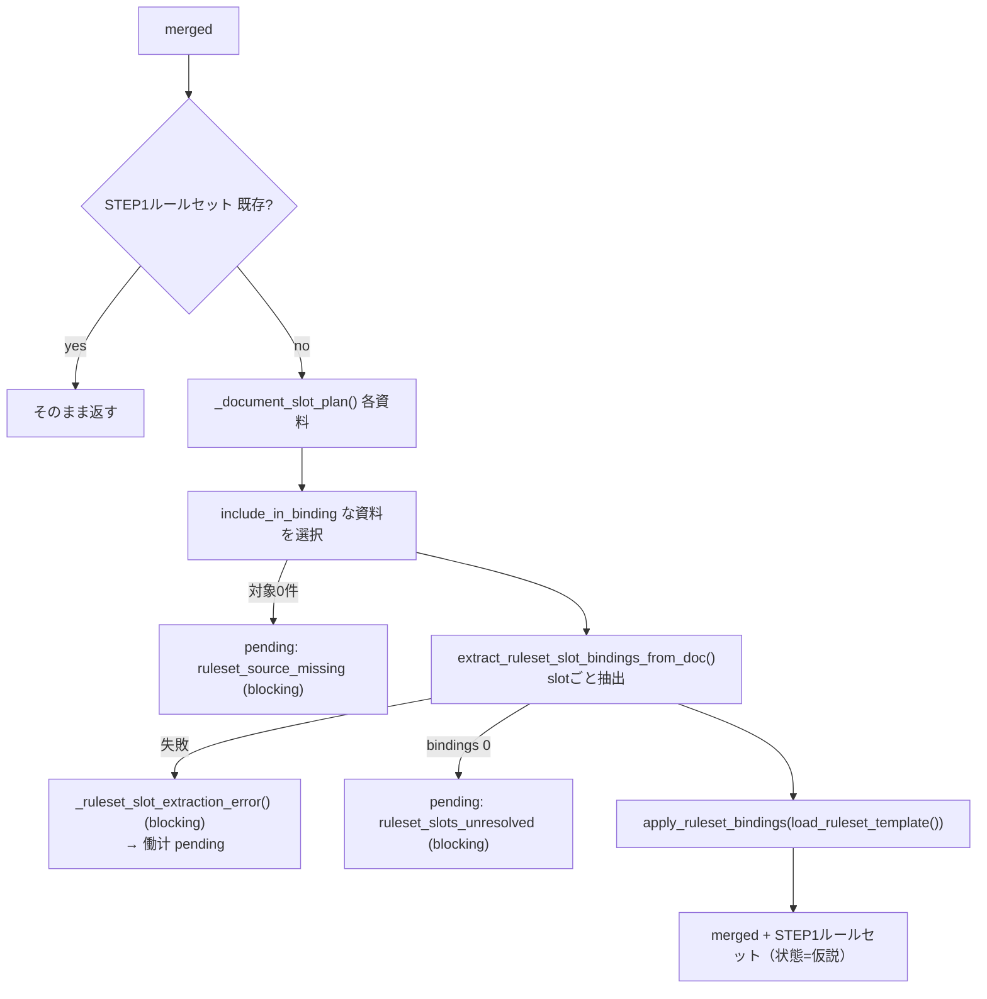

- `_document_slot_plan()`: `document_kind` と `config/rulesets/document_role_slot_hints.yaml`（`load_document_role_slot_hints()`）から、抽出対象 slot を `resolved_document_kind` / `candidate_union` / `full_template_fallback` のいずれかで決める。
- `_resolved_ruleset_document_kind()` / `_ruleset_candidate_kinds()` / `_sorted_document_kind_candidates()`：主種別と候補種別から ruleset 対象種別を解決する。
- 失敗の集約は `slot_extraction_observability.summarize_slot_extraction_errors()` / `error_category()` を共有。

### A-3-2. 中間入力（intermediate_input_stage.py）

`解体機器リスト` / `MRC1費用割振` の構造化事実だけを Step1 契約フィールドへ写像する（自然文推論・分類はしない）。

| 生成フィールド | ビルダー | 元データ |
|---|---|---|
| `STEP1分類入力` | `_build_classification_inputs()` | 各行の equipment / action |
| `STEP1工数入力.items` | `_build_manhour_items()` | 各行の数量・単位・分類 |
| `直課労務費` | `_build_direct_labor_costs()` (`_direct_cost_entries()`) | `MRC1費用割振.direct_costs` |
| `写像バケット照合` | `_build_mapping_bucket_checks()` (`_mapped_amounts_by_category()`) | MRC1費用割振金額 vs 見積行金額 |

### A-3-3. 意味分類（classification_stage.py）

- `apply_mrc1_semantic_classification()` → `classify_mrc1_items()`（ruleset_interpreter）で閉集合 taxonomy に分類。
- `confidence < 0.75` / `needs_review` は反映せず pending。
- `_apply_confirmed_classifications_to_manhour_input()` が確定分類を同一 `line_id` の工数入力へ反映。

### A-3-4. 決定論計算（compute_stage.py）

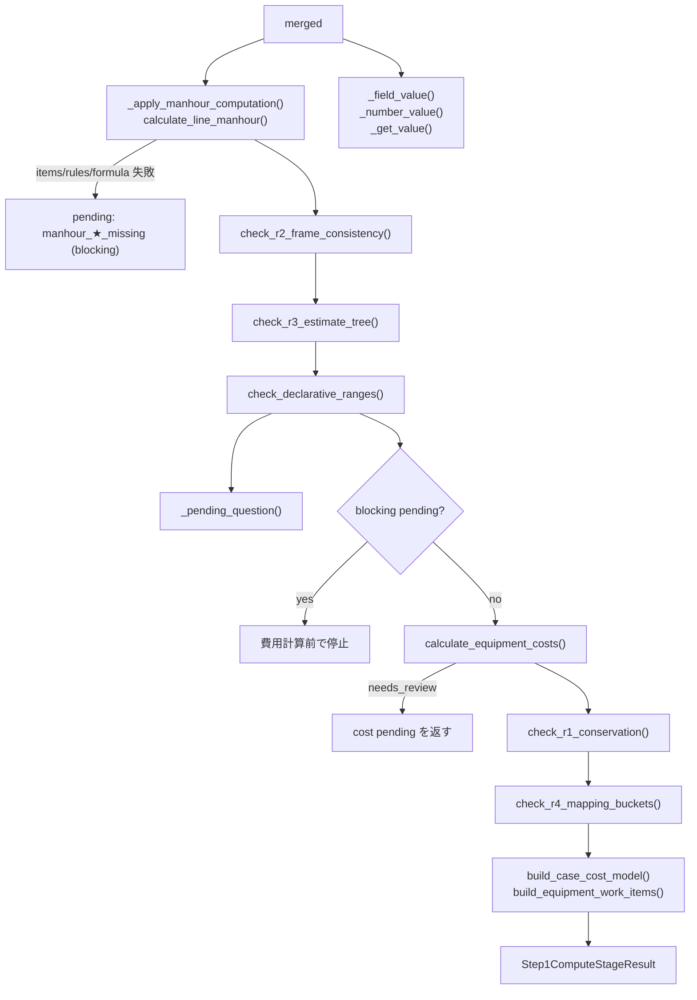

- 工数：`_apply_manhour_computation()` が `STEP1工数入力` と承認済み `rates/factor_rules/formula` から行単位で `calculate_line_manhour()` を実行し STEP1工数計算 を付与、未確定は blocking pending。
- 費用：`calculate_equipment_costs()` (`mrc1_cost_kernel`) が `ruleset.cost_allocation` と「直課労務費」から `STEP1費用計算` を算出。
- 整合：`check_r1_conservation`（保存則） / `check_r2_frame_consistency`（様式内） / `check_r3_estimate_tree`（見積ツリー） / `check_r4_mapping_buckets`（写像バケット） / `check_declarative_ranges`（レンジ）を上書きしない。

## A-4. 決定論カーネル（tools/）

※本カーネル群は型安全性と引数間違いを防ぐため、多くの引数がキーワード専用引数（`*`）としてインターフェースが定義されています。

| カーネル | 主関数 | 役割説明 |
|---|---|---|
| `formula_executor.py` | `execute_formula()`, `safe_eval()` | AIが抜き出してきた計算式（「数量 × 単価」など）を、不正なコマンドの実行などを完全に防ぎながら、安全にPythonで実際に検算（ダブルチェック）します。 |
| `mrc1_manhour_calculator.py` | `calculate_line_manhour()`, `factor_rules_from_dict()`, `manhour_formula_from_dict()` | 各工事明細行に対し、マスタから適合する基準人工（日給）や補正ルール、計算式を自動で引き当て、行ごとの工数（人日・人時）を正確に計算します。適合ルールが見つからない場合は、計算を実施して人間に引き渡します。 |
| `reconciliation_kernel.py` | `calculate_equipment_costs()`, `check_r1_conservation()`, `check_r2_frame_consistency()`, `check_r3_estimate_tree()`, `check_r4_mapping_buckets()`, `check_declarative_ranges()` | 計算された全体の合計額が合っているか（R1）、表に矛盾がないか（R2）、小計が合っているか（R3）、見積ツリーや宣言省の範囲に収まっているか（R4/RANGE）をすべて一気に検証（整合性検証）します。 |
| `case_cost_model.py` | `build_case_cost_model()`, `build_equipment_work_items()` | バラバラに計算・検証された「工数」「費用」「整合性R1〜R4」のデータを、システム共通で安全に扱える1つのまとまった「案件原価モデル（CaseCostModel）」へと美しくパッケージ（構築）します。 |

## A-5. 書き込み（form_generation_pipeline.py）

| 関数 | 入力 | 出力 / 役割説明 |
|---|---|---|
| `generate_form_from_dict()` | `input_data`, `source_metadata`, `template_excel_path`, `result_excel_path`, `frame_name`, `source_filename` | 転記処理の仕上げです。渡された統合データやマッピング情報を正確に書き込み、完成したExcelファイルを保存します。 |
| `_determine_mapping_with_reasoning()` | `input_data`, `workbook`, `frame_name`, `sheet_name` | 設計図YAMLに定義されているセル座標（例：「炉型」→「C7」）を優先して確定します。未定義のセルのみ、AI判定（cell_locator）を呼び出して座標を自動的に決定します。 |
| `_iter_tabular_mapping_rows()` | `*.section`, `rows`, `max_rows=200` | 複数行がある表形式データについて、行・列のセル座標を自動計算し、「どの座標にどのデータ項目を書き込むか」をきれいに整列させて順次取り出します。 |
| `write_to_cell()` (`core/cell_writer.py`) / `write_tabular_section()` (`section_handlers/tabular_handler.py`) | editor, セル, 値 | Excelのプルダウンリスト、図形、数式などを一切さわないように維持したまま、指定されたセル座標に実際の値を安全に書き込みます。 |

書込は `writable:false` フィールドをスキップし、`unit` 指定があれば `convert_unit()` で単位変換する。

分類A 追記（A-5 書込補助関数）：

- `normalize_tabular_cell_value()`：列定義の型に合わせて入力値をセル書込可能な値へ正規化する。
- `resolve_tabular_column_field()`：入力フィールド名を YAML 定義の列キーへ対応付ける。
- `resolve_tabular_excel_row()`：1行データの書込先となる Excel 行番号を決定する。

## A-6. legacy エンジンと ADK エンジン

`engine=adk` のときは `run_transcription_workflow()`（すべての引数がキーワード専用引数 `*` として定義され、型安全性を確保）が以下のノード列を実行する。戻り値 state を `_run_transcription_pipeline` が受け取り、route 側では document_kind pending の追加、blocking 判定、Excel 出力、永続化だけを後段で共通実行する。

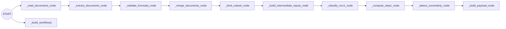

各ノードは A-2 の同名ステージ関数を呼ぶ薄いラッパで、`ctx.state` に `merged` / `manual_pending_questions` / `case_cost_model` などを積み上げる。`_detect_uncertainty_node()` は `build_hitl_pending_questions()` に加え、`collapsed_manual_pending_questions` と `workflow_status` を管理する。

## A-7. HITL（pending question）— ゲートと回答ループ

HITL は「自動で埋めると危ない情報を、人間に確認してから進める」ための仕組み。代表例は、資料間で値が食い違う、資料種別が不明、計算ルールを確定できない、歩掛や費用配賦の方針が必要、など。blocking な質問は Excel 書き込み前に止め、回答後に mappings と Excel を更新する。

### A-7-1. 書き込み前ゲート

`run_step1_compute_stage` や各 stage は不確実点を `build_stage_pending_question()`（core/gap_model.py）で pending question 化する。route 本流では `_document_kind_pending_questions()` と `*question_groups` を受けて柔軟な設計）が真になり、`generate_form_from_dict()` を呼ばずに Excel 出力を作らない（通常は `outcome=hitl`。`document_kind_out_of_scope` など対象外理由があれば `outcome=out_of_scope`）。

`_collapse_manual_pending_questions()` を合流させたあと `_normalize_pipeline_pending_questions()` を通し、`blocking=True` が 1 件でもあると `has_blocking_pending_questions()`（実コードは可変長引数

### A-7-2. pending question の種類

| `type` / `reason` | 発生源 | 代表 candidate / 解決 |
|---|---|---|
| `conflict` | merge 差分（`merge_extractions` / uncertainty） | 候補値の選択（blocking） |
| `formula_review` | `validate_formula_specs` 不一致 | 確認 |
| `required_missing` / `low_confidence` | `build_pending_questions()`（core/uncertainty.py） | 個入力 |
| `document_kind:★` | `_document_kind_pending_questions()` | 資料種別の選択 |
| `ruleset_source_missing` / `ruleset_slots_unresolved` / `slot_extraction_failed` | ルールセット抽出 | 資料・方式の確認（blocking） |
| `manhour_items_missing` / `manhour_rules_missing` / `manhour_calculation_unresolved` | compute 工数 | 工数入力・歩掛確認（blocking） |
| `equipment_classification_review` | 分類/工数の未確定 | `manhour_rule:<id>` / `manhour_policy:<...>` |
| `cost_calculation_policy` | 費用方針未確定 | 配賦方針の選択 |
| `ruleset_patch_review` | ルールセット修正提案 | パッチ承認 |
| `work_area_hypothesis_applied` | 作業区域の仮設定 | 管理区域/非管理区域 |

質問の正規化・blocking/review 判定は `core/gap_model.py`（`gap_to_pending_question()`, `has_blocking_pending_questions()`, `has_review_pending_questions()`）に共通化されている。

### A-7-3. 回答ループ（api/routes/sessions.py）

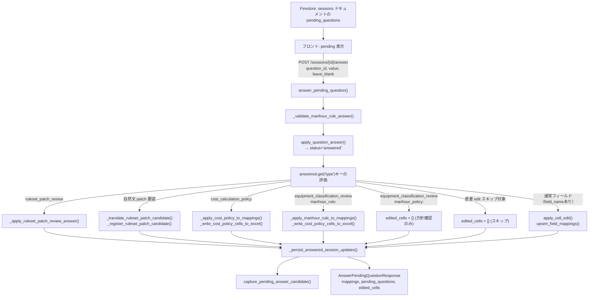

| 段階 | 関数 | 役割 | 入力例 | 出力例 |
|---|---|---|---|---|
| 回答受付 | `answer_pending_question()` | 画面から来た回答を受け取り、質問タイプごとに「値更新・再計算・ルール反映」のどれを行うか決める中心API | `session_id, question_id='q1', value='BWR'` | `AnswerPendingQuestionResponse` |
| 質問更新 | `apply_question_answer()` | 指定した質問IDだけを `answered` に更新し、回答後を保存する（計算はしない） | `pending_questions, question_id='q1'` | `updated_questions, answered` |
| 回答検証 | `_validate_manhour_rule_answer()` | 選んだ歩掛ルールが「この行で使っていた補か」を事前チェック | `calculation_context, rule_id='rule_a'` | `validation ok / HTTPException` |
| ルール更新 | `_apply_ruleset_patch_review_answer()` / `_translate_ruleset_patch_candidate()` / `_register_ruleset_patch_candidate()` | 自然文の修正要望を ruleset パッチ候補として登録し、承認結果を計算文脈に反映する | `calculation_context, answer_value` | `updated calculation_context` |
| 費用反映 | `_apply_cost_policy_to_mappings()` / `_write_cost_policy_cells_to_excel()` | 選んだ費用方針で mappings を更新し、対応セルへ実値を書き戻す | `mappings, policy='use_cost_allocation'` | `updated mappings, edited cells` |
| 工数再計算 | `_apply_manhour_rule_to_mappings()` | 指定行の見積明細を再分析して工数を再計算し、mappings・Excel・`calculation_context` を同時更新する | `mappings, rule_id='rule_a'` | `updated mappings/context` |
| 通常編集 | `apply_cell_edit()` / `upsert_field_mappings()` | 通常の値変更を Excel セルに書き込み、同じ変更を mappings にも反映して整合を保つ | `field_name='炉型', new_value='BWR'` | `edited cell, updated update + GCS sync` |
| 永続化 | `_persist_answered_session_updates()` | 回答後の最新状態（mappings/pending/context）を Firestore に保存し、成果物Excelも GCS と同期する | `session_ref, mappings, pending_questions` | `Firestore update + GCS sync` |
| 候補審議 | `capture_pending_answer_candidate()` (`core/rule_candidates.py`) | 人手で確定した値を「次回の候補ルール学習データ」として保存する（本処理に影響しない補助） | `answered_question, confirmed_value` | `rule candidate updated` |
| 画面操作 | `get_session_mappings()` / `complete_session_review()` / `list_sessions_with_status()` | 画面完了や作業完了するために、セッション状態を読み出し・完了更新・一覧取得する | `session_id` | `session payload / status list` |

`build_ruleset_observability()` (`core/ruleset_observability.py`) が pending から `slot_extraction_failures_aggregated` / `role_decision_summary` を算出し、Firestore session に保存する。

## A-8. チャット Q&A・再計算（api/routes/chat.py）

チャットは、転記結果を見ているユーザーが「なぜこの値か」を聞いたり、「このセルを直して」と依頼したりする補助入口。通常の転記パイプラインとは別に、保存済み `calculation_context` と mappings を使って説明・編集・再計算を行う。

| 段階 | 関数 | 役割 | 入力例 | 出力例 |
|---|---|---|---|---|
| 意図判定 | `chat()` | ユーザー文を「質問に答える」「セルを編集する」「工数を再計算する」に振り分け、必要な処理だけ実行する入口API | `ChatRequest(message='この値の根拠は?')` | `ChatResponse(type='answer' など)` |
| 再計算実行 | `_handle_recalculate_chat()` | 対象行と歩掛ルールを確定し、再計算サービスを呼んで結果をセルへ反映する | `request, parsed result` | `recalculated ChatResponse` |
| 永続化 | `_update_firestore_mappings()` / `_update_recalculated_session()` / `_reupload_excel_to_gcs()` | チャット経由の編集・再計算結果を Firestore と成果物Excelへ保存し、次回表示でも同じ値になるようにする | `session_id, mappings` | `Firestore update + GCS sync` |
| 文脈読込 | `_load_session_calculation_context()` / `_load_session_data()` | 再計算に必要な過去計算データを安全に読み込み、取得失敗時は空で継続する | `session_id` | `calculation_context, session data` |

編集系（`edited`）は `apply_cell_edit()` で Excel に書き込み、`EditedCell` を返してフロントのハイライトに反映する。

---

# B. 事前レビュー系（RAG）

> **最終更新：2026-07-03**（BigQuery平坦化・Excelアップロード入口・炉型導出・公式ver5.3準拠message_idを反映）
> 仕様の正本は `docs/preliminary_review/REQUIREMENTS.md §0`、検証根拠・実装バックログは `docs/preliminary_review/RAG_VERIFICATION.md`。本章は「**コードがどう動いているか**」の地図。

## B-0. 30秒でわかる事前レビュー

電力会社が提出した様式（転記結果）を、NuRO担当者が目視チェックする**前に**、AIが過去の問合せナレッジと照合して「ここを確認すべき」という指摘（`ReviewItem`）を作る機能。

- **入力**：転記結果の `mappings`（どのセルに何が書いてあるかの一覧）
- **参照**：F2ナレッジ（NuRO内共有の知見）・F3ナレッジ（電力別の問合せ履歴）を Agent Search で検索
- **出力**：`ReviewItem` のリスト（セル座標・指摘文・根拠つき）→ `/review` 画面で NuRO が承諾/棄却

システムは**独立した2つの流れ**でできている。この区別が全体理解の鍵：

| 流れ | いつ動く | 何をする | 入口 |
|---|---|---|---|
| **① ナレッジ供給（オフライン）** | ナレッジExcel更新時に手動実行 | Excel正本 → 平坦化 → BigQuery → Agent Search索引 | `uv run python scripts/ingest_knowledge.py --backend bigquery` |
| **② レビュー実行（オンライン）** | NuROがレビューを開始したとき | 検索 → ルール検出 → Gemini指摘生成 → Firestore保存 | `POST /api/review` |

初見の方への読み方：**B-1（データの置き場）→ B-2（①の流れ）→ B-3〜B-6（②の流れを入口から出口まで）** の順に読むと、関数名が全部つながります。

## B-1. 鳥瞰図：4つのデータ置き場と役割

4つの置き場は役割が完全に分かれている（混同しないこと・REQUIREMENTS §0-4）：

| 置き場 | 役割 | 実体 |
|---|---|---|
| **Excel** | ナレッジの**正本**（人間が編集する唯一の場所。DBは常に派生） | `data/knowledge/F2_knowledge.xlsx` / `F3_knowledge*.xlsx` |
| **BigQuery** | 平坦化したナレッジの**データ置き場**（BigQuery自体は検索しない） | `nuro_knowledge.f2_flat_ver53` / `f3_flat_ver53` |
| **Agent Search** | **検索エンジン**（BigQueryを索引。BM25+ベクトルのハイブリッド検索） | `nuro-f2-bq-knowledge` / `nuro-f3-bq-knowledge` |
| **Firestore** | レビューの**運用状態**（セッション・指摘・採否・undo・統計） | `sessions/{id}/review_results/{review_id}` |

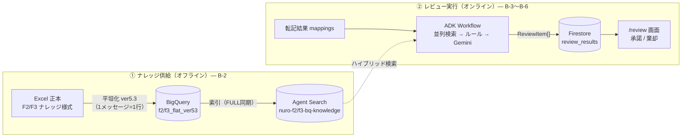

## B-2. ① ナレッジ供給パイプライン（Excel → BigQuery → Agent Search）

**なぜ平坦化が要るのか**：ナレッジ様式は「1件の問合せが横に伸びる」形（1回目質問→1回目回答→2回目…）。検索エンジンには「**1メッセージ=1行**」が必要。公式ver5.3様式に付属する「出力用シート」（関数による自動生成・入力不要）と同じ変換を、コード側で再現している。

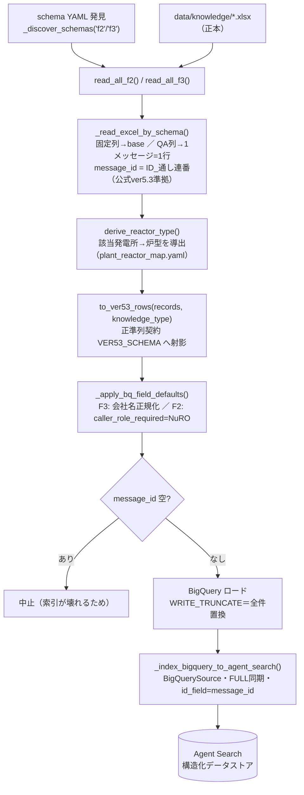

| 関数（場所） | 役割 | 入力 | 出力 |
|---|---|---|---|
| `read_all_f2()` / `read_all_f3()`（`agents/reviewer/_excel_reader.py`） | schema YAML を全発見し、対応するナレッジExcelを平坦レコード化する入口 | `data/knowledge/*.xlsx` ＋ `schema/f2_*／f3_*_schema.yaml` | `list[dict]`（1メッセージ=1行） |
| `_read_excel_by_schema()`（同上） | 1シート分の読み込み中核。固定列→base辞書、QA繰り返し列→メッセージ展開、`sheet_name` 付与 | schema dict ＋ Excelパス | `(records, utility_name)` |
| `derive_reactor_type()`（同上） | **炉型は様式の列ではなく「該当発電所」から導出**（発電所≒炉型一意のドメイン知識。号機で異なる例外は「発電所/号機」キーで上書き） | `("網走原子力発電所", "1号機")` | `"PWR"`（`data/knowledge/schema/plant_reactor_map.yaml`） |
| `to_ver53_rows(records, knowledge_type)`（同上） | 正準列契約 `VER53_SCHEMA` への射影。余分キーは落とし、欠損は既定値で埋める＝**BigQueryが常に同一スキーマの行を受け取る保証** | 平坦レコード ＋ `"f2"/"f3"` | BigQuery行の `list[dict]` |
| `_ingest_bigquery(knowledge_type)`（`scripts/ingest_knowledge.py`） | 上記を束ね、BigQueryへ**全件置換**（WRITE_TRUNCATE）でロード→索引投入まで実行 | `"f2"/"f3"` | `f2/f3_flat_ver53` テーブル更新 |
| `_index_bigquery_to_agent_search()`（同上） | BigQueryテーブルを構造化データストアへ**FULL同期**（テーブルと索引が完全一致） | datastore_id, table_id | Agent Search ドキュメント（`id_field=message_id`） |
| `create_datastores.py`（scripts/） | データストアの新規作成（初回のみ。`structured: True`＝BigQuery索引用） | — | `nuro-f2/f3-bq-knowledge` |

**ver5.3 平坦行の形**（F3の例。F2は業務カテゴリ/事象概要/判断基準など様式固有の列に置き換わる＝`F2_VER53_COLUMNS`）：

| 区分 | 列 |
|---|---|
| 本体列（様式の出力用シート準拠） | ID／**メッセージID**（`{ID}_{通し連番:02d}`）／起票日／起票者所属G／起票者／参照先ナレッジID／提出タイミング／確認年度／該当発電所／該当プラント／該当費目／該当工事／該当資料／**メッセージ内容**（検索対象テキスト） |
| 付帯列（検索フィルタ・権限用） | utility_name（正規化済み）／reactor_type（発電所から導出）／sheet_name／message_direction／round |

**安全装置**：①検索先がBigQuery索引ストアを指しているのに旧 `--backend direct` でF2/F3を投入しようとすると**中止**（NO_CONTENTストアの汚染防止）。②message_idが空の行があれば**中止**（索引の id_field に使えない）。③FULL同期＝再実行すれば常にExcel正本と一致（PoCは知識凍結・R7）。

## B-3. ② レビュー実行の入口（3つの入口 → 1つに合流）

レビューの入口は3つあるが、**すべて `reviewer_agent.run_review()` に合流する**。検証ハーネスも本番と同じコードパスを通るため、検証で通った経路がそのまま本番の経路になる。

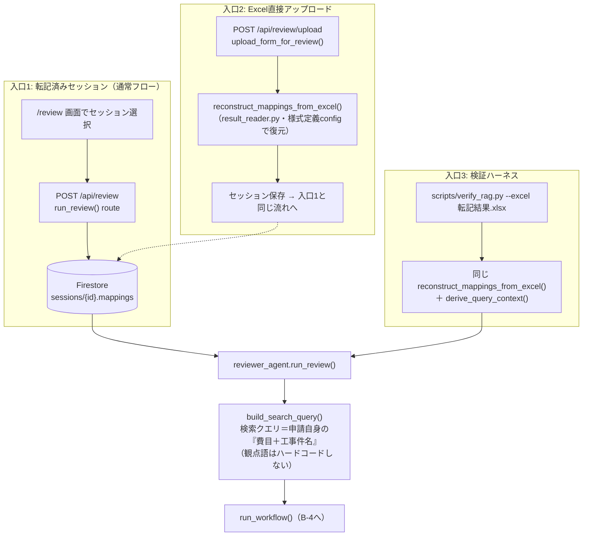

| 関数（場所） | 役割 | 入力 | 出力 |
|---|---|---|---|
| `run_review()` route（`api/routes/review.py`・`POST /api/review`） | セッションの mappings を読み、AIレビューを実行して結果を保存（転記結果自体は変更しない）。`reviewed=True` に更新 | `ReviewRequest(session_id, utility_name, frame_name, sheet_name)` | `ReviewResponse(review_id, review_items, summary, mappings, retrieval_trace)` |
| `upload_form_for_review()`（同上・`POST /api/review/upload`） | 転記を経ずに完成様式Excelを直接レビューにかける入口。復元→Firestoreセッション作成 | `file=転記結果.xlsx, frame_name, sheet_name` | `UploadResponse(session_id, mappings)` |
| `reconstruct_mappings_from_excel()`（`agents/reviewer/result_reader.py`） | 様式定義（`config/{frame}/{sheet}.yaml`）に基づきセル値→mappings を復元。label_value／plan_actual／tabular セクション対応。**特定ファイル・特定費目に依存しない** | `excel_path, frame, sheet` | `list[mapping dict]` |
| `derive_query_context()`（同上） | Excelから検索文脈（費目・炉型・電力会社）を導出。クロスシート対応（MRC2レビューでも文脈はMRC1から取る） | `excel_path, frame, sheet, context_sheet` | `{fee_type, reactor_type, utility_name}` |
| `reviewer_agent.run_review()`（`agents/reviewer/reviewer_agent.py`） | レビュー本体の外部I/F（**Phase 1から不変**）。mappingsから炉型・費目を自動補完し、Workflowを起動 | `session_id, utility_name, mappings, frame_name, sheet_name, [reactor_type], [fee_type]` | `(list[ReviewItem], retrieval_trace)` |
| `build_search_query()`（`agents/reviewer/_review_logic.py`） | mappingsから「対象費目1＋工事件名」を取り出して検索クエリを合成（取れなければfallback） | `mappings, fallback` | `"施設解体一解体費 ○○建屋解体工事"` |

## B-4. レビュー本体：ADK Workflow（並列検索 → ルール検出 → 生成）

`run_workflow()`（`adk/runner.py`）が毎リクエスト新規セッションで実行する。**5つの検索ノードが並列**に走り（同期loaderを `run_in_executor` でスレッド並列化）、全完了後にルール検出→Gemini生成が**直列**に続く。各ノードは `ctx.state` を読み書きするだけで、エラー時は空リストにフォールバックしてレビュー全体を止めない。

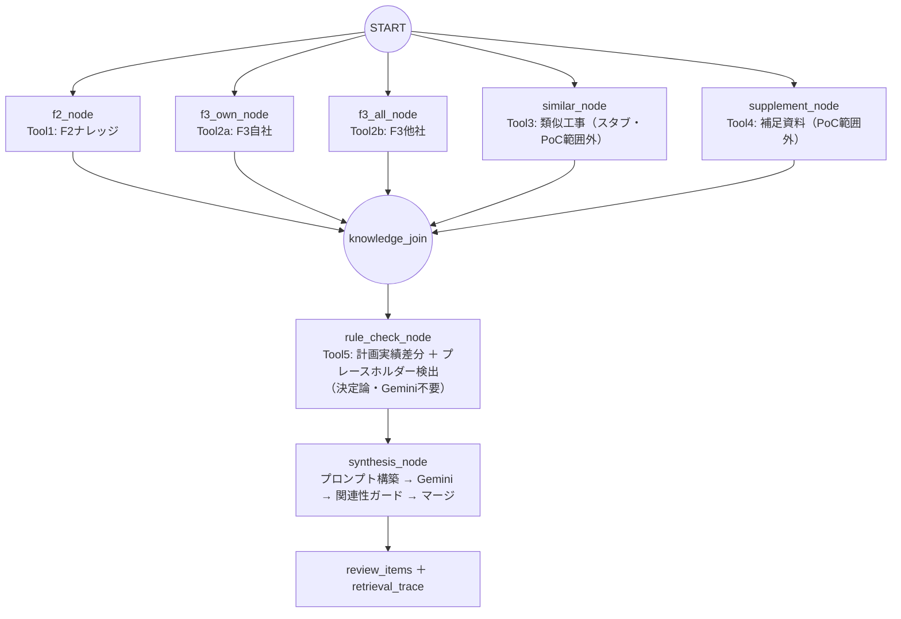

**state の受け渡し**（`adk/agents.py`。キー定義は `adk/state_keys.py`）：

| ノード | 読む state | 書く state | 呼ぶ関数 |
|---|---|---|---|
| `f2_knowledge_node` | `fee_type`（=検索クエリ） | `f2_knowledge`, `_trace_f2` | `load_f2("NuRO", query, 20)` |
| `f3_own_knowledge_node` | `utility_name`, `reactor_type`, `fee_type` | `f3_own`, `_trace_f3_own` | `load_f3("NuRO", 自社, 炉型, query, None, 20)` |
| `f3_all_knowledge_node` | `reactor_type`, `fee_type` | `f3_all`, `_trace_f3_all` | `load_f3("NuRO", None=全社, 炉型, query, None, 20)` |
| `similar_work_node` | `reactor_type`, `fee_type` | `_trace_similar` のみ（常に空＝スタブ） | `load_similar_work()` |
| `supplement_node` | `utility_name`, `fee_type` | `supplement_info`, `_trace_supplement` | `load_supplement()` |
| `rule_check_node` | `mappings`, `frame_name`, `sheet_name` | `plan_diffs`, `rule_items`, `rule_cells`, `empty_cells`, `placeholder_cells` | `detect_plan_diff()` ほか（B-6） |
| `synthesis_node` | 上記すべて | `review_items`, `retrieval_trace` | `_build_prompt()` → `call_gemini()` → `apply_relevance_guard()`（B-6） |

`retrieval_trace` は各Toolの `{tool, query, count, top_ids}` の一覧。**「なぜこの指摘か」の透明性**を担保し、画面のRAG詳細パネルとデバッグに使う（Firestoreには保存せずレスポンスのみ）。

## B-5. ナレッジ検索の中身（knowledge_loader.py）

検索バックエンドの差し替え点。**公開I/F（`load_f2`/`load_f3`/…の引数・戻り値）はPhase 1から不変**で、内部だけが Excel直読み → Agent Search ハイブリッド検索へ進化してきた。B-2 で作った索引をここで引く。

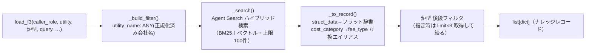

| 関数 | 役割 | 入力 | 出力 |
|---|---|---|---|
| `load_f2(caller_role, fee_type, limit)` | F2検索。**電力ロールは常に空リスト**（F2はNuROのみ参照可＝DB層で権限を完結）。`caller_role_required=NuRO` でフィルタ | `("NuRO", "解体撤去費", 20)` | `list[dict]` |
| `load_f3(caller_role, utility_name, reactor_type, fee_type, sheet_name, limit)` | F3検索。会社名フィルタ（NuROは全社可・電力は自社のみ）＋炉型は**Python後段フィルタ**（新規フィールドのサーバ側index反映遅延を回避） | `("NuRO", "関東電力", "BWR", query, None, 20)` | `list[dict]` |
| `normalize_utility()` | 会社名正規化（「株式会社」等を除去）。**ingest側と検索側の両方**に同じ正規化を通し、表記ゆれで自社フィルタが外れるのを防ぐ | `"関東電力株式会社"` | `"関東電力"` |
| `_search()` | Agent Search 呼び出しの共通部。空クエリは全文スキャン相当（"工事"）に置換 | `datastore_id, query, filter_str, limit` | `list[dict]` |
| `_to_record()` | 検索結果1件→フラット辞書。ver5.3列名（`cost_category`）と旧structキー（`fee_type`）の**互換エイリアス**を付与（下流の関連性ガードが `fee_type` を読むため） | `SearchResult` | `dict`（`_doc_id` 付き） |
| `_serving_config()` | データストア→検索エンジンのパス解決（エンジン未設定ならデータストア直接） | `datastore_id` | serving config パス |

## B-6. 指摘の生成（rule_check_node → synthesis_node・_review_logic.py）

生成は**2段構え**。機械的に確定できる指摘はルールで先に作り（Geminiを待たない・ぶれない）、文脈判断が要るものだけGeminiに渡す。Geminiの出力には**関連性ガード**をかけ、無関係な過去事例を根拠にした指摘（誤grounding）を防ぐ。

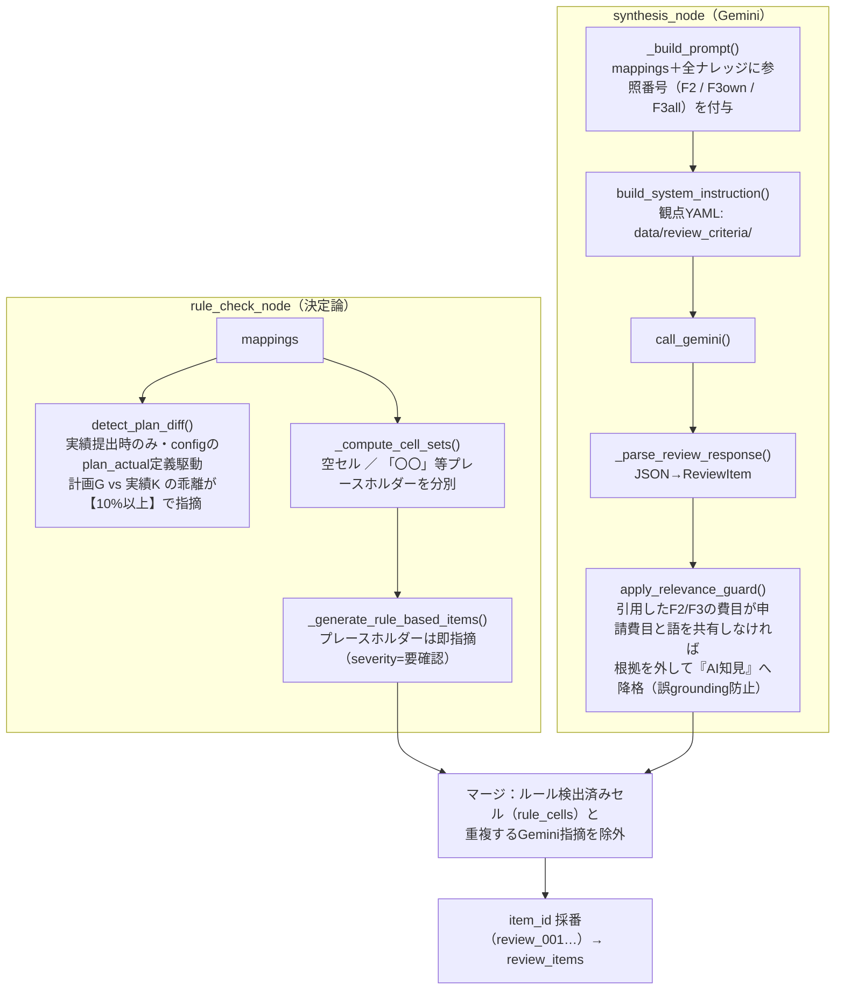

| 関数 | 役割 | 入力 | 出力 |
|---|---|---|---|
| `detect_plan_diff()` | Tool5。様式定義（config）の `plan_actual` ペア定義を使い、**実績提出時のみ**計画値(G)と実績値(K)を比較。**数値差異10%以上**（`_NUMERIC_DIFF_THRESHOLD_RATE=0.1`）で指摘対象 | `mappings, frame_name, sheet_name` | `plan_diffs` |
| `_compute_cell_sets()` | 空白セルと仮置きセル（「〇〇」「TBD」等）を分別収集 | `mappings` | `(empty_cells, placeholder_cells)` |
| `_generate_rule_based_items()` | 確実にNGと言える項目（プレースホルダー残り）をGemini抜きで即指摘化 | `mappings, placeholder_cells` | `rule_items`（`knowledge_source="AI知見"`） |
| `_build_prompt()` | レビュー対象・全ナレッジ・差分・空セル情報を1つの指示文に合成。同一観点が複数セルに跨る場合は1指摘に統合するよう指示（過検出抑制） | mappings＋ナレッジ＋plan_diffs ほか | プロンプト文字列 |
| `build_system_instruction()`（`criteria_loader.py`） | レビュー観点を宣言的YAMLから読み込む（**観点はコードでなくconfig**＝資料・カテゴリに依存しない） | `frame_name, sheet_name` | system instruction |
| `_parse_review_response()` | GeminiのJSON応答を安全にパースして `ReviewItem` 化 | 生レスポンス | `list[ReviewItem]` |
| `apply_relevance_guard()` | **誤grounding防止の安全網**。指摘が引用した `[F2#N]/[F3all#N]` の費目が本申請の費目と語を共有しない場合、`knowledge_source` を「AI知見」・severity を「要確認」に降格（指摘自体は残す） | `items, mappings, f2/f3ナレッジ` | 降格処理済み `list[ReviewItem]` |

> **数値チェックは2種類ある**（混同注意・REQUIREMENTS §0-6）：上記 Tool5 は計画/実績の**乖離検出（閾値10%）**。これとは別に、合計値・セル内関数の**算術整合の検証（決定論・円・許容0＝数式破壊検知）**が未実装バックログにある（B-9）。

## B-7. 結果の保存・採否・統計（Firestore）

```
sessions/{session_id}
  mappings / utility_name / frame_name / sheet_name / reviewed / session_name
  review_results/{review_id}
    review_items[] / summary / reviewed_at
    feedbacks[]（accept・rejectとも記録＝履歴復元用） / total_count / decided_count
review_stats/{YYYY-MM-DD}    ← 承諾/棄却の日次集計
```

| 関数（`api/routes/review.py`） | 役割 | 入力 | 出力 |
|---|---|---|---|
| `submit_feedback()`（`POST /review/{id}/feedback`） | 指摘1件の承諾/棄却を `feedbacks` に記録し、日次統計を加算 | `item_id, decision="accept"/"reject"` | `FeedbackResponse(status)` |
| `undo_feedback()`（`DELETE /review/{id}/feedback/{item_id}`） | 採否の取り消し（undo） | `review_id, item_id` | 更新後状態 |
| `sync_feedbacks()`（`POST /review/{id}/feedbacks/sync`） | 画面状態との一括同期 | feedback一覧 | synced state |
| `list_sessions()` / `get_latest_review_result()` | セッション一覧（未レビューのみ or 履歴込み）／最新レビュー結果の復元 | `include_history` | 一覧／最新結果 |
| `get_review_stats()`（`GET /review/stats`） | 棄却率・件数トレンドを集計。**棄却率50%超の継続が Agentic RAG 移行トリガー**（REQUIREMENTS §4-5） | — | stats payload |

## B-8. 検証基盤（本番と同じ経路を通す）

検証ハーネスは B-3 の復元関数と B-4〜B-6 の本体をそのまま呼ぶため、**検証で通った経路＝本番の経路**。生成レポートは `data/verification/` 等に出力される（gitignore・コミットしない）。

```bash
uv run python scripts/verify_rag.py --smoke-only                          # GCP/Agent Search 疎通
uv run python scripts/verify_rag.py --excel <転記結果.xlsx> [--retrieval-only]  # 検索の中身／フルレビュー
uv run python scripts/eval_review.py                                       # PoC検証マトリクス（難易度1〜4×2軸）
uv run python scripts/review_annotation.py --excel <結果.xlsx> --sheets MRC1,MRC2  # NuROアノテーション用
```

- `eval_review.py` ＋ `data/review_eval/gold_expectations.yaml`：**性質ベース**の自動判定（「PWRでフィルタしたらPWRだけ返る」等）。単発runの網羅率100%は追わない（過剰適合回避・RAG_VERIFICATION 付録A-3）。
- 回帰ゲート：`uv run pytest`（`test_review_e2e.py`）＋ 上記マトリクス。**これを割ったら次の変更に進まない**。

## B-9. 未実装（実装バックログとの対応）

「決定済み・未実装」の唯一の一覧は `RAG_VERIFICATION.md §2`。主なもの：

| 未実装 | 内容 | 土台の状況 |
|---|---|---|
| Reranking（Ranking API） | `_search()` 後段に semantic-ranker を追加（設定でON/OFF・未設定は素通り） | 採用方針確定（§3-2） |
| 提出タイミング＋G/K列分岐 | MRC1のC8（計画/実績区分）で検索対象シートとレビュー列を分岐 | `submission_timing` はver5.3列として**索引済み**＝後段フィルタを足すだけ |
| MRC2観点＋粒度感＋数式破壊検知 | `frameB_MRC2.yaml` 観点追加／合計・関数セルの再計算突合（決定論・円・許容0） | 観点YAML機構は稼働中 |
| ワークブック単位レビュー入口 | 全シート一括の `review_workbook()`（現状は1シート単位） | 復元関数は共通化済み（result_reader） |
| Tool3 類似工事／Tool4 補足資料 | **PoC範囲外**（similar_node はスタブ、supplement は将来マルチモーダル） | — |

---

## 設計原則

## 1. Definition-Driven（YAML 駆動）

様式定義は `config/frames/{frame_name}/{sheet_name}.yaml` に閉じ込める。

- `extraction_schema`：抽出定義（type/required/synonyms/unit/writable など）
- `sections`：表形式書き込み定義（開始行、列定義、行解析キーなど）
- `config/frames/{frame_name}/enums.yaml`：プルダウン候補や事前選択候補値の正規化補ある
- `config/reconciliation/{frame_name}.yaml`：R1-R4 やレンジ検証の閾値
- `config/rulesets/schema/template.yaml`：Step1 ルールセットの空契約

YAML 更新で業務要件の変更を吸収し、コード改修を最小化する。

## 2. LLM の責務限定

LLM（Gemini）は主に以下に限定して利用する。

- 項目抽出（`map_to_schema_from_doc()`）
- ルールセット slot 抽出、MRC1 分類の仮説生成
- レビュー文生成（synthesis）

数値計算、セル確定、整合判定、最終書き込みは決定論ロジックで実施し、再現性を担保する。

## 3. 不確実性は HITL に寄せる

- 資料種別、抽出値の整合、式検証失敗、ルールセット slot 抽出失敗は `pending_questions` に集約。
- `blocking=True` の pending がある場合、Excel 書き込みをスキップして HITL 待ちにする。
- 不明値は null/スキップとして扱い、推測埋めを抑制する。

## 4. 安全側フォールバック

- GCS/Firestore 保存失敗時は処理全体を止めず、ローカル出力とジョブ結果を優先する。
- Gemini MAX_TOKENS 失敗時は対象資料を空抽出として扱い、後段の pending で可視化する。
- キャッシュ不整合時は再判定する。

---

## データ構造リファレンス

ここから先は詳細調査用。日常的に読む必要はないが、関数表の「入力」「出力」に出てくる dict の形を確認したいときに使う。

関数間で受け渡す主なデータの形。

### SourceDocument（build_source_documents の出力）

```python
SourceDocument{
    file_name="見積書.pdf",
    document_kind="見積書",          # harmonize_document_kind_inference で補正
    text="...構造化テキスト...",
    raw_bytes=b"...",                # マルチモーダル mapping 用
}
```

### extraction dict（build_combined_extraction の出力 / merge_extractions の入力）

```jsonc
{
    "source_file": "見積書.pdf",
    "document_kind": "見積書",
    "data": { "工事件名": "_", "解体機器リスト": [ .. ] },
    "_metadata": { "工事件名": { "confidence": "high", "source_location": {..}, "source_context": "_" } },
    "formula_specs": [ { "formula_name": "_", "expression": "a*b", "variables": {..}, "gemini_result": 12.0, "result_unit": "人日" } ],
    "manual_pending_questions": [ .. ]
}
```

### merged field（merge_extractions の出力 / 各 Step1 ステージの入出力）

```jsonc
"工事件名": {
    "value": "_",
    "source_file": "見積書.pdf",
    "confidence": "high",
    "source_location": {..},
    "source_context": "_"
}
```

`merged` には `STEP1ルールセット` / `STEP1分類入力` / `STEP1工数入力` / `STEP1分類結果` / `STEP1工数計算` / `STEP1費用計算` / `STEP1整合結果` / `直課労務費` / `写像バケット照合` といった Step1 契約フィールドが順に付与される。`conflicts` は `{field, candidates:[{value, source, document_kind}]}`.

### pending_question（HITL 単一形式）

```jsonc
{
    "id": "manhour_calculation_unresolved:line_3",
    "type": "equipment_classification_review",
    "blocking": true,
    "field_name": "解体機器リスト.計画_工数",
    "status": "open",           // open | answered
    "question": "_",
    "candidates": [ { "label": "歩掛A", "value": "manhour_rule:rule_a" } ],
    "answer": null,
    "source": "compute_stage",
    "source_location": {..}
}
```

### CaseCostModel（build_case_cost_model の出力）

エンジン中立の案件原価モデル。`equipment_work_items`（行単位の数量・工数・費用）、`cost_buckets`（費目別集計）、`estimate_tree`（見積ツリー）、`reconciliations`（R1〜R4 結果）、`needs_review`（True なら正本上書き防止）を束ねる。`build_form_generation_payload()` が Authority Swap でこのモデルを書込 payload の正となる値に差し替える。

### ReviewItem（synthesis_node の出力）

```jsonc
{
    "item_id": "review_001",
    "field_name": "費用低減策",
    "cell_address": "K22",
    "severity": "要確認",          // 要確認 | AIからの指摘
    "comment": "_",
    "evidence": "[F3all#2] _",
    "knowledge_source": "F3"       // F2 | F3 | 類似工事 | 補足資料 | 計画差分 | AI知見
}
```

### retrieval_trace

各 Tool の `{tool, query, count, top_ids}` のリスト。RAG 詳細パネルで根拠の透明性を担保する。

### calculation_context

`_build_calculation_context()` が生成し Firestore に保存。見積行（`_collect_estimate_line_items()`）、歩掛レート（`_serialize_manhour_rate()`）、ルールセット構成などを含む。`POST /sessions/{id}/answer` の再計算と `POST /chat` の Q&A・再計算で再利用する。

---

## データ永続化と連携

## Firestore

- `sessions`：
    - 転記単位のセッション情報
    - `mappings`（セル転記結果）
    - `pending_questions`（HITL 確認事項）
    - `calculation_context`（再計算やチャット編集で利用する計算文脈）
    - `reviewed` / `review_completed` などのレビュー状態
- `sessions/{session_id}/review_results`：
    - AI 指摘結果
    - NuRO の承認/棄却フィードバック

## GCS（任意）

- 転記成果物：`outputs/{utility}/{session_id}/MRC1_filled.xlsx`

`GCS_BUCKET_NAME` 未設定時はアップロードをスキップし、ローカルファイル運用を継続する。

---

## キャッシュ戦略

セルマッピングは以下でキャッシュする。

- `data/artifacts/form_generation/cache/mapping_cache_{sheet_name}.json`
- キー：テンプレート + `config/frames/{frame_name}/{sheet_name}.yaml` + `enums.yaml` のハッシュ

テンプレートまたは YAML が変わると自動でキャッシュミスになり、再判定される。

---

## 現時点の制約と今後

- N対1 転記ジョブはインメモリ管理(PoC)。 本番では Redis 等に置換予定
- 類似工事 Tool は現状スタブ(データ整備後に有効化)
- 補足資料の画像理解は将来のマルチモーダル拡張対象
- 認証許可は PoC 簡略化。 将来は JwT とロール連携を実装予定