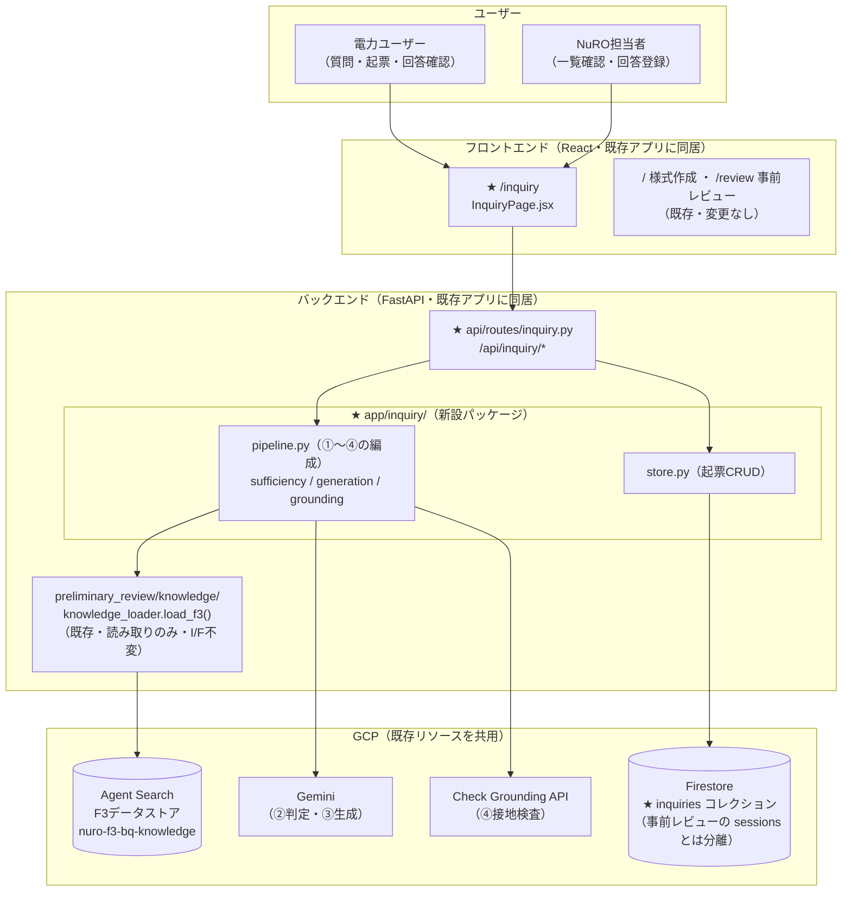
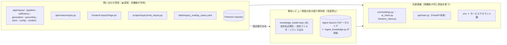
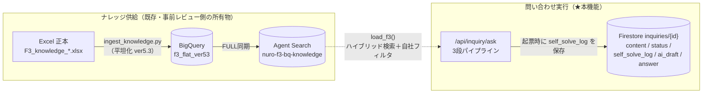
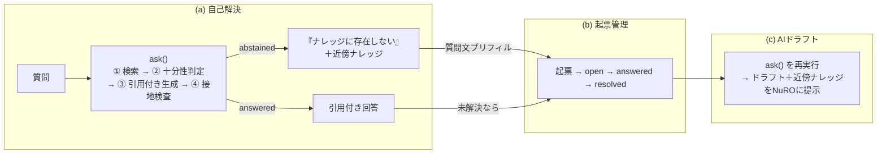

# 問い合わせナレッジ対応自動化 アーキテクチャ

> **最終更新：2026-07-14**（**フェーズ3完了**：`/draft`＋NuRO向けAIドラフト表示。フェーズ1・2も完了済み・残りはフェーズ4評価ハーネス）

本書は問い合わせ機能の「**システムがどういう構造か**」の地図（静的構造・再利用境界・データの置き場）。
処理フロー・関数I/F・APIスキーマの詳細（動的な振る舞い）は [`DESIGN.md`](DESIGN.md) が正本であり、本書では繰り返さない。

| ドキュメント | 役割 |
|---|---|
| [`REQUIREMENTS.md`](REQUIREMENTS.md) | What/Why（正本）— スコープ・コア要件・評価指標 |
| [`DESIGN.md`](DESIGN.md) | How（実装の契約）— 処理フロー・モジュールI/F・APIスキーマ・実装フェーズ |
| **本書 `ARCHITECTURE.md`** | **Map（構造の地図）— 全体構成図・コンポーネント境界・既存資産との関係・実装状況** |

> 事前レビュー側の同種ドキュメントは [`../preliminary_review/ARCHITECTURE.md`](../preliminary_review/ARCHITECTURE.md)。
> 本機能は事前レビューと**基盤（F3ナレッジ・Agent Search・Firestore・Gemini）を共有**するが、**コードは別パッケージ**である。この「共有と分離の境界」が本書の主題。

## 1. 30秒でわかる問い合わせ機能

電力会社ユーザーが廃炉業務の疑問を質問すると、AIが **F3自社ナレッジ（過去の問合せ履歴）だけを根拠に引用付きで回答**する。ナレッジに答えが無ければでっち上げず「存在しない」と明示して**起票（NuROへの問い合わせ）に流す**。起票された問い合わせにはAIがドラフトを付け、NuRO担当者の回答を支援する。

- **(a) 自己解決**：質問 → 3段パイプライン（検索→十分性判定→生成＋接地検査）→ 回答 or 棄却
- **(b) 起票管理**：棄却・未解決 → フォーム起票 → Firestore → NuRO回答 → 解決
- **(c) AIドラフト**：起票された問い合わせに (a) と同一パイプラインでドラフト＋近傍ナレッジを提示

コア命題は「**答えがあるものは引用付きで回答し、無いものは棄却できる**」こと（REQUIREMENTS §0-4）。
このため回答生成を1回のLLM呼び出しに任せず、**②十分性判定と④接地検査の二重ゲート**で棄却を構造的に強制する（DESIGN §1-2）。

## 2. 鳥瞰図：システム全体

登場する箱は「新設するもの（★）」と「既存をそのまま使うもの」の2種類しかない。
既存資産には**一切手を入れない**（変更は `main.py` のルータ登録と `App.jsx` のタブ追加の2行レベルのみ）。

- **★＝新設**はフロント1ページ・ルート1本・バックエンド1パッケージ・Firestoreコレクション1つ。
- GCPリソースは**新設ゼロ**。F3データストア・Gemini・Firestore はすべて既存を共用する（REQUIREMENTS §5）。

## 3. コンポーネント境界：共有と分離のルール

事前レビューと問い合わせは「**データと基盤は共有・コードは分離**」。境界は3層で整理できる。

| 層 | ルール | 根拠 |
|---|---|---|
| 問い合わせ専用 | `app/inquiry/` に集約。事前レビュー側 `preliminary_review/` のコードを**改変しない** | 機能は別・障害と検証を汚染しない（REQUIREMENTS §5） |
| 読み取り再利用 | `load_f3()` を **I/F不変・読み取りのみ**で利用。ナレッジ供給（Excel→BQ→索引）は事前レビュー側パイプラインのまま | 実績ある検索（正規化・自社フィルタ・リランク）を再実装しない（DESIGN D-1） |
| 共通基盤 | 設定・GCP接続・FastAPI本体は `core/` を共用。inquiry 固有の設定だけ `inquiry/config.py` に分離 | 事前レビューの `preliminary_review/config.py` と同じ分離パターン |

**なぜこの境界か**：本番構想は「あらゆる社内資料への横断ナレッジ検索」（REQUIREMENTS §0-3）。検索対象の追加は「データストアを増やして設定で指す」だけで済むよう、F3固有名をパイプラインに埋め込まない（設定駆動・DESIGN §5）。一方でナレッジの供給・索引は資料種別ごとの前処理が本質なので、検索する側（本機能）と供給する側（ingest）を最初から分けておく。

## 4. データの置き場と流れ

事前レビューの「4つの置き場」（Excel正本 → BigQuery → Agent Search → Firestore）のうち、
**前半3つ（ナレッジ供給側）はそのまま共用**し、Firestore に本機能専用のコレクションを1つ足す。

| 置き場 | 本機能での役割 | 所有 |
|---|---|---|
| Excel／BigQuery／Agent Search | F3ナレッジの正本〜検索索引。**読むだけ**（書き戻し(d)はPoC範囲外） | 事前レビュー側 |
| Firestore `inquiries` | 起票・ステータス・NuRO回答・AIドラフト・起票直前のRAG応答ログ（スキーマは DESIGN §4-2） | ★本機能 |

- F3はBigQuery平坦化で**1行=1メッセージ**のため、引用の最小単位は「レコードID＋round＋message_direction」（DESIGN D-9）。
- `self_solve_log`（起票直前の棄却理由・検索ヒット）を残すのは、PoC評価（棄却の妥当性）と将来の (d) ナレッジ書き戻しの入力になるため（REQUIREMENTS §6）。

## 5. 実行時の3つの流れ（概観）

詳細フロー図は DESIGN §1（機能全体・パイプラインsequence・ステータス遷移）にあるため、ここでは3つの流れの関係だけ示す。**(c) は (a) と同一のパイプライン**であること（コードの二重化をしない）が構造上のポイント。

- 二重ゲート（②④）はどちらも「疑わしければ棄却」に倒す。**棄却は失敗ではなく起票への正規フォールバック**（REQUIREMENTS §8）。
- 棄却（正常系）とシステム障害（エラー）は混同しない：検索失敗は502、ゲート失敗は棄却に倒す（DESIGN §6）。
- ①検索が0件なら②をスキップして即棄却（Step 0 実測でB群の大半が検索0件・DESIGN D-7）。

## 6. 実装状況マップ（2026-07-14 時点）

フェーズ計画は DESIGN §7。現在は**フェーズ3（AIドラフト）まで完了**。次はフェーズ4（評価ハーネス）。

| コンポーネント | 状態 | 備考 |
|---|---|---|
| `data/inquiry_eval/qa_cases.yaml` | ✅ 実装済（Step 0） | A群5問＋B群6問（サブカテゴリ付き・D-12） |
| `inquiry/config.py` | ✅ 実装済（Step 1） | TOP_K / MODEL / GROUNDING_THRESHOLD を env 駆動で集約 |
| `inquiry/models.py` | ✅ 実装済（Step 1） | AskResult / Evidence 等。status⇔フィールド整合を Pydantic バリデータで強制 |
| `inquiry/pipeline.py`・`sufficiency.py`・`generation.py`・`grounding.py` | ✅ 実装済（Step 2） | ③は自前生成＝Answer API 不採用（D-2）・文体は条件平叙文（D-13）・検索障害は KnowledgeSearchError 送出（D-14）。ミニ評価：B群誤答0/6・A群5/5（DESIGN §7） |
| `api/routes/inquiry.py`（`/ask`）＋最小UI | ✅ 実装済（Step 3） | 棄却=200・検索障害=502（§6）。UIは `/inquiry`（InquiryPage.jsx）＝質問→回答/棄却表示・起票ボタンはフェーズ2まで無効表示。実サーバE2Eで回答・棄却・422を確認 |
| `inquiry/store.py`＋起票CRUD＋一覧UI | ✅ 実装済（フェーズ2） | Firestore `inquiries`。エンドポイント5本＋UI3画面（`pages/inquiry/` 再編・D-16）・状態遷移は store に集約（D-15）。起票→回答→解決のUI一巡を実サーバE2Eで確認 |
| `/draft`＋NuRO向け表示 | ✅ 実装済（フェーズ3） | `ask()` 再利用（起票時に保存した utility で再実行・D-17）。詳細画面でオンデマンド生成・answered=ドラフト＋根拠／abstained=近傍ナレッジ表示を実サーバE2Eで確認 |
| `scripts/inquiry/eval_inquiry.py` | ⬜ フェーズ4 | REQUIREMENTS §8 の4指標・閾値較正 |

- 各フェーズ完了時に `uv run pytest` で事前レビュー側の回帰が無いことを確認する（DESIGN §7）。
