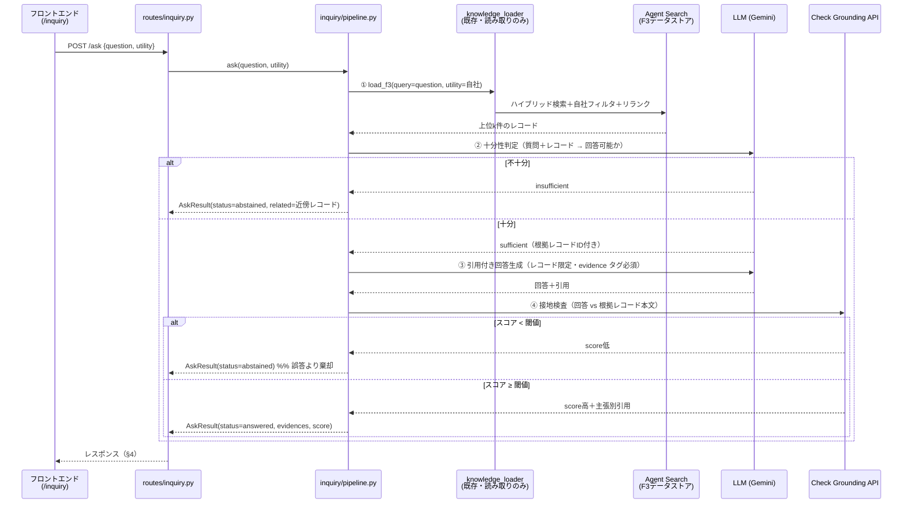
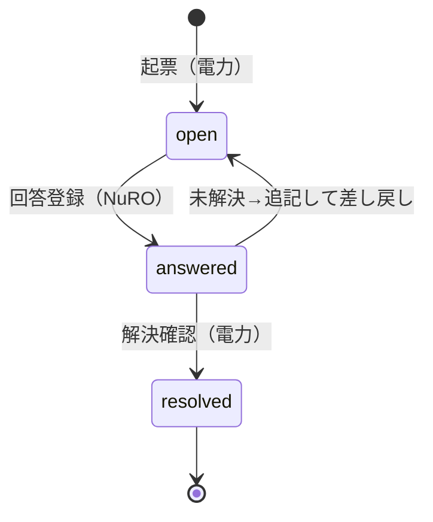

# 問い合わせナレッジ対応自動化 詳細設計書

作成日：2026-07-10
最終更新：2026-07-10（初版ドラフト）
対象：`docs/inquiry/REQUIREMENTS.md` の実装設計（How）

## 本書の位置づけ（すみわけ）

| ドキュメント | 役割 | 書くこと |
|---|---|---|
| `REQUIREMENTS.md` | **What/Why（正本）** | スコープ・コア要件・評価指標・未確定事項 |
| **本書 `DESIGN.md`** | **How（実装の契約）** | 処理フロー・フォルダ構成・モジュールI/F・APIスキーマ・設定の置き場・実装フェーズ |
| `ARCHITECTURE.md` | **Map（構造の地図）** | 全体構成図・コンポーネント境界・既存資産との共有/分離・実装状況マップ |
| （将来）検証ドキュメント | Proof | 実装状況・検証ログ・バックログ（`RAG_VERIFICATION.md` 相当。実装開始後に必要になったら新設） |

> 要件（なぜこの設計か）は本書では繰り返さず `REQUIREMENTS §` を参照する。
> 本書の各I/F・スキーマは**セッション間の契約**であり、変更する場合は本書を先に更新する。

---

## 1. 全体処理フロー

### 1-1. 機能全体（(a)自己解決 → (b)起票 → (c)ドラフト → 回答）

```mermaid
flowchart TB
    subgraph 電力ユーザー
        Q[質問を入力] --> ASK
        SELF{自己解決<br>できた?}
        FILE[起票フォーム<br>質問文プリフィル] --> SUBMIT[問い合わせ登録]
        VIEW[回答を確認]
    end

    subgraph "バックエンド (a) /api/inquiry/ask"
        ASK[3段パイプライン<br>§1-2] -->|answered| ANS[引用付き回答を表示]
        ASK -->|abstained| ABS["「ナレッジに存在しない」<br>＋起票導線"]
    end

    subgraph "バックエンド (b)(c)"
        STORE[(Firestore<br>inquiries)]
        DRAFT[AIドラフト生成<br>= (a)と同一パイプライン]
    end

    subgraph NuRO担当者
        LIST[未回答一覧を確認] --> REPLY[ドラフトを参考に<br>回答を登録]
    end

    ANS --> SELF
    SELF -->|はい| DONE([終了])
    SELF -->|いいえ| FILE
    ABS --> FILE
    SUBMIT --> STORE
    STORE --> LIST
    STORE --> DRAFT --> LIST
    REPLY --> STORE
    STORE --> VIEW
    VIEW -->|未解決| FILE
    VIEW -->|解決| DONE2([終了])
```

### 1-2. 自己解決パイプライン（コア・`/api/inquiry/ask`）

REQUIREMENTS §4-1 の3段パイプライン。**②と④の二重ゲートで棄却を強制**する（設計根拠は REQUIREMENTS §4-1）。



### 1-3. 問い合わせステータス遷移（(b)・最小3状態）



---

## 2. フォルダ構成（新設・変更箇所のみ）

```
apps/backend/app/
├ inquiry/                      # ★新設（事前レビュー preliminary_review/ とは分離・改変しない）
│ ├ __init__.py
│ ├ config.py                   # 閾値・モデル名・top_k（§5。env読み込み＋デフォルト）
│ ├ models.py                   # Pydanticモデル（AskResult / Evidence / Inquiry 等・§4）
│ ├ pipeline.py                 # ①〜④の3段パイプライン（§3-1）。入口 ask()
│ ├ sufficiency.py              # ② 十分性判定（§3-2）
│ ├ generation.py               # ③ 引用付き回答生成（§3-3）
│ ├ grounding.py                # ④ Check Grounding API ラッパ（§3-4）
│ └ store.py                    # Firestore アクセス（inquiries コレクション・§4-2）
├ api/routes/
│ └ inquiry.py                  # ★新設。エンドポイント（§4-1）。main.py に include_router 追加
apps/frontend/src/
├ pages/
│ └ InquiryPage.jsx             # ★新設。質問入力・回答/棄却表示・起票・一覧
└ App.jsx                       # タブ追加 { path: "/inquiry", label: "問い合わせ" }
scripts/inquiry/                # ★新設（運用スクリプト。preliminary_review/ と並列）
└ eval_inquiry.py               # A/B群評価ハーネス（REQUIREMENTS §8。フェーズ4）
data/inquiry_eval/
└ qa_cases.yaml                 # 想定問答（評価シード・Step 0 作成済み✅。A群5問+B群5問）
docs/inquiry/                   # 本ドキュメント群
```

- **既存への変更は2ファイルのみ**（`api/main.py` のルータ登録・`App.jsx` のタブ追加）。
- ナレッジアクセスは `preliminary_review/knowledge/knowledge_loader.py` の **`load_f3()` を読み取りで再利用**
  （会社名正規化・自社フィルタ・Ranking API 適用済みの実績ある検索。**I/F不変・改変しない**）。

---

## 3. モジュール設計（関数I/F＝契約）

### 3-1. `pipeline.py` — 入口

```python
def ask(question: str, utility: str, *, top_k: int | None = None) -> AskResult:
    """3段パイプラインを実行して回答 or 棄却を返す。
    utility: 問い合わせ元電力会社名（自社フィルタに使用。正規化は load_f3 側）。
    例外方針は §6（検索失敗=例外送出／判定・検査失敗=棄却に倒す）。
    """
```

- `AskResult`（models.py・§4-1 のレスポンスと同型）：
  `status: Literal["answered", "abstained"]` / `answer: str | None` /
  `evidences: list[Evidence]` / `grounding_score: float | None` /
  `related: list[Evidence]`（棄却時の近傍ナレッジ・(c)ドラフトでも使用） /
  `abstain_reason: Literal["insufficient_context", "low_grounding", "gate_error"] | None` /
  `failed_stage: Literal["sufficiency", "generation", "grounding"] | None`
  （gate_error 時にどのゲートで落ちたか。評価・閾値較正の分析用）
  - status⇔フィールドの整合（answered→answer必須／abstained→abstain_reason必須 等）は
    Pydantic バリデータで強制し、矛盾状態を Firestore に保存させない。

### 3-2. `sufficiency.py` — ② 十分性判定

```python
def check_sufficiency(question: str, records: list[dict]) -> SufficiencyResult:
    """検索結果 records で question に回答できるかを独立LLM判定。
    返り値: sufficient: bool / usable_record_ids: list[str] / reason: str
    判定プロンプトは「部分的にしか答えられない場合は insufficient 側に倒す」を明示。
    """
```

### 3-3. `generation.py` — ③ 引用付き回答生成

```python
def generate_answer(question: str, records: list[dict]) -> GeneratedAnswer:
    """usable_record_ids のレコード本文のみを根拠に回答を生成。
    回答内の主張には evidence タグ（[F3#<record_id>]・事前レビューの evidence 記法と統一）を必須とし、
    タグの無い主張・レコード外の情報は出力しないようプロンプトで制約。
    返り値: answer: str / cited_record_ids: list[str]
    """
```

- **第一候補は Agent Search Answer API**（引用を構造化取得・REQUIREMENTS §4-2）。
  その場合 `generate_answer` の内部実装が Answer API 呼び出しになるだけで、本I/Fは不変。
- **フェーズ1で Answer API の引用粒度を検証**し、要件（ファイル/シート/レコード単位）を満たさなければ
  自前生成（LLM＋evidenceタグ）へ切替える。切替判断は本書を更新して記録する。

### 3-4. `grounding.py` — ④ 接地検査

```python
def check_grounding(answer: str, records: list[dict]) -> GroundingResult:
    """Check Grounding API で answer が records に支持される度合いを検査。
    返り値: score: float（0〜1）/ claim_citations: list[ClaimCitation]
    score < INQUIRY_GROUNDING_THRESHOLD なら pipeline 側で棄却に切替。
    """
```

### 3-5. `store.py` — Firestore

```python
def create_inquiry(inquiry: InquiryCreate) -> str            # 採番して保存、inquiry_id を返す
def list_inquiries(*, requester: str | None = None) -> list[Inquiry]   # 電力=自分の分/NuRO=全件
def get_inquiry(inquiry_id: str) -> Inquiry
def save_answer(inquiry_id: str, answer: AnswerCreate) -> None          # status: open→answered
def save_draft(inquiry_id: str, draft: AskResult) -> None
def update_status(inquiry_id: str, status: InquiryStatus) -> None
```

---

## 4. データ契約

### 4-1. APIスキーマ（REQUIREMENTS §7 のエンドポイントの入出力確定版）

**POST `/api/inquiry/ask`**

```jsonc
// リクエスト
{ "question": "〇〇タンクは支払い対象でしょうか", "utility": "関東電力" }

// レスポンス（回答時）
{
  "status": "answered",
  "answer": "…（引用タグ付き回答文）…",
  "evidences": [
    { "record_id": "03_KT_1G_01_0002", "sheet": "KNI_1G_01",
      "snippet": "…該当箇所の抜粋…", "score": 0.92,
      "source_file": "F3_knowledge_関東電力.xlsx",  // 任意（BQ平坦化に原本ファイル名列が無いため導出できる場合のみ）
      "round": 1, "message_direction": "denryoku" }  // D-9 引用単位（実データ語彙は nuro/denryoku）
  ],
  "grounding_score": 0.87,
  "related": [], "abstain_reason": null, "failed_stage": null
}

// レスポンス（棄却時）
{
  "status": "abstained",
  "answer": null, "evidences": [], "grounding_score": null,
  "related": [ /* 近傍ナレッジ（Evidence同型）。起票時の参考・(c)ドラフトに転用 */ ],
  "abstain_reason": "insufficient_context",
  "failed_stage": null   // abstain_reason="gate_error" 時のみ ②③④ のどれかを記録（分析用）
}
```

**POST `/api/inquiry`**：`{ category, content, requester }` → `{ inquiry_id, number }`
**GET `/api/inquiry`**：`?requester=` で絞り込み → `Inquiry[]`
**POST `/api/inquiry/{id}/answer`**：`{ content, answered_by }` → `204`
**POST `/api/inquiry/{id}/draft`**：body なし（保存済み content で `ask()` 再実行）→ `AskResult`

### 4-2. Firestore スキーマ（REQUIREMENTS §6 の「案」の確定版）

```
inquiries/{inquiry_id}
  number:        string   # "0001"（採番はトランザクションでカウンタ管理）
  category:      string   # "質問" 等（PoCは自由入力でよい）
  content:       string
  requester:     string   # 電力ユーザー識別子（方式は REQUIREMENTS §9-2 未確定→暫定は表示名）
  status:        string   # "open" | "answered" | "resolved"（§1-3）
  created_at / updated_at: timestamp
  self_solve_log: map     # 起票直前の AskResult（棄却理由・検索ヒット。評価と将来(d)の入力）
  ai_draft:      map      # AskResult 同型（(c)。再生成で上書き）
  answer:        map      # { content, answered_by, answered_at }
```

---

## 5. 設定の置き場所（ハードコード禁止の担保）

`inquiry/config.py` が env を読み、デフォルトを持つ。**閾値・モデル・k値をコードに直書きしない。**

| 設定 | env | デフォルト | 用途 |
|---|---|---|---|
| 検索件数 | `INQUIRY_TOP_K` | `10` | ① load_f3 の件数 |
| 接地スコア閾値 | `INQUIRY_GROUNDING_THRESHOLD` | `0.6`（仮・評価で較正） | ④ゲート |
| 生成モデル | `INQUIRY_MODEL` | 事前レビューと同一モデル | ②③ |
| F3データストア | 既存の事前レビュー用 env を共用 | — | ① |

- 検索対象データストアの指定は**設定駆動**とし、F3固有名をパイプラインに埋め込まない
  （本番の資料種別追加に備える・REQUIREMENTS §4-4）。

---

## 6. エラー・フォールバック方針

**原則：「答えがない（棄却）」と「システム障害（エラー）」を混同しない。**
棄却は正常系（起票に流す）、障害はエラー表示（起票を誘発させない）。

| 障害箇所 | 挙動 | 理由 |
|---|---|---|
| ① Agent Search 検索失敗 | **HTTP 502 エラー** | 「ナレッジなし」と誤認させると偽の棄却になる |
| ② 十分性判定の LLM 失敗 | **棄却に倒す**（`abstain_reason="gate_error"`） | 誤答リスクより棄却。UIは「検証未完了のため起票を推奨」と表示 |
| ③ 生成失敗 | 同上（棄却に倒す） | 同上 |
| ④ Check Grounding 失敗 | 同上（棄却に倒す） | ゲート不通過の回答は出さない |
| Firestore 失敗（(b)） | HTTP 502 エラー | 起票消失を隠さない |

---

## 7. 実装フェーズと完了条件

コア検証命題（REQUIREMENTS §0-4＝棄却の実証）を最初に検証できる順に実装する。

| フェーズ | 内容 | 完了条件 |
|---|---|---|
| **1. コアパイプライン** | `inquiry/`（①〜④）＋ `/ask` ＋ 最小UI（質問→回答/棄却表示） | 手元のミニ評価（A群・B群 各5問程度）で**B群の誤答0件**を確認。Answer API の引用粒度判定（§3-3）を完了し本書に記録 |
| 2. 起票管理 | `store.py`＋CRUDエンドポイント＋一覧・詳細UI・棄却→起票プリフィル導線 | 起票→NuRO回答→解決の一巡が UI で通る |
| 3. AIドラフト | `/draft`（`ask()` 再利用）＋NuRO向け表示 | 起票済み問い合わせにドラフト＋近傍ナレッジが表示される |
| 4. 評価ハーネス | `scripts/inquiry/eval_inquiry.py`（A/B群・REQUIREMENTS §8 の4指標を出力） | 評価セットで指標が算出され、閾値（§5）の較正根拠が得られる |

- 各フェーズ完了時に `uv run pytest` の回帰を確認（事前レビュー側を壊していないこと）。
- 影響の大きいフェーズ1完了時にコードレビューを1回（CLAUDE.md エージェント方針）。

---

## 8. 設計判断の記録

| # | 判断 | 理由 | 状態 |
|---|---|---|---|
| D-1 | ①の検索は `load_f3()` 再利用（新規検索実装をしない） | 自社フィルタ・正規化・リランク済みの実績。I/F不変で読み取りのみ | 確定 |
| D-2 | ③は Answer API 第一候補、引用粒度が不足なら自前生成へ切替 | REQUIREMENTS §4-2。粒度検証はフェーズ1 | **フェーズ1で判定** |
| D-3 | 棄却は②④の二重ゲートで強制（モデルの自制に頼らない） | REQUIREMENTS §4-1（Sufficient Context / AbstentionBench） | 確定 |
| D-4 | 棄却とエラーを区別（§6） | 偽の棄却は評価指標（誤棄却）と起票品質を汚す | 確定 |
| D-5 | evidence 記法は事前レビューと統一（`[F3#record_id]`） | 横断での可読性・将来の還流(d)との整合 | 確定 |
| D-6 | 文脈焼き込み（`ingest_knowledge.py` 拡張）は**当面不要** | Step 0 実測（2026-07-10）：自然文質問で A群 5/5 が TOP1 ヒット。既存ハイブリッド検索＋リランクで十分 | 確定（評価拡充時に再判定可） |
| D-7 | ①検索が**0件なら②をスキップして即棄却**（ショートカット） | Step 0 実測：B群 5問中4問が検索0件。LLM判定不要で高速・安価に棄却できる。②は「ヒットするが答えでない」ハードネガティブ（B-4型）用 | 確定 |
| D-8 | 評価セットは `data/inquiry_eval/qa_cases.yaml`（Step 0 で10問作成・実データ由来） | フェーズ1ミニ評価とフェーズ4ハーネスの共通入力。拡充時も同形式 | 確定 |
| D-9 | 引用の最小単位は「レコードID＋round＋message_direction」 | F3はBigQuery平坦化で**1行=1メッセージ**（確認/回答×回数）のため、同一IDが複数ヒットする。表示・重複排除はこの単位で行う | 確定 |
| D-10 | 合成F3（架空電力）の追加は**フェーズ4まで保留** | 現データで検索検証は成立。追加するなら Tool2b（F3他社検索）への混入で事前レビュー検証を汚さない方式（別データストア等）を先に決める | 保留 |
| D-11 | Evidence の `source_file` は**任意**・`message_direction` の語彙は**実データの `nuro`/`denryoku`**（日本語化は表示層）・record_id は案件ID（メッセージ単位キーは `_doc_id`＝message_id） | Step 1 レビュー（2026-07-11）：BQ平坦化テーブルに原本ファイル名の列が無く、direction の実語彙は excel_reader `_infer_direction` 由来。load_f3 キー→Evidence の対応表は models.py docstring に明記 | 確定 |
| D-12 | B群評価セットにサブカテゴリ (i)F3全体に無い (ii)自社ヒットするが答えでない (iii)他社F3にはあるが自社に無い、を持たせる（B-6追加・計11問） | REQUIREMENTS §8 の「他社F3にしかない話題を含む」の実装。(iii) が自社フィルタ破損の検出器になる | 確定 |
