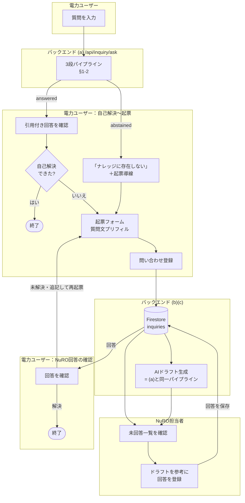
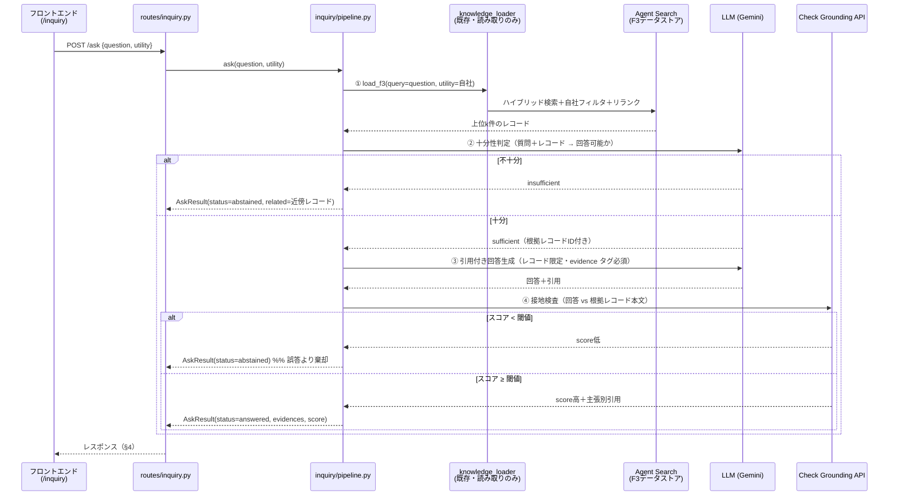
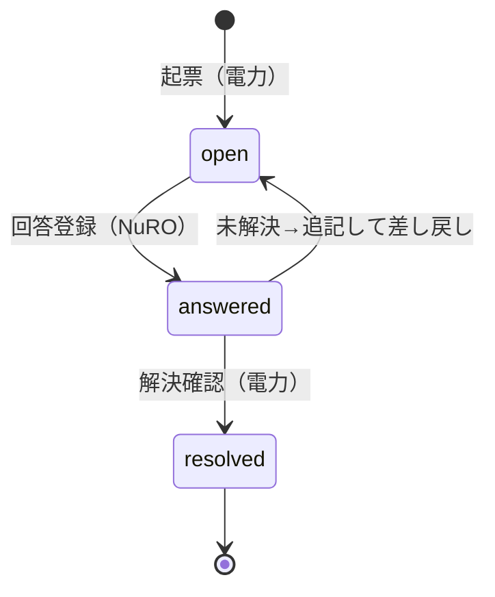

# 問い合わせナレッジ対応自動化 詳細設計書

作成日：2026-07-10
最終更新：2026-07-14（フェーズ4完了記録・D-18（評価ハーネスの決定論判定）追加＝**全フェーズ完了**）
対象：`docs/inquiry/REQUIREMENTS.md` の実装設計（How）

## 本書の位置づけ（すみわけ）

| ドキュメント | 役割 | 書くこと |
|---|---|---|
| `REQUIREMENTS.md` | **What/Why（正本）** | スコープ・コア要件・評価指標・未確定事項 |
| **本書 `DESIGN.md`** | **How（実装の契約）** | 処理フロー・フォルダ構成・モジュールI/F・APIスキーマ・設定の置き場・実装フェーズ |
| `ARCHITECTURE.md` | **Map（構造の地図）** | 全体構成図・コンポーネント境界・既存資産との共有/分離・実装状況マップ |
| （将来）検証ドキュメント | Proof | 実装状況・検証ログ・バックログ（`RAG_VERIFICATION.md` 相当。実装開始後に必要になったら新設） |

> 要件（なぜこの設計か）は本書では繰り返さず `REQUIREMENTS §` を参照する。
> 本書の各I/F・スキーマは**セッション間の契約**であり、変更する場合は本書を先に更新する。

---

## 1. 全体処理フロー

### 1-1. 機能全体（(a)自己解決 → (b)起票 → (c)ドラフト → 回答）



### 1-2. 自己解決パイプライン（コア・`/api/inquiry/ask`）

REQUIREMENTS §4-1 の3段パイプライン。**②と④の二重ゲートで棄却を強制**する（設計根拠は REQUIREMENTS §4-1）。



### 1-3. 問い合わせステータス遷移（(b)・最小3状態）



---

## 2. フォルダ構成（新設・変更箇所のみ）

```
apps/backend/app/
├ inquiry/                      # ★新設（事前レビュー preliminary_review/ とは分離・改変しない）
│ ├ __init__.py
│ ├ config.py                   # 閾値・モデル名・top_k（§5。env読み込み＋デフォルト）
│ ├ models.py                   # Pydanticモデル（AskResult / Evidence / Inquiry 等・§4）
│ ├ pipeline.py                 # ①〜④の3段パイプライン（§3-1）。入口 ask()
│ ├ sufficiency.py              # ② 十分性判定（§3-2）
│ ├ generation.py               # ③ 引用付き回答生成（§3-3）
│ ├ grounding.py                # ④ Check Grounding API ラッパ（§3-4）
│ └ store.py                    # Firestore アクセス（inquiries コレクション・§4-2）
├ api/routes/
│ └ inquiry.py                  # ★新設。エンドポイント（§4-1）。main.py に include_router 追加
apps/frontend/src/
├ pages/inquiry/                # ★フェーズ2で pages/InquiryPage.jsx をディレクトリに再編（1画面→3画面のため）
│ ├ api.js                      # /api/inquiry の fetch ラッパ（エンドポイント・エラー整形の一元管理）
│ ├ shared.jsx                  # 共通部品（カラートークン・EvidenceCard・簡易ユーザー識別 useIdentity・共通レイアウト）
│ ├ InquiryPage.jsx             # /inquiry：質問入力・回答/棄却表示・起票フォーム（フェーズ1UIを移設）
│ ├ InquiryListPage.jsx         # /inquiry/tickets：問い合わせ一覧（電力=自分の分／NuRO=全件）
│ └ InquiryDetailPage.jsx       # /inquiry/tickets/:id：詳細・NuRO回答登録・解決/差し戻し
└ App.jsx                       # タブ追加 { path: "/inquiry", label: "問い合わせ" }（配下パスもアクティブ表示）
scripts/inquiry/                # ★新設（運用スクリプト。preliminary_review/ と並列）
└ eval_inquiry.py               # A/B群評価ハーネス（REQUIREMENTS §8。フェーズ4）
data/inquiry_eval/
└ qa_cases.yaml                 # 想定問答（評価シード・Step 0 作成済み✅。A群5問+B群5問）
docs/inquiry/                   # 本ドキュメント群
```

- **既存への変更は3ファイルのみ**（`api/main.py` のルータ登録・`App.jsx` のタブ追加・
  `main.jsx` のルート追加。ほかに D-14 の `knowledge_loader` へのオプション引数追加のみ）。
- ナレッジアクセスは `preliminary_review/knowledge/knowledge_loader.py` の **`load_f3()` を読み取りで再利用**
  （会社名正規化・自社フィルタ・Ranking API 適用済みの実績ある検索。**I/F不変・改変しない**）。

---

## 3. モジュール設計（関数I/F＝契約）

### 3-1. `pipeline.py` — 入口

```python
def ask(question: str, utility: str, *, top_k: int | None = None) -> AskResult:
    """3段パイプラインを実行して回答 or 棄却を返す。
    utility: 問い合わせ元電力会社名（自社フィルタに使用。正規化は load_f3 側）。
    例外方針は §6（検索失敗=例外送出／判定・検査失敗=棄却に倒す）。
    """
```

- `AskResult`（models.py・§4-1 のレスポンスと同型）：
  `status: Literal["answered", "abstained"]` / `answer: str | None` /
  `evidences: list[Evidence]` / `grounding_score: float | None` /
  `related: list[Evidence]`（棄却時の近傍ナレッジ・(c)ドラフトでも使用） /
  `abstain_reason: Literal["insufficient_context", "low_grounding", "gate_error"] | None` /
  `failed_stage: Literal["sufficiency", "generation", "grounding"] | None`
  （gate_error 時にどのゲートで落ちたか。評価・閾値較正の分析用）
  - status⇔フィールドの整合（answered→answer必須／abstained→abstain_reason必須 等）は
    Pydantic バリデータで強制し、矛盾状態を Firestore に保存させない。

### 3-2. `sufficiency.py` — ② 十分性判定

```python
def check_sufficiency(question: str, records: list[dict]) -> SufficiencyResult:
    """検索結果 records で question に回答できるかを独立LLM判定。
    返り値: sufficient: bool / usable_record_ids: list[str] / reason: str
    判定プロンプトは「部分的にしか答えられない場合は insufficient 側に倒す」を明示。
    """
```

### 3-3. `generation.py` — ③ 引用付き回答生成

```python
def generate_answer(question: str, records: list[dict]) -> GeneratedAnswer:
    """usable_record_ids のレコード本文のみを根拠に回答を生成。
    回答内の主張には evidence タグ（[F3#<record_id>]・事前レビューの evidence 記法と統一）を必須とし、
    タグの無い主張・レコード外の情報は出力しないようプロンプトで制約。
    返り値: answer: str / cited_record_ids: list[str]
    """
```

- ~~第一候補は Agent Search Answer API~~ → **自前生成（LLM＋evidenceタグ）に確定**（D-2・2026-07-13）。
  フェーズ1スパイクで F3 BQ エンジンの Answer API は
  `400 This feature is only available when Large Language Model add-on is enabled` となり使用不可。
  引用は evidence タグのパース＋検索レコードとの突合で構造化する（引用のでっち上げは
  「タグが検索レコードIDと一致しない場合は引用として採用しない」ことで排除）。
- **文体制約（D-13）**：回答の1文目は「〜の場合、〜が必要です」の**条件平叙文（直接回答型）**にする。
  Check Grounding API は文単位で検査要否を分類し、検査対象の主張が無い回答は score=0 で
  ④を通過できない。条件平叙文は確実に検査対象になる一方、メタ言及（「〜と記録されています」）・
  過去の個別事象の再叙述・指示形の例示は検査対象外に分類されやすい（実測）。

### 3-4. `grounding.py` — ④ 接地検査

```python
def check_grounding(answer: str, records: list[dict]) -> GroundingResult:
    """Check Grounding API で answer が records に支持される度合いを検査。
    返り値: score: float（0〜1）/ claim_citations: list[ClaimCitation]
    score < INQUIRY_GROUNDING_THRESHOLD なら pipeline 側で棄却に切替。
    """
```

### 3-5. `store.py` — Firestore

```python
def create_inquiry(inquiry: InquiryCreate) -> Inquiry        # 採番して保存、保存済み文書を返す（書込後の再読取をさせない）
def list_inquiries(*, requester: str | None = None) -> list[Inquiry]   # 電力=自分の分/NuRO=全件
def get_inquiry(inquiry_id: str) -> Inquiry                  # 無ければ InquiryNotFoundError
def save_answer(inquiry_id: str, answer: AnswerCreate) -> None          # status: open→answered
def save_draft(inquiry_id: str, draft: AskResult) -> None
def update_status(inquiry_id: str, status: InquiryStatus) -> None       # §1-3 外の遷移は InvalidTransitionError
```

- **状態遷移の検証は store.py に置く**（ルート層でなく）：§1-3 に無い遷移は
  `InvalidTransitionError` を送出し、ルート層が 409 に変換する。フェーズ3の `/draft` や
  将来の呼び出し元が増えても遷移ルールが一箇所に留まる（D-15）。
- コレクション名は `config.py` の `INQUIRY_FIRESTORE_COLLECTION`（デフォルト `inquiries`）。
  採番カウンタは同コレクション外の `inquiry_counters/{collection名}` に置き、
  トランザクションでインクリメントする（一覧クエリにカウンタ文書が混ざらない）。

---

## 4. データ契約

### 4-1. APIスキーマ（REQUIREMENTS §7 のエンドポイントの入出力確定版）

**POST `/api/inquiry/ask`**

```jsonc
// リクエスト
{ "question": "〇〇タンクは支払い対象でしょうか", "utility": "関東電力" }

// レスポンス（回答時）
{
  "status": "answered",
  "answer": "…（引用タグ付き回答文）…",
  "evidences": [
    { "record_id": "03_KT_1G_01_0002", "sheet": "KNI_1G_01",
      "snippet": "…該当箇所の抜粋…", "score": 0.92,
      "source_file": "F3_knowledge_関東電力.xlsx",  // 任意（BQ平坦化に原本ファイル名列が無いため導出できる場合のみ）
      "round": 1, "message_direction": "denryoku" }  // D-9 引用単位（実データ語彙は nuro/denryoku）
  ],
  "grounding_score": 0.87,
  "related": [], "abstain_reason": null, "failed_stage": null
}

// レスポンス（棄却時）
{
  "status": "abstained",
  "answer": null, "evidences": [], "grounding_score": null,
  "related": [ /* 近傍ナレッジ（Evidence同型）。起票時の参考・(c)ドラフトに転用 */ ],
  "abstain_reason": "insufficient_context",
  "failed_stage": null   // abstain_reason="gate_error" 時のみ ②③④ のどれかを記録（分析用）
}
```

**POST `/api/inquiry`**：`{ category, content, requester, utility?, self_solve_log? }` → `201 { inquiry_id, number }`
（`self_solve_log` は起票直前の `AskResult`。棄却→起票導線で自動添付・§4-2。
　`utility` は起票者の電力会社名＝`/draft` の `ask()` 再実行に必要（D-17）。フロントは必ず送る）
**GET `/api/inquiry`**：`?requester=` で絞り込み → `Inquiry[]`（`updated_at` 降順）
**GET `/api/inquiry/{id}`**：詳細1件 → `Inquiry`（無ければ `404`）
**POST `/api/inquiry/{id}/answer`**：`{ content, answered_by }` → `204`（`open`→`answered`。それ以外の状態は `409`）
**PATCH `/api/inquiry/{id}/status`**：`{ "status": "resolved" | "open" }` → `204`
（§1-3 の電力側遷移専用：`answered`→`resolved`＝解決確認／`answered`→`open`＝差し戻し。
　それ以外の遷移は `409`。`open`→`answered` は `/answer` のみが行う＝回答なしの answered を作らせない）
**POST `/api/inquiry/{id}/draft`**：body なし（保存済み content＋utility で `ask()` 再実行）→ `AskResult`
（棄却ドラフトも 200 の正常系＝`related` の近傍ナレッジが NuRO の参考情報。
　`utility` 未保存の文書（D-17 以前の起票）は `409`・検索障害は `/ask` と同じ `502`）

### 4-2. Firestore スキーマ（REQUIREMENTS §6 の「案」の確定版）

```
inquiries/{inquiry_id}
  number:        string   # "0001"（採番はトランザクションでカウンタ管理）
  category:      string   # "質問" 等（PoCは自由入力でよい）
  content:       string
  requester:     string   # 電力ユーザー識別子（方式は REQUIREMENTS §9-2 未確定→暫定は表示名）
  utility:       string?  # 起票者の電力会社名（/draft の自社フィルタ用・D-17。旧文書は無し）
  status:        string   # "open" | "answered" | "resolved"（§1-3）
  created_at / updated_at: timestamp
  self_solve_log: map     # 起票直前の AskResult（棄却理由・検索ヒット。評価と将来(d)の入力）
  ai_draft:      map      # AskResult 同型（(c)。再生成で上書き）
  answer:        map      # { content, answered_by, answered_at }
```

---

## 5. 設定の置き場所（ハードコード禁止の担保）

`inquiry/config.py` が env を読み、デフォルトを持つ。**閾値・モデル・k値をコードに直書きしない。**

| 設定 | env | デフォルト | 用途 |
|---|---|---|---|
| 検索件数 | `INQUIRY_TOP_K` | `10` | ① load_f3 の件数 |
| 文脈補完の有効化 | `INQUIRY_EXPAND_CASE_CONTEXT` | `1`（`0`で無効） | ①後の同一案件往復メッセージ補完（D-19。無効化は前後比較・切り戻し用） |
| 文脈補完の対象案件数 | `INQUIRY_EXPAND_MAX_CASES` | `3` | 補完の追加検索コール数の上限（検索上位から） |
| 接地スコア閾値 | `INQUIRY_GROUNDING_THRESHOLD` | `0.6`（仮・評価で較正） | ④ゲート |
| 生成モデル | `INQUIRY_MODEL` | 事前レビューと同一モデル | ②③ |
| F3データストア | 既存の事前レビュー用 env を共用 | — | ① |

- 検索対象データストアの指定は**設定駆動**とし、F3固有名をパイプラインに埋め込まない
  （本番の資料種別追加に備える・REQUIREMENTS §4-4）。

---

## 6. エラー・フォールバック方針

**原則：「答えがない（棄却）」と「システム障害（エラー）」を混同しない。**
棄却は正常系（起票に流す）、障害はエラー表示（起票を誘発させない）。

| 障害箇所 | 挙動 | 理由 |
|---|---|---|
| ① Agent Search 検索失敗 | **HTTP 502 エラー** | 「ナレッジなし」と誤認させると偽の棄却になる |
| ② 十分性判定の LLM 失敗 | **棄却に倒す**（`abstain_reason="gate_error"`） | 誤答リスクより棄却。UIは「検証未完了のため起票を推奨」と表示 |
| ③ 生成失敗 | 同上（棄却に倒す） | 同上 |
| ④ Check Grounding 失敗 | 同上（棄却に倒す） | ゲート不通過の回答は出さない |
| Firestore 失敗（(b)） | HTTP 502 エラー | 起票消失を隠さない |

---

## 7. 実装フェーズと完了条件

コア検証命題（REQUIREMENTS §0-4＝棄却の実証）を最初に検証できる順に実装する。

| フェーズ | 内容 | 完了条件 |
|---|---|---|
| **1. コアパイプライン** | `inquiry/`（①〜④）＋ `/ask` ＋ 最小UI（質問→回答/棄却表示） | 手元のミニ評価（A群・B群 各5問程度）で**B群の誤答0件**を確認。Answer API の引用粒度判定（§3-3）を完了し本書に記録 |
| 2. 起票管理 | `store.py`＋CRUDエンドポイント＋一覧・詳細UI・棄却→起票プリフィル導線 | 起票→NuRO回答→解決の一巡が UI で通る |
| 3. AIドラフト | `/draft`（`ask()` 再利用）＋NuRO向け表示 | 起票済み問い合わせにドラフト＋近傍ナレッジが表示される |
| 4. 評価ハーネス | `scripts/inquiry/eval_inquiry.py`（A/B群・REQUIREMENTS §8 の4指標を出力） | 評価セットで指標が算出され、閾値（§5）の較正根拠が得られる |

- 各フェーズ完了時に `uv run pytest` の回帰を確認（事前レビュー側を壊していないこと）。
- 影響の大きいフェーズ1完了時にコードレビューを1回（CLAUDE.md エージェント方針）。

**フェーズ1 Step 2（パイプライン①〜④）のミニ評価実績（2026-07-13・qa_cases.yaml 11問）**：
- **B群 誤答 0/6（3run とも）**＝コア検証命題を充足。全ケース `insufficient_context` で棄却
  （(i) は D-7 の0件ショートカット、ハードネガティブ B-4/B-6 は②ゲートで棄却）。
- A群 正答 5/5（D-13 修正後。修正前の事実報告型プロンプトでは④の誤棄却で 2/5）。
  A-4 のみ②の判定が run 間で振れる境界ケース（insufficient 側に倒れる分には誤答にならない。
  フェーズ4の評価ハーネスで継続計測）。
- Step 3（2026-07-13）：`/api/inquiry/ask`＋最小UI（`/inquiry`）を実装し**フェーズ1完了**。
  実サーバE2Eで回答（A-1・接地0.90）・棄却（B-1）・バリデーション422を確認。
  棄却時UIの起票ボタンはフェーズ2まで無効表示（プリフィル内容のプレビューのみ）。

**フェーズ2（起票管理）完了記録（2026-07-13）**：
- `store.py`＋起票管理エンドポイント5本（§4-1）＋UI3画面（§2 の `pages/inquiry/` 再編）を実装。
- テスト：`test_store.py` 14件（採番・遷移・不存在）／`test_routes.py` 拡張（404/409/422/502 変換）。
  inquiry 計66件パス・全体回帰は既存の転記側17件失敗のみ（inquiry/事前レビューに影響なし）。
- 実サーバE2E（`INQUIRY_FIRESTORE_COLLECTION=inquiries_e2e` で本体データと分離・検証後削除）：
  - API一巡：起票(201/No.0001)→open時resolve=409→回答(204)→再回答=409→差し戻し(204)→再回答(204)→解決(204)→404。
  - **UI一巡（完了条件充足）**：質問（B群・棄却）→起票フォーム（プリフィル＋self_solve_log添付）→
    起票(No.0002)→NuROロールで一覧（未回答1件）→詳細で回答登録→電力ロールで解決確認→resolved。

**フェーズ3（AIドラフト）完了記録（2026-07-14）**：
- `POST /api/inquiry/{id}/draft`（§4-1）＋詳細画面の NuRO向け「AIドラフト」セクション
  （オンデマンド生成・再生成上書き。answered=ドラフト本文＋接地スコア＋根拠レコード／
  abstained=棄却理由＋近傍ナレッジ）を実装。前提として起票時の `utility` 永続化を D-17 で確定。
- テスト：`test_routes.py` に draft 系6件（answered/abstained=200・404・utility無し=409・
  検索障害/Firestore障害=502）＋`test_store.py` に utility 保存検証。inquiry 計73件パス・
  全体回帰は既存の転記側17件失敗のみ（inquiry/事前レビューに影響なし）。
- 実サーバE2E（`INQUIRY_FIRESTORE_COLLECTION=inquiries_e2e` で本体データと分離・検証後削除）：
  - API：B群起票→`/draft`=棄却ドラフト保存（status=open 不変）／A群起票→`/draft`=answered
    （接地0.94・根拠2件）保存／utility 無し旧文書=409 を確認。
  - **UI一巡（完了条件充足）**：NuROロールで詳細→「AIドラフトを生成」→ハードネガティブ
    （B-4型）で棄却ドラフト＋近傍ナレッジ3件表示・A群で answered ドラフト＋根拠2件＋
    接地スコア表示・生成後はボタンが「再生成」に切替を確認。

**フェーズ4（評価ハーネス）完了記録（2026-07-14）**：
- `scripts/inquiry/eval_inquiry.py` を実装（2軸・決定論判定＝D-18）。**全フェーズ完了**。
- **軸①検索精度**：A群5問すべて正解が最良1位（Agent Search ハイブリッド＋Ranking API）・
  B群(i)は3問とも0件・(ii)(iii)ハードネガティブは想定どおりヒット・**他社レコード混入ゼロ**
  （自社フィルタ正常＝D-12 の検出器が機能）。
- **軸② 4指標（11問×3run）**：正答率 **15/15=100%**（仮目標80%）・引用正確性 15/15=100%
  （仮目標90%）・棄却率 18/18=100%（仮目標90%）・**誤答率 0/18=0%**（コア命題 §0-4 充足）。
- **閾値較正の根拠（§5）**：answered の接地スコアは 0.73〜0.95（最低は A-5）。現行
  `INQUIRY_GROUNDING_THRESHOLD=0.6` は下側マージン 0.13 で妥当・引き上げる場合も 0.7 が上限。
  棄却経路の内訳は 0件即棄却(D-7)=12・②ゲート=6（④での棄却は未観測）。応答時間 平均2.9s/最大6.6s。
- **計測から得た知見**：
  - 初回計測（Vertex AI 429 クォータ枯渇と同時間帯）では A-4 が3/3誤棄却・正答率67%。
    再計測（負荷正常時）で 100% に回復＝A-4 の②判定の振れは負荷状況と相関。
    ②プロンプトの調整は全PASS 状態では過剰適合になるため見送り（横断ルール）。
  - 評価中に `core/ai_client.py` の **NameError（未定義 `_extract_finish_reason`）を発見・修正**
    （空応答時のエラーパスが壊れており finish_reason 診断が失われていた。同ファイル既存イディオムで修正）。
- ~~バックログ：同一案件IDの往復メッセージ補完~~ → **UI実機で A-4 の誤棄却が再現されたため
  前倒しで導入した（下記追補・D-19）**。

**フェーズ4追補：案件単位の文脈補完（D-19/D-20・2026-07-14）**：
- 経緯：A-4 の誤棄却（②）がUI実機で再現→D-19（往復メッセージ補完）導入→②は通過するが
  **今度は④で棄却**→Check Grounding をプローブで解剖し2つの挙動を特定（複合主張化 score=0.007・
  メッセージ単位 fact では会話をまたぐ関係が検証不能 score=0.50）→D-20（④入力の整形）を導入。
- **前後比較（11問×3run）**：導入後も4指標オールPASS（正答率15/15=100%・誤答率0/18=0%・
  引用正確性18/18・棄却率18/18）。**A-4 は3/3正答（接地0.87〜0.88）に安定**。
  B-4/B-6 ハードネガティブは補完で材料が増えても②棄却を維持＝安全側は不変。
- 副次効果：A-5 が2案件引用（03_KT_2G_0001＋0004・どちらも正解群）に改善。一方で接地スコアは
  run により 0.63（閾値0.6 と接近）→**④閾値を較正で引き上げる場合は 0.6 近傍が上限**（要注視）。
- コスト：応答時間 平均2.9s→4.8s・最大9.8s（案件ID再検索 最大3コール＋②③の入力増。§9-6 未確定）。

---

## 8. 設計判断の記録

| # | 判断 | 理由 | 状態 |
|---|---|---|---|
| D-1 | ①の検索は `load_f3()` 再利用（新規検索実装をしない） | 自社フィルタ・正規化・リランク済みの実績。I/F不変で読み取りのみ | 確定 |
| D-2 | ③は**自前生成（LLM＋evidenceタグ）**。Answer API は不採用 | フェーズ1スパイク実測（2026-07-13）：F3 BQ エンジンは LLM アドオン未有効で Answer API が 400。アドオン有効化はコスト・構成変更を伴うためPoCでは行わず、実績ある evidence タグ方式（事前レビューと同記法・D-5）で自前生成する | **確定** |
| D-3 | 棄却は②④の二重ゲートで強制（モデルの自制に頼らない） | REQUIREMENTS §4-1（Sufficient Context / AbstentionBench） | 確定 |
| D-4 | 棄却とエラーを区別（§6） | 偽の棄却は評価指標（誤棄却）と起票品質を汚す | 確定 |
| D-5 | evidence 記法は `[F3#record_id]`（案件IDキー）。事前レビューの `F3#` プレフィックス様式を踏襲するが、**キーは非互換**（事前レビューは `[F3own#N]`/`[F3all#N]` の連番キーで、相互のパーサでは解決できない） | 横断での可読性・将来の還流(d)との整合。レビュー指摘（2026-07-13）：「統一」と書くと同一パーサで解決可能と誤読されるため正確化 | 確定 |
| D-6 | 文脈焼き込み（`ingest_knowledge.py` 拡張）は**当面不要** | Step 0 実測（2026-07-10）：自然文質問で A群 5/5 が TOP1 ヒット。既存ハイブリッド検索＋リランクで十分 | 確定（評価拡充時に再判定可） |
| D-7 | ①検索が**0件なら②をスキップして即棄却**（ショートカット） | Step 0 実測：B群 5問中4問が検索0件。LLM判定不要で高速・安価に棄却できる。②は「ヒットするが答えでない」ハードネガティブ（B-4型）用 | 確定 |
| D-8 | 評価セットは `data/inquiry_eval/qa_cases.yaml`（Step 0 で10問作成・実データ由来） | フェーズ1ミニ評価とフェーズ4ハーネスの共通入力。拡充時も同形式 | 確定 |
| D-9 | 引用の最小単位は「レコードID＋round＋message_direction」 | F3はBigQuery平坦化で**1行=1メッセージ**（確認/回答×回数）のため、同一IDが複数ヒットする。表示・重複排除はこの単位で行う | 確定 |
| D-10 | 合成F3（架空電力）の追加は**フェーズ4まで保留** | 現データで検索検証は成立。追加するなら Tool2b（F3他社検索）への混入で事前レビュー検証を汚さない方式（別データストア等）を先に決める | 保留 |
| D-11 | Evidence の `source_file` は**任意**・`message_direction` の語彙は**実データの `nuro`/`denryoku`**（日本語化は表示層）・record_id は案件ID（メッセージ単位キーは `_doc_id`＝message_id） | Step 1 レビュー（2026-07-11）：BQ平坦化テーブルに原本ファイル名の列が無く、direction の実語彙は excel_reader `_infer_direction` 由来。load_f3 キー→Evidence の対応表は models.py docstring に明記 | 確定 |
| D-12 | B群評価セットにサブカテゴリ (i)F3全体に無い (ii)自社ヒットするが答えでない (iii)他社F3にはあるが自社に無い、を持たせる（B-6追加・計11問） | REQUIREMENTS §8 の「他社F3にしかない話題を含む」の実装。(iii) が自社フィルタ破損の検出器になる | 確定 |
| D-13 | ③の回答は1文目を**条件平叙文（直接回答型）**「〜の場合、〜が必要です」で生成し、④に渡す際は evidence タグを除去する | Check Grounding API の実測（2026-07-13）：文単位で検査要否（`grounding_check_required`）が分類され、検査対象の主張が無いと support_score=0。同一根拠でも「〜した場合、〜が必要です」= 0.98、「〜と記録されています」等のメタ言及・過去事象の再叙述・指示形の例示 = 検査対象外→0。当初の「事実報告型」案はミニ評価でA群3/5が誤棄却となり本形に修正（A群5/5に回復） | 確定 |
| D-14 | `load_f3`／`_search` に `raise_on_error: bool = False` を追加し、inquiry からは `True` で呼ぶ（`KnowledgeSearchError` を送出）。**リランク（Ranking API）失敗は対象外**＝`raise_on_error=True` でも並べ替えスキップで検索は継続する（意図的な境界：順位劣化は「検索できなかった」ではない） | §6 の「①検索失敗=502」の実装手段。既存実装は API エラー時に空リストを返すため、そのままでは検索障害が D-7 の0件ショートカットに吸われ**偽の棄却**になる。デフォルト付きオプション引数の追加は REQUIREMENTS §0-5 の許容範囲（既定動作は不変＝事前レビュー側に影響なし） | 確定 |
| D-15 | 状態遷移は `PATCH /{id}/status` を新設し**電力側遷移（answered→resolved／answered→open）専用**とする。open→answered は `/answer` のみ。遷移検証は store.py に集約し、違反は 409 | §1-3 の一巡（起票→回答→解決）に遷移APIが必要だが、§4-1 初版に未定義だった（フェーズ2着手時に発見・2026-07-13）。「回答なしの answered」等の矛盾状態を API 経由で作れないことをサーバ側で保証する | 確定 |
| D-16 | フロントは `pages/inquiry/` に再編（`api.js`＋3ページ構成・§2）。ロールは PoC では画面上の「電力／NuRO」トグル＋表示名の自由入力で代替（認証は作らない） | フェーズ2で1画面→3画面（質問・一覧・詳細）になり、既存の1ファイル大画面方式（ReviewPage=1200行超）を踏襲すると保守困難。認証・ユーザー識別は REQUIREMENTS §9-2 で未確定のため、既存プラットフォーム同等の簡易運用に留め、本番移行時に `get_current_user` へ差し替える前提（routes/inquiry.py の docstring に明記済み） | 確定 |
| D-17 | 起票時に `utility`（電力会社名）を Inquiry 文書へ保存し、`/draft` はそれで `ask()` を再実行する。未保存（D-17 以前の旧文書）は 409。ドラフト生成は起票時の自動実行ではなく**オンデマンド**（NuROが詳細画面のボタンで生成・再生成） | `/draft` は「body なしで保存済み content から再実行」（§4-1）だが、`ask()` に必須の `utility` が §4-2 初版に無かった（フェーズ3着手時に発見・2026-07-14）。identity から起票時に確実に取れる値のため保存が素直（フィールド追加は models.py の契約上可・旧文書は Optional で後方互換）。自動実行にしないのは起票の応答時間・障害を LLM に結合させないため | 確定 |
| D-18 | 評価ハーネス（eval_inquiry.py）の判定は**決定論**（LLM審査員なし）：正答=answered∧引用が expected_ids と交差（qa_cases.yaml の規約）／引用正確性=引用レコード単位の expected_ids 適合率／棄却・誤答=status で判定。**2軸構成**＝軸①検索精度（load_f3 を pipeline と同一条件で呼び正解順位・リランクスコア・自社フィルタを観測）＋軸② E2E 4指標。ハードFAIL（exit=1）は誤答>0 と他社レコード混入のみ・他3指標は WARN | 判定の再現性とコスト（LLM審査員は判定自体が振れて較正に使えない）。4指標の目標値は仮置き・未合意（REQUIREMENTS §9-1）のためハードゲートにしない。軸①を独立させるのは RAG 精度改善の切り分け（検索で正解が圏外なら②以降を弄っても無駄）のため。④閾値の生スコア観測は `INQUIRY_GROUNDING_THRESHOLD=0` での再実行（env 駆動・コード変更不要） | 確定 |
| D-19 | ①の検索後、ヒット上位の案件ID（`INQUIRY_EXPAND_MAX_CASES` 件まで）ごとに案件IDをクエリに再検索し、**同一案件の往復メッセージ（確認・回答の対）を検索結果の末尾に補完**して②③へ渡す（small-to-big retrieval）。元の順位・スコアは不変（補完分のスコアは比較不能のため落とす）。補完の検索失敗はベストエフォート＝本体結果のみで続行（①本体の502とは分離・D-14 のリランク境界と同じ考え方）。`INQUIRY_EXPAND_CASE_CONTEXT=0` で無効化可 | F3は1行=1メッセージ（D-9）のため、質問文に類似する側（NuRO確認）だけがヒットし、答えの本体（電力回答＝「差異説明書を提出します」等）が②に見えないケースを実測（フェーズ4計測＋UI実機で A-4 の誤棄却を再現。ヒットは1件のみだった）。**判定基準（②の厳格さ・④の閾値）は緩めず、判定材料を完全にする**方向の改善のため誤答リスクを上げない（Sufficient Context の知見：判定の不安定さは文脈が不十分・曖昧なときに集中する）。ハーネス前後比較で B群誤答0の維持を確認して採用 | 確定（計測で問題があれば差し戻し） |
| D-20 | ④に渡す入力を Check Grounding API の挙動に合わせて整形する：(1) **回答は文境界（「。」直後）に改行を補ってから渡す**（タグ除去は従来どおり）／(2) **facts は1メッセージ単位でなく同一案件の往復を1つに結合**（`【NuRO確認】/【電力回答】` ラベル・メッセージID順＝時系列）。表示用の回答本文・閾値は不変 | D-19 で②を通過した A-4 が今度は④で棄却される事象をプローブで解剖（2026-07-14）：(1) 文境界に空白・改行が無いと**複数文が1つの複合主張に束ねられ score=0.007**（正規化後は文単位に分解）／(2) fact が1メッセージ単位だと**会話をまたぐ関係**（確認「超過理由を求める」↔回答「除染工程増加」）を検証できず、正しい合成回答が支持なし=0.50 で閾値未達。往復結合で 0.84〜0.96 に回復。②③に渡す文脈単位（案件＝D-19）と④の検証単位を揃える整合でもある。なお D-13 の「過去事象の再叙述は検査対象外に分類されやすい」は本プローブでは再現せず（検査対象になった）＝文体による検査除外は当てにせず、fact 側の文脈を完全にする方針を採る | 確定（計測で問題があれば差し戻し） |
