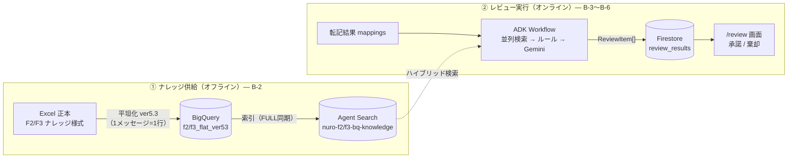
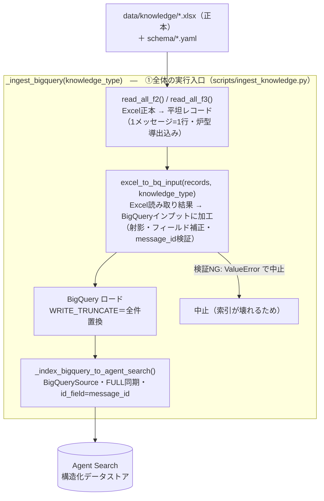
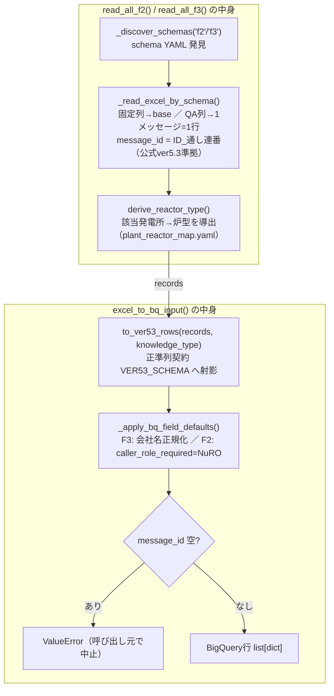
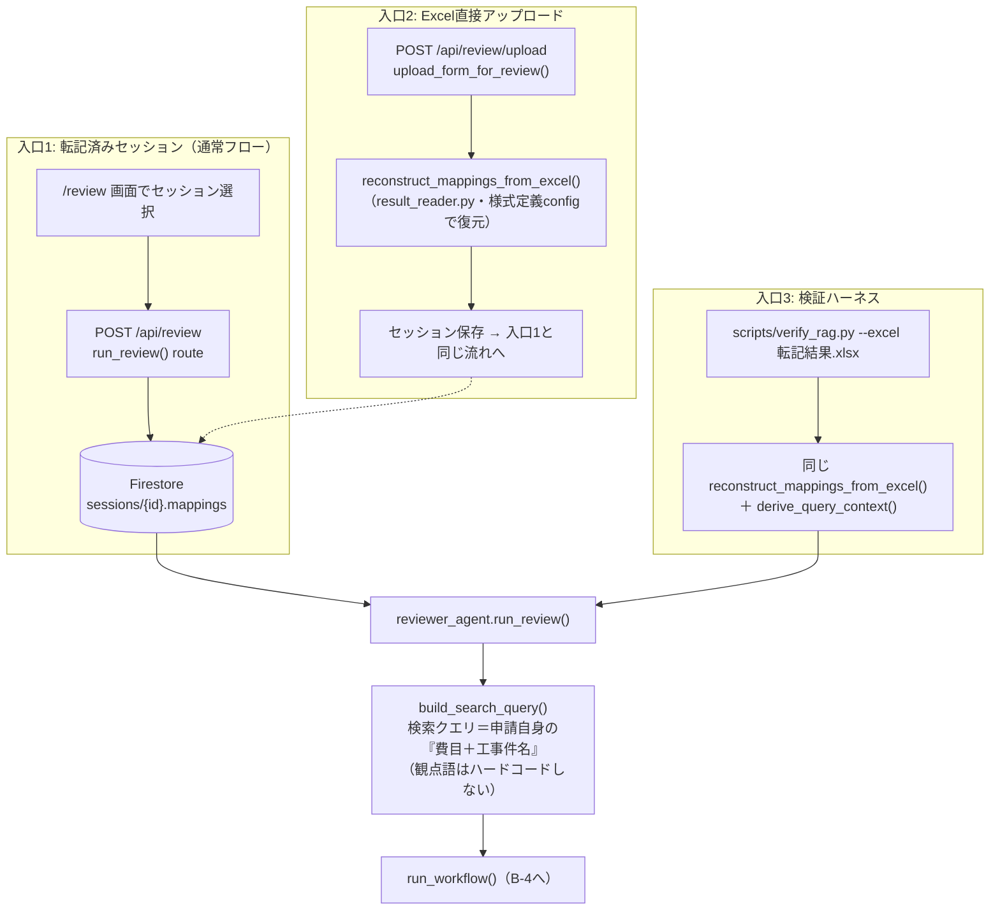
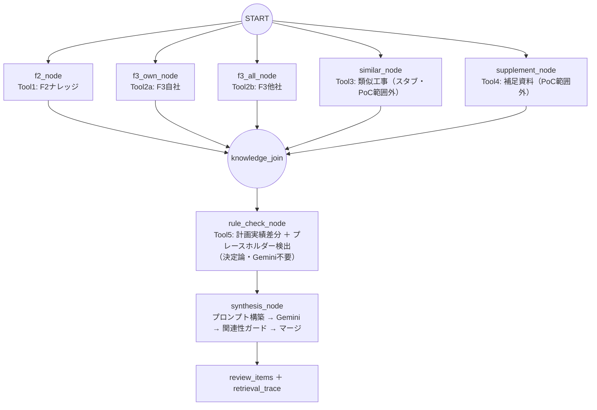
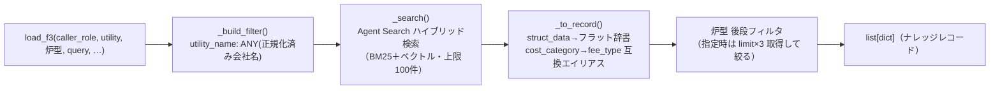
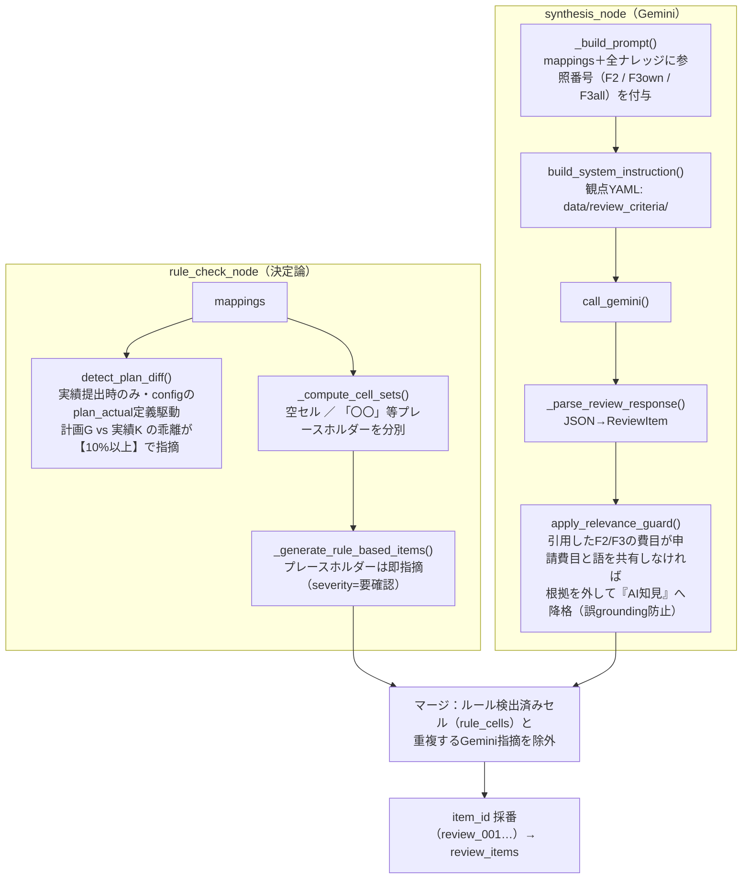

# 事前レビュー（RAG）アーキテクチャ

> **最終更新：2026-07-03**（`docs/architecture.md` からファイル分割。BigQuery平坦化・Excelアップロード入口・炉型導出・公式ver5.3準拠message_idを反映）

本書は事前レビュー系（RAG）の「**コードがどう動いているか**」の地図。様式自動作成（転記系）とは**別システム**のため、アーキテクチャ図をファイル分割した（転記系は [`docs/architecture.md`](../architecture.md)）。

- 仕様の正本（What/Why）: [`REQUIREMENTS.md`](REQUIREMENTS.md) §0
- 実装状況・検証根拠・バックログ（How/Proof）: [`RAG_VERIFICATION.md`](RAG_VERIFICATION.md)

※節番号は分割前の `architecture.md` の「B-x」をそのまま引き継ぐ（既存ドキュメント・コミット履歴からの参照を保つため）。

## B-0. 30秒でわかる事前レビュー

電力会社が提出した様式（転記結果）を、NuRO担当者が目視チェックする**前に**、AIが過去の問合せナレッジと照合して「ここを確認すべき」という指摘（`ReviewItem`）を作る機能。

- **入力**：転記結果の `mappings`（どのセルに何が書いてあるかの一覧）
- **参照**：F2ナレッジ（NuRO内共有の知見）・F3ナレッジ（電力別の問合せ履歴）を Agent Search で検索
- **出力**：`ReviewItem` のリスト（セル座標・指摘文・根拠つき）→ `/review` 画面で NuRO が承諾/棄却

システムは**独立した2つの流れ**でできている。この区別が全体理解の鍵：

| 流れ | いつ動く | 何をする | 入口 |
|---|---|---|---|
| **① ナレッジ供給（オフライン）** | ナレッジExcel更新時に手動実行 | Excel正本 → 平坦化 → BigQuery → Agent Search索引 | `uv run python scripts/ingest_knowledge.py --backend bigquery` |
| **② レビュー実行（オンライン）** | NuROがレビューを開始したとき | 検索 → ルール検出 → Gemini指摘生成 → Firestore保存 | `POST /api/review` |

初見の方への読み方：**B-1（データの置き場）→ B-2（①の流れ）→ B-3〜B-6（②の流れを入口から出口まで）** の順に読むと、関数名が全部つながります。

各節は「**本流の図＝親玉関数（細かい処理を束ねる上位関数）の粒度** → 中身の詳細は後続の節・小節で後述」という構成をとる。

**親玉関数の一覧（索引）**：

| 流れ | 処理の段階 | 親玉関数 | 束ねている中身（1行要約） | 詳細 |
|---|---|---|---|---|
| ① | ナレッジ供給全体 | `_ingest_bigquery()` | Excel読取 → BQインプット加工 → ロード → 索引投入 | B-2 |
| ① | Excel読取 | `read_all_f2()` / `read_all_f3()` | schema発見 → シート読込 → 炉型導出 | B-2-1 |
| ① | BQインプット加工 | `excel_to_bq_input()` | ver5.3射影 → フィールド補正 → message_id検証 | B-2-1 |
| ② | レビュー全体 | `run_review()` | 炉型・費目の補完 → Workflow起動 → 結果整形 | B-3 |
| ② | Excel復元 | `reconstruct_mappings_from_excel()` | セル読み → config照合 → mappings復元 | B-3 |
| ② | Workflow実行 | `run_workflow()` | 5並列検索 → ルール検出 → 生成、の各ノードを編成 | B-4 |
| ② | ナレッジ検索 | `load_f2()` / `load_f3()` | フィルタ構築 → ハイブリッド検索 → レコード変換 → 炉型後段フィルタ | B-5 |
| ② | ルール指摘 | `rule_check_node()` | 計画実績差分 → 空セル/プレースホルダー分別 → 即時指摘化 | B-6 |
| ② | Gemini指摘生成 | `synthesis_node()` | プロンプト構築 → Gemini → パース → 関連性ガード | B-6 |

## B-1. 鳥瞰図：4つのデータ置き場と役割

4つの置き場は役割が完全に分かれている（混同しないこと・REQUIREMENTS §0-4）：

| 置き場 | 役割 | 実体 |
|---|---|---|
| **Excel** | ナレッジの**正本**（人間が編集する唯一の場所。DBは常に派生） | `data/knowledge/F2_knowledge.xlsx` / `F3_knowledge*.xlsx` |
| **BigQuery** | 平坦化したナレッジの**データ置き場**（BigQuery自体は検索しない） | `nuro_knowledge.f2_flat_ver53` / `f3_flat_ver53` |
| **Agent Search** | **検索エンジン**（BigQueryを索引。BM25+ベクトルのハイブリッド検索） | `nuro-f2-bq-knowledge` / `nuro-f3-bq-knowledge` |
| **Firestore** | レビューの**運用状態**（セッション・指摘・採否・undo・統計） | `sessions/{id}/review_results/{review_id}` |



## B-2. ① ナレッジ供給パイプライン（Excel → BigQuery → Agent Search）

**なぜ平坦化が要るのか**：ナレッジ様式は「1件の問合せが横に伸びる」形（1回目質問→1回目回答→2回目…）。検索エンジンには「**1メッセージ=1行**」が必要。公式ver5.3様式に付属する「出力用シート」（関数による自動生成・入力不要）と同じ変換を、コード側で再現している。

処理全体は、次の**3つの親玉関数**（細かい処理を束ねる上位関数）の直列で構成する。各親玉関数の中身は B-2-1 で後述する。



| 親玉関数（場所） | 役割 | 入力 | 出力 |
|---|---|---|---|
| `read_all_f2()` / `read_all_f3()`（`agents/reviewer/_excel_reader.py`） | schema YAML を全発見し、対応するナレッジExcelを平坦レコード化する入口（炉型導出まで含む） | `data/knowledge/*.xlsx` ＋ `schema/f2_*／f3_*_schema.yaml` | `list[dict]`（1メッセージ=1行） |
| `excel_to_bq_input(records, knowledge_type)`（同上） | **Excel読み取り結果を受け取って BigQuery のインプットに加工する**。射影・フィールド補正・message_id検証を束ねる。検証NGは `ValueError` | 平坦レコード ＋ `"f2"/"f3"` | BigQueryロード可能な行の `list[dict]` |
| `_ingest_bigquery(knowledge_type)`（`scripts/ingest_knowledge.py`） | ①全体の実行入口。上記2つを呼び、BigQueryへ**全件置換**（WRITE_TRUNCATE）でロード→索引投入まで実行 | `"f2"/"f3"` | `f2/f3_flat_ver53` テーブル更新＋索引 |
| `_index_bigquery_to_agent_search()`（同上） | BigQueryテーブルを構造化データストアへ**FULL同期**（テーブルと索引が完全一致） | datastore_id, table_id | Agent Search ドキュメント（`id_field=message_id`） |
| `create_datastores.py`（scripts/） | データストアの新規作成（初回のみ。`structured: True`＝BigQuery索引用） | — | `nuro-f2/f3-bq-knowledge` |

### B-2-1. 親玉関数の中身（詳細）



| 関数（場所） | 役割 | 入力 | 出力 |
|---|---|---|---|
| `_read_excel_by_schema()`（`agents/reviewer/_excel_reader.py`） | 1シート分の読み込み中核。固定列→base辞書、QA繰り返し列→メッセージ展開、`sheet_name` 付与 | schema dict ＋ Excelパス | `(records, utility_name)` |
| `derive_reactor_type()`（同上） | **炉型は様式の列ではなく「該当発電所」から導出**（発電所≒炉型一意のドメイン知識。号機で異なる例外は「発電所/号機」キーで上書き） | `("網走原子力発電所", "1号機")` | `"PWR"`（`data/knowledge/schema/plant_reactor_map.yaml`） |
| `to_ver53_rows(records, knowledge_type)`（同上） | 正準列契約 `VER53_SCHEMA` への射影。余分キーは落とし、欠損は既定値で埋める＝**BigQueryが常に同一スキーマの行を受け取る保証** | 平坦レコード ＋ `"f2"/"f3"` | BigQuery行の `list[dict]` |
| `_apply_bq_field_defaults(knowledge_type, rows)`（同上） | knowledge_type ごとの検索用フィールド補正（F3=会社名正規化・F2=`caller_role_required=NuRO`）。検索側と同じ正規化で表記ゆれを吸収 | `"f2"/"f3"` ＋ 行リスト | 行リストを直接補正 |

**ver5.3 平坦行の形**（F3の例。F2は業務カテゴリ/事象概要/判断基準など様式固有の列に置き換わる＝`F2_VER53_COLUMNS`）：

| 区分 | 列 |
|---|---|
| 本体列（様式の出力用シート準拠） | ID／**メッセージID**（`{ID}_{通し連番:02d}`）／起票日／起票者所属G／起票者／参照先ナレッジID／提出タイミング／確認年度／該当発電所／該当プラント／該当費目／該当工事／該当資料／**メッセージ内容**（検索対象テキスト） |
| 付帯列（検索フィルタ・権限用） | utility_name（正規化済み）／reactor_type（発電所から導出）／sheet_name／message_direction／round |

**安全装置**：①検索先がBigQuery索引ストアを指しているのに旧 `--backend direct` でF2/F3を投入しようとすると**中止**（NO_CONTENTストアの汚染防止）。②message_idが空の行があれば**中止**（索引の id_field に使えない）。③FULL同期＝再実行すれば常にExcel正本と一致（PoCは知識凍結・R7）。

## B-3. ② レビュー実行の入口（3つの入口 → 1つに合流）

レビューの入口は3つあるが、**すべて `reviewer_agent.run_review()` に合流する**。検証ハーネスも本番と同じコードパスを通るため、検証で通った経路がそのまま本番の経路になる。



| 関数（場所） | 役割 | 入力 | 出力 |
|---|---|---|---|
| `run_review()` route（`api/routes/review.py`・`POST /api/review`） | セッションの mappings を読み、AIレビューを実行して結果を保存（転記結果自体は変更しない）。`reviewed=True` に更新 | `ReviewRequest(session_id, utility_name, frame_name, sheet_name)` | `ReviewResponse(review_id, review_items, summary, mappings, retrieval_trace)` |
| `upload_form_for_review()`（同上・`POST /api/review/upload`） | 転記を経ずに完成様式Excelを直接レビューにかける入口。復元→Firestoreセッション作成 | `file=転記結果.xlsx, frame_name, sheet_name` | `UploadResponse(session_id, mappings)` |
| `reconstruct_mappings_from_excel()`（`agents/reviewer/result_reader.py`） | 様式定義（`config/{frame}/{sheet}.yaml`）に基づきセル値→mappings を復元。label_value／plan_actual／tabular セクション対応。**特定ファイル・特定費目に依存しない** | `excel_path, frame, sheet` | `list[mapping dict]` |
| `derive_query_context()`（同上） | Excelから検索文脈（費目・炉型・電力会社）を導出。クロスシート対応（MRC2レビューでも文脈はMRC1から取る） | `excel_path, frame, sheet, context_sheet` | `{fee_type, reactor_type, utility_name}` |
| `reviewer_agent.run_review()`（`agents/reviewer/reviewer_agent.py`） | レビュー本体の外部I/F（**Phase 1から不変**）。mappingsから炉型・費目を自動補完し、Workflowを起動 | `session_id, utility_name, mappings, frame_name, sheet_name, [reactor_type], [fee_type]` | `(list[ReviewItem], retrieval_trace)` |
| `build_search_query()`（`agents/reviewer/_review_logic.py`） | mappingsから「対象費目1＋工事件名」を取り出して検索クエリを合成（取れなければfallback） | `mappings, fallback` | `"施設解体一解体費 ○○建屋解体工事"` |

## B-4. レビュー本体：ADK Workflow（並列検索 → ルール検出 → 生成）

`run_workflow()`（`adk/runner.py`）が毎リクエスト新規セッションで実行する。**5つの検索ノードが並列**に走り（同期loaderを `run_in_executor` でスレッド並列化）、全完了後にルール検出→Gemini生成が**直列**に続く。各ノードは `ctx.state` を読み書きするだけで、エラー時は空リストにフォールバックしてレビュー全体を止めない。



**state の受け渡し**（`adk/agents.py`。キー定義は `adk/state_keys.py`）：

| ノード | 読む state | 書く state | 呼ぶ関数 |
|---|---|---|---|
| `f2_knowledge_node` | `fee_type`（=検索クエリ） | `f2_knowledge`, `_trace_f2` | `load_f2("NuRO", query, 20)` |
| `f3_own_knowledge_node` | `utility_name`, `reactor_type`, `fee_type` | `f3_own`, `_trace_f3_own` | `load_f3("NuRO", 自社, 炉型, query, None, 20)` |
| `f3_all_knowledge_node` | `reactor_type`, `fee_type` | `f3_all`, `_trace_f3_all` | `load_f3("NuRO", None=全社, 炉型, query, None, 20)` |
| `similar_work_node` | `reactor_type`, `fee_type` | `_trace_similar` のみ（常に空＝スタブ） | `load_similar_work()` |
| `supplement_node` | `utility_name`, `fee_type` | `supplement_info`, `_trace_supplement` | `load_supplement()` |
| `rule_check_node` | `mappings`, `frame_name`, `sheet_name` | `plan_diffs`, `rule_items`, `rule_cells`, `empty_cells`, `placeholder_cells` | `detect_plan_diff()` ほか（B-6） |
| `synthesis_node` | 上記すべて | `review_items`, `retrieval_trace` | `_build_prompt()` → `call_gemini()` → `apply_relevance_guard()`（B-6） |

`retrieval_trace` は各Toolの `{tool, query, count, top_ids}` の一覧。**「なぜこの指摘か」の透明性**を担保し、画面のRAG詳細パネルとデバッグに使う（Firestoreには保存せずレスポンスのみ）。

## B-5. ナレッジ検索の中身（knowledge_loader.py）

検索バックエンドの差し替え点。**公開I/F（`load_f2`/`load_f3`/…の引数・戻り値）はPhase 1から不変**で、内部だけが Excel直読み → Agent Search ハイブリッド検索へ進化してきた。B-2 で作った索引をここで引く。



| 関数 | 役割 | 入力 | 出力 |
|---|---|---|---|
| `load_f2(caller_role, fee_type, limit)` | F2検索。**電力ロールは常に空リスト**（F2はNuROのみ参照可＝DB層で権限を完結）。`caller_role_required=NuRO` でフィルタ | `("NuRO", "解体撤去費", 20)` | `list[dict]` |
| `load_f3(caller_role, utility_name, reactor_type, fee_type, sheet_name, limit)` | F3検索。会社名フィルタ（NuROは全社可・電力は自社のみ）＋炉型は**Python後段フィルタ**（新規フィールドのサーバ側index反映遅延を回避） | `("NuRO", "関東電力", "BWR", query, None, 20)` | `list[dict]` |
| `normalize_utility()` | 会社名正規化（「株式会社」等を除去）。**ingest側と検索側の両方**に同じ正規化を通し、表記ゆれで自社フィルタが外れるのを防ぐ | `"関東電力株式会社"` | `"関東電力"` |
| `_search()` | Agent Search 呼び出しの共通部。空クエリは全文スキャン相当（"工事"）に置換 | `datastore_id, query, filter_str, limit` | `list[dict]` |
| `_to_record()` | 検索結果1件→フラット辞書。ver5.3列名（`cost_category`）と旧structキー（`fee_type`）の**互換エイリアス**を付与（下流の関連性ガードが `fee_type` を読むため） | `SearchResult` | `dict`（`_doc_id` 付き） |
| `_serving_config()` | データストア→検索エンジンのパス解決（エンジン未設定ならデータストア直接） | `datastore_id` | serving config パス |

## B-6. 指摘の生成（rule_check_node → synthesis_node・_review_logic.py）

生成は**2段構え**。機械的に確定できる指摘はルールで先に作り（Geminiを待たない・ぶれない）、文脈判断が要るものだけGeminiに渡す。Geminiの出力には**関連性ガード**をかけ、無関係な過去事例を根拠にした指摘（誤grounding）を防ぐ。



| 関数 | 役割 | 入力 | 出力 |
|---|---|---|---|
| `detect_plan_diff()` | Tool5。様式定義（config）の `plan_actual` ペア定義を使い、**実績提出時のみ**計画値(G)と実績値(K)を比較。**数値差異10%以上**（`_NUMERIC_DIFF_THRESHOLD_RATE=0.1`）で指摘対象 | `mappings, frame_name, sheet_name` | `plan_diffs` |
| `_compute_cell_sets()` | 空白セルと仮置きセル（「〇〇」「TBD」等）を分別収集 | `mappings` | `(empty_cells, placeholder_cells)` |
| `_generate_rule_based_items()` | 確実にNGと言える項目（プレースホルダー残り）をGemini抜きで即指摘化 | `mappings, placeholder_cells` | `rule_items`（`knowledge_source="AI知見"`） |
| `_build_prompt()` | レビュー対象・全ナレッジ・差分・空セル情報を1つの指示文に合成。同一観点が複数セルに跨る場合は1指摘に統合するよう指示（過検出抑制） | mappings＋ナレッジ＋plan_diffs ほか | プロンプト文字列 |
| `build_system_instruction()`（`criteria_loader.py`） | レビュー観点を宣言的YAMLから読み込む（**観点はコードでなくconfig**＝資料・カテゴリに依存しない） | `frame_name, sheet_name` | system instruction |
| `_parse_review_response()` | GeminiのJSON応答を安全にパースして `ReviewItem` 化 | 生レスポンス | `list[ReviewItem]` |
| `apply_relevance_guard()` | **誤grounding防止の安全網**。指摘が引用した `[F2#N]/[F3all#N]` の費目が本申請の費目と語を共有しない場合、`knowledge_source` を「AI知見」・severity を「要確認」に降格（指摘自体は残す） | `items, mappings, f2/f3ナレッジ` | 降格処理済み `list[ReviewItem]` |

> **数値チェックは2種類ある**（混同注意・REQUIREMENTS §0-6）：上記 Tool5 は計画/実績の**乖離検出（閾値10%）**。これとは別に、合計値・セル内関数の**算術整合の検証（決定論・円・許容0＝数式破壊検知）**が未実装バックログにある（B-9）。

## B-7. 結果の保存・採否・統計（Firestore）

```
sessions/{session_id}
  mappings / utility_name / frame_name / sheet_name / reviewed / session_name
  review_results/{review_id}
    review_items[] / summary / reviewed_at
    feedbacks[]（accept・rejectとも記録＝履歴復元用） / total_count / decided_count
review_stats/{YYYY-MM-DD}    ← 承諾/棄却の日次集計
```

| 関数（`api/routes/review.py`） | 役割 | 入力 | 出力 |
|---|---|---|---|
| `submit_feedback()`（`POST /review/{id}/feedback`） | 指摘1件の承諾/棄却を `feedbacks` に記録し、日次統計を加算 | `item_id, decision="accept"/"reject"` | `FeedbackResponse(status)` |
| `undo_feedback()`（`DELETE /review/{id}/feedback/{item_id}`） | 採否の取り消し（undo） | `review_id, item_id` | 更新後状態 |
| `sync_feedbacks()`（`POST /review/{id}/feedbacks/sync`） | 画面状態との一括同期 | feedback一覧 | synced state |
| `list_sessions()` / `get_latest_review_result()` | セッション一覧（未レビューのみ or 履歴込み）／最新レビュー結果の復元 | `include_history` | 一覧／最新結果 |
| `get_review_stats()`（`GET /review/stats`） | 棄却率・件数トレンドを集計。**棄却率50%超の継続が Agentic RAG 移行トリガー**（REQUIREMENTS §4-5） | — | stats payload |

## B-8. 検証基盤（本番と同じ経路を通す）

検証ハーネスは B-3 の復元関数と B-4〜B-6 の本体をそのまま呼ぶため、**検証で通った経路＝本番の経路**。生成レポートは `data/verification/` 等に出力される（gitignore・コミットしない）。

```bash
uv run python scripts/verify_rag.py --smoke-only                          # GCP/Agent Search 疎通
uv run python scripts/verify_rag.py --excel <転記結果.xlsx> [--retrieval-only]  # 検索の中身／フルレビュー
uv run python scripts/eval_review.py                                       # PoC検証マトリクス（難易度1〜4×2軸）
uv run python scripts/review_annotation.py --excel <結果.xlsx> --sheets MRC1,MRC2  # NuROアノテーション用
```

- `eval_review.py` ＋ `data/review_eval/gold_expectations.yaml`：**性質ベース**の自動判定（「PWRでフィルタしたらPWRだけ返る」等）。単発runの網羅率100%は追わない（過剰適合回避・RAG_VERIFICATION 付録A-3）。
- 回帰ゲート：`uv run pytest`（`test_review_e2e.py`）＋ 上記マトリクス。**これを割ったら次の変更に進まない**。

## B-9. 未実装（実装バックログとの対応）

「決定済み・未実装」の唯一の一覧は `RAG_VERIFICATION.md §2`。主なもの：

| 未実装 | 内容 | 土台の状況 |
|---|---|---|
| Reranking（Ranking API） | `_search()` 後段に semantic-ranker を追加（設定でON/OFF・未設定は素通り） | 採用方針確定（§3-2） |
| 提出タイミング＋G/K列分岐 | MRC1のC8（計画/実績区分）で検索対象シートとレビュー列を分岐 | `submission_timing` はver5.3列として**索引済み**＝後段フィルタを足すだけ |
| MRC2観点＋粒度感＋数式破壊検知 | `frameB_MRC2.yaml` 観点追加／合計・関数セルの再計算突合（決定論・円・許容0） | 観点YAML機構は稼働中 |
| ワークブック単位レビュー入口 | 全シート一括の `review_workbook()`（現状は1シート単位） | 復元関数は共通化済み（result_reader） |
| Tool3 類似工事／Tool4 補足資料 | **PoC範囲外**（similar_node はスタブ、supplement は将来マルチモーダル） | — |


---

## データ構造リファレンス

### ReviewItem（synthesis_node の出力）

```jsonc
{
    "item_id": "review_001",
    "field_name": "費用低減策",
    "cell_address": "K22",
    "severity": "要確認",          // 要確認 | AIからの指摘
    "comment": "_",
    "evidence": "[F3all#2] _",
    "knowledge_source": "F3"       // F2 | F3 | 類似工事 | 補足資料 | 計画差分 | AI知見
}
```

### retrieval_trace

各 Tool の `{tool, query, count, top_ids}` のリスト。RAG 詳細パネルで根拠の透明性を担保する。
