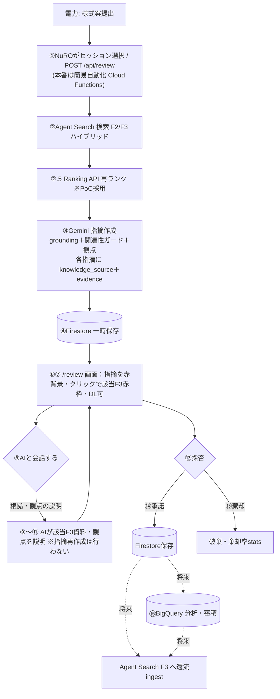

# 事前レビューRAG — 検証結果・設計判断・実装バックログ

最終更新：2026-07-02（課題①をa/bに分割・Rerankingの位置づけ明確化・数値チェック2種の区別を追記）

> **本書の役割（HOW/Proof）**：PoCで「現行RAGが実データで機能するか」を検証した結果と、そこで下した
> **設計判断**・**実装バックログ**を記録する。**要件・確定仕様（What/Why）の正本は `REQUIREMENTS.md §0`。**
> 仕様で迷ったら REQUIREMENTS を、根拠・経緯・残作業はここを見る。
>
> 読み方：**§0〜§3 が現在の確定内容**。**付録A は時系列の検証ログ（根拠・履歴）**で、最新仕様は §0〜§3 を優先。

---

## 0. サマリ（現在地）
- **検索（リトリーバル）は機能**：Agent Search（旧 Vertex AI Search）のハイブリッド検索で、費目の表記ゆれ
  （例 `施設解体一解体費`→`解体撤去費`）を意味的に吸収。
- **grounding（検索→根拠付き指摘の変換）も機能**：当初は実出力が全て「AI知見」で根拠付けゼロだったが、
  プロンプト改修＋費目関連性ガードで **F2/F3 根拠の指摘が安定発火**（誤grounding/ハルシネーションも抑制）。
- **PoC検証マトリクス（難易度1〜4×2軸）全PASS**。回帰テスト `test_review_e2e.py` **36 passed**。
- **スコープ**：F2/F3＋Tool5＋観点。**Tool3（類似工事）・Tool4（補足資料）はPoC範囲外**。
- 検証は既存の upload→Firestore→/review フローへ非破壊（並存）。常設ハーネス `scripts/verify_rag.py` で再現可。

---

## 1. 検証で確定した設計判断（#1〜8・10〜12＝実装済み・CONFIRMED／#9＝採用方針・未実装）

| # | 判断 | 要点 | 根拠/場所 |
|---|---|---|---|
| 1 | **grounding強化** | `_build_prompt()` に「F3過去事例＝NuROが過去に求めた確認事項。本様式に不足あれば `[F3all#N]` を根拠に指摘」を追加。過剰萎縮を解除 | `_review_logic.py`／before 0/10→after 発火 |
| 2 | **誤grounding防止（難4）** | 引用F2/F3の費目が本申請の費目と**語を共有しなければ AI知見へ降格**（`apply_relevance_guard`）。費目名はハードコードしない一般則 | `_review_logic.py`／eval難4ハードゲート |
| 3 | **指摘の統合** | 同一観点が複数セルに跨る場合は1指摘に統合し対象セルを列挙（過検出抑制） | `_build_prompt()`／関東 9→2・3→2件 |
| 4 | **Tool5（計画/実績差分）現設計整合** | 総額/全体支払対象金額を MRC2 の SUM へ移管（MRC1に数値plan/actual無し）。`detect_plan_diff` は設定駆動で無変更、MRC2に計画/実績ペア定義時に自動対象化。テストを現設計に整合 | `test_review_e2e.py`／`test_sougaku_moved_to_mrc2` |
| 5 | **炉型フィルタ有効化** | F3スキーマに炉型列(Z)追加・struct_data投入・`load_f3`で後段フィルタ（新規フィールドのindex反映遅延を回避） | `knowledge_loader.py` |
| 6 | **会社名正規化** | `normalize_utility`（株式会社等を除去）を ingest と検索の両側に適用＝表記ゆれで自社フィルタが外れる問題を解消 | `knowledge_loader.py`／`ingest_knowledge.py` |
| 7 | **検索クエリの一般化** | クエリを申請自身の **費目＋工事件名** で構成（観点語ハードコードなし）。Tool2a surfacing 10→16件 | `build_search_query`／`reviewer_agent.py` |
| 8 | **config/ 移行追従（レビュー系）** | frame config を `config/` へ移行。`load_frame_config` は config/ 優先・frames/ 後方互換 | `frame_config_loader.py` |
| 9 | **Reranking 採用方針** | Agent Search の Ranking API（semantic-ranker）を**PoC採用**（§3-2）。実装は `knowledge_loader._search()` 後段（未実装・§2） | §3 |
| 10 | **message_id の一意化**（2026-07-02） | 旧形式 `{id}_{round}` は同一ラウンドの質問/回答で衝突し、doc_id 上書きで**271→158件（42%）が silently 消失**していた。`{id}_{round}_{direction}` に修正（下流利用なし・ver5.3「1メッセージ=1行」に整合） | `_excel_reader.py`／一意性テスト |
| 11 | **炉型Z列の復元**（2026-07-02） | 中部→北の海リネーム（1f2efe8）で正本ExcelのZ列が欠落し、**炉型後段フィルタが silently 全件除外**になっていた退行を修正（f9adad2からIDマッチングで75行復元）。Z列欠落の回帰ガードテスト追加 | `data/knowledge/*.xlsx`／`test_f3_reactor_type_present` |
| 12 | **BigQuery→Agent Search 経路の本採用**（2026-07-02・Step1） | `Excel→平坦化(ver5.3)→BigQuery→Agent Search索引` を実装し、マトリクス全PASSで本採用（measure-first・二系統フォールバック不要だった）。`_to_record` に cost_category→fee_type 互換エイリアス（relevance guard の grounding降格防止） | `ingest_knowledge.py`／`knowledge_loader.py` |

**横断原則（最重要・誤実装防止）**：チェックの拠り所は「**様式定義（config）＋普遍的算術**」のみ。特定費目/見積書
構造/検証ケースに**ハードコード・過剰適合しない**。`run_review` / `knowledge_loader` の I/F は不変。

**データストアの役割**（詳細・DB方針は §3-3）：
- **Firestore**＝レビュー中の運用状態（リアルタイム）。
- **Agent Search(F3)**＝検索で根拠を引く本体／承諾ナレッジの還流先（将来）。
- **BigQuery＝2用途**：①F3知識の置き場（PoC採用・Agent Searchが索引）／②採否結果の分析・蓄積（検索しない・将来）。
- ※①は**実装済み（2026-07-02・Step1）**：`Excel→平坦化(ver5.3)→BigQuery→Agent Search索引` が現行経路（§1-12）。
  旧直接投入データストア（nuro-f3-knowledge）は比較基準として残置・検索には未使用。

---

## 2. 課題・実装バックログ（唯一の一覧）

凡例：✅解消／🟦対応済み（実装した）／🔲決定・未実装／⛔PoC範囲外

| # | 項目 | 状態 | メモ |
|---|---|---|---|
| ①a | Tool5 数値差分のMRC1対象消失（テスト整合） | ✅ | 現設計に整合（§1-4）＝**テスト・枠組みの整合のみ**。数値差分の復活は①b待ち |
| ①b | MRC2 に計画/実績ペア定義（数値差分の復活） | 🔲 | config に定義すれば `detect_plan_diff` が自動対象化（設定駆動・コード無変更）。「提出タイミング＋G/K列フィルタ」と連動 |
| ② | MRC2 review_criteria 未整備 | 🔲 | 年度整合・合計一致・単価妥当性などを観点YAML化（資料非依存） |
| ③ | Tool3 類似工事データ | ⛔ | PoC範囲外 |
| ④ | Tool4 補足資料（Phase3） | ⛔ | PoC範囲外 |
| ⑤ | reactor_type フィルタ | 🟦 | 有効化済み（§1-5） |
| ⑥ | Reranking | 🔲 | **PoC採用方針**＝Agent Search Ranking API。`_search()` 後段に実装（§3-2） |
| ⑦ | Tool2b が自社も返す（重複表示） | 🔲(軽微) | 表示の冗長のみ |
| ⑧ | 過剰指摘 | 🟦 | 統合で抑制（§1-3）。継続は `/review/stats` 棄却率で監視 |
| ⑨ | キャプション生成モデル（Phase3） | ⛔ | Tool4範囲外につき該当なし |
| ⑩ | ゴールド指摘（NuRO正解）未確定 | 🔲 | 仮説 `gold_expectations.yaml`＋`review_annotation.py` で土台あり。NuRO承諾で `must_flag`化→`provisional:false` |
| ⑪ | 認証なし（PoC） | 🔲(本番) | Firebase Auth/JWT |
| ⑫ | 難4 誤grounding | 🟦 | 関連性ガードで対応（§1-2・ハードゲート） |
| — | 数値の妥当性チェック（**軽量版＝数式破壊検知**・2026-07-02確定） | 🔲 | **決定論・単位は円・許容0**。合計・関数セルの結果を再計算と突合し、**数式のベタ値上書き・SUM範囲ずれを検出**（金額=数量×単価／合計=Σ明細／MRC1総額=MRC2年度総額SUM）。テンプレ数式が健在なら指摘ゼロが正常（算術は数式で構造保証＝2026-06-26分析。フル独立検証はレビュー価値ゼロのため不採用）。割合Σ=100%等の未転記関係はやらない（資料依存回避）。**Tool5の乖離検出（閾値10%）とは別物**（REQUIREMENTS §0-6） |
| — | 転記の粒度感チェック | 🔲 | 様式が要求する粒度を review_criteria に宣言（数量/単価/金額が揃う・1式は内訳・単位整合） |
| — | config 移行の転記系パス追従 | 🔲 | `settings`/`form_generation_pipeline`/`test_mrc1_writer` の frames→config（レビュー系は対応済み §1-8） |
| — | F3スキーマを ver.5.3 平坦形式へ | 🟦 | **実装済み（2026-07-02・Step1）**：`VER53_COLUMNS`/`to_ver53_rows`（`_excel_reader.py`）＝正準列契約＋射影。sheet_name付与・message_id一意化（§1-10）込み |
| — | BigQuery平坦テーブル＋Agent Search索引 | 🟦 | **実装済み・本採用（2026-07-02・Step1）**：`ingest_knowledge.py --backend bigquery` → `nuro-f3-bq-knowledge`（FULL同期・id_field=message_id）。マトリクス全PASS・回帰41 PASS・切替は .env のID差し替えのみ（§1-12） |
| — | 承諾→F3 Excel追記→BigQuery反映（還流） | 🔲(本番) | **実現性確認済み**（追記=openpyxl／反映=INSERT/MERGE）。**PoCは凍結＝未実装**（再現性のため・R6/§3-3） |
| — | Reranking（Ranking API） | 🔲 | semantic-ranker を `_search()` 後段に（§3-2・採用方針） |
| — | 提出タイミング＋G/K列フィルタ | 🔲 | 区分(C8)で **RAG対象シート**(計画→計画申請時 KNI_1G_01／実績→費用請求時 KNI_1G_02)と**レビュー列**(計画=G／実績=K)を分岐。情報提供時は検索対象外。**実績の差分はTool5**＝課題①b(MRC2計画/実績ペア定義)と連動。`submission_timing` 後段フィルタ＋セルG/K選別・I/F不変・measure-first（REQUIREMENTS §0-3） |

---

## 3. 将来設計（本番スケール／Agent Search採否／フロー）

### 3-1. 本番スケール方針（多数電力会社 × 多レコード）
PoCの小規模で"たまたま動く"設計にしない。本番は N社 × 各社多件（将来1社1万件規模）。
- **検索の関連度打ち切り（surfacing低下）が悪化** → ①費目+工事名クエリ（実装済）＋ ②**Reranking で上位N高精度化**。
- **Tool2b 巨大化** → 費目・炉型で母集団を絞り、必ずランク/リランクで上位限定。
- **データ供給** → 手管理Excelはスケールしない。**記録元(DB)→Agent Search 増分ingest**、会社名正規化等をパイプラインで担保。
- **移行トリガー（要件§4-5）**：F3>1万件 ／ 棄却率50%超 → Agentic RAG本格化・DB化。
  ※Reranking は移行トリガー待ちではなく **PoCで実装する採用方針**（§3-2・課題⑥）。
- 設計原則：検索/フィルタは申請フィールド＋普遍則で構成（件数非依存）／「広く取り→Rerankで絞る」／I/F不変。

### 3-2. Agent Search（旧 Vertex AI Search）採否
- **名称**：Vertex AI Search → **Agent Search**（土台は Discovery Engine・SDKそのまま＝移行不要・既に利用中）。
- **✅ Ranking API（semantic-ranker, 1024トークン/件・日本語可・≒$1/1000）＝PoC採用**。検索結果を関連度0–1で
  再ランク＋topN。低コスト・低リスク・surfacing改善に直結。実装は `knowledge_loader._search()` 後段（I/F不変）。
- **⚠️ Answer API（grounded answer）＝不採用**：我々の出力はセル単位・観点駆動の構造化指摘で、汎用Q&A回答では
  表現できない（support scoreの発想のみ将来参考）。
- **❌ Gemini Enterprise/Agentspace＝不採用**：組織横断の検索UI/エージェント基盤で用途レイヤーが違う。
- 出典：Ranking API https://docs.cloud.google.com/generative-ai-app-builder/docs/ranking ／
  Answer API https://docs.cloud.google.com/generative-ai-app-builder/docs/answer ／
  Gemini Enterprise https://docs.cloud.google.com/agentspace/docs/overview ／ 料金 https://cloud.google.com/generative-ai-app-builder/pricing

### 3-3. データストア方針（2026-06-25 更新：本番想定のデータ持ち方を確定）

**役割**：Excel=正本／**BigQuery=データ置き場**／**Agent Search=検索エンジン（BigQueryを索引）**／Firestore=レビュー運用状態。
データの流れ：`Excel(正本) → 平坦化(1メッセージ=1行) → BigQuery → Agent Search索引 → RAG検索`。

- **F3知識（検索用）**：本番想定で **BigQuery（平坦テーブル）→ Agent Search が索引** する構成を**PoCでも採用**する
  （今回データはほぼ固定＝凍結のため「無限に連なる」問題は起きず、BigQuery採用に支障なし）。
  - **採用は"作って再検証してから確定"**（measure-first）。`verify_rag`/`eval_review`/マトリクスが新データストアで
    全PASSすることを確認 → 本採用。落ちる場合は**安全策＝二系統**（Agent Search直接投入＋BigQuery並列）に切替し、
    RAG検索は実証済み経路のまま維持。
  - 留意：構造化(BigQuery)データストアは「検索対象テキスト＝メッセージ内容」「フィルタ＝費目/炉型/会社/発電所等」の
    スキーマ設定が必要。同期はバッチ（PoCの凍結データでは問題なし）。
- **レビュー運用状態**：引き続き **Firestore**（採否・undo・履歴・低レイテンシ）。
- **承諾ナレッジの還流（フィードバック）**：承諾→F3 Excel追記→平坦化→DB反映→次回検索に効かせる、は **本番機能**。
  追記＝openpyxlで容易／BigQuery反映＝INSERT/MERGEで容易（実現性確認済み）。**PoCでは凍結＝未実装**（再現性のため）。
- ※「承諾ナレッジを次回検索で活かす」最終先は **Agent Search（BigQueryを索引）**。BigQuery単体は検索しない。

### 3-4. 事前レビュー フロー（PoC現状／将来目標）
ステップ別の確定：①手動起動（本番はCloud Functionsで簡易自動）／②Agent Search＋②.5 Ranking／⑤通知=スコープ外／
⑧〜⑪=AIが根拠(該当F3)・観点を**説明**（指摘再作成までは行わない）／⑮=PoCはFirestore。


---

## 4. 検証基盤・再現手順
- `scripts/verify_rag.py`：疎通／検索ヒット中身／レビュー出力を実データで検証（mappings復元・tabular・クロスシートクエリ対応）。
- `scripts/eval_review.py` ＋ `data/review_eval/gold_expectations.yaml`：PoC検証マトリクス（難易度1〜4×2軸）を性質ベースで自動判定。
- `scripts/review_annotation.py`：AI指摘一覧＋ゴールド網羅状況を Markdown 出力（NuROが○×記入）。
- 関東ダミーF3生成：`scripts/generate_kanto_f3.py`（他社ダミー＝北の海電力F3は無改変・炉型列のみ非破壊追記）。
```
uv run python scripts/verify_rag.py --smoke-only                          # 疎通
uv run python scripts/verify_rag.py --excel <結果.xlsx> [--retrieval-only] # 検索/フル
uv run python scripts/eval_review.py                                       # マトリクス
uv run python scripts/review_annotation.py --excel <結果.xlsx> --sheets MRC1,MRC2
```

---

# ============================================================
# 付録A. 検証ログ（時系列・根拠・履歴）  ※最新仕様は §0〜§3 を参照
# ============================================================

### A-1. 初期検証（grounding gap の発見と解消）
- 初回：実データでretrievalは機能（F2/F3ヒット）するが、Gemini出力10件が**全て `AI知見`＝根拠付けゼロ**（grounding gap）。
  原因はプロンプト（F3を指摘に変換する具体トリガー不在＋ハルシネーション防止節の過剰萎縮）。
- 対応（§1-1）：プロンプト改修で **F3根拠の指摘が発火**（before 0/10 → after 発火）。回帰35/35→36 PASS。

### A-2. 処理対象変更（他社→関東電力）の評価
- 関東電力F3を新規作成・投入（自社=Tool2a 検証）。**MRC1/MRC2 ともに F3 根拠の指摘**が出ることを確認。
- プレースホルダー検出（target非依存）＋ナレッジ参照指摘（grounded）が対象変更後も安定発火。

### A-3. PoC検証マトリクス（難易度1〜4×2軸）
- 軸①検索精度：難1(費目一致)/難2(同義語)/難3(希少費目)/難3(希少炉型) **全PASS**。
- 軸②レビュー品質：難2/3(ノイズ選別)PASS。**難4(正解不在で非ハルシネーション)** は関連性ガードでPASS＝
  `provisional:false`（ハードゲート）に昇格。回帰36 PASS。
- 「レコードがsurfacingしても指摘として出るかはLLMのばらつき＋申請が実際に問題を持つか依存」。
  単発runのゴールド網羅率を100%に追うのは過剰適合のため避け、アノテーションでNuROが判断する運用。

### A-4. ゴールド指摘（仮説）とアノテーション・F3拡充
- 廃炉業務を想定したゴールド指摘 G1〜G12 を `gold_expectations.yaml` に定義（config外出し＝要件確定時はYAML編集のみ）。
- 検索改善（費目+工事名）で Tool2a surfacing 改善。F3はステージ拡充（号機/費目/工事/やり取りの多様化・無関係ノイズ・
  起票者名の多様化）。承諾/棄却の正解確定（課題⑩）は NuRO のアノテーションで段階的に固める。
- 留意（過剰適合回避）：件数増で検索競合が起き一部が押し出される＝本番では Reranking/取得上限調整が要る（§3-1）。

### A-5. 成果物
- ハーネス：`verify_rag.py`／`eval_review.py`＋`gold_expectations.yaml`／`review_annotation.py`／`generate_kanto_f3.py`。
- 生成レポート（gitignore）：`data/verification/`（検証）／`data/review_eval/annotations/`（アノテーション）。
