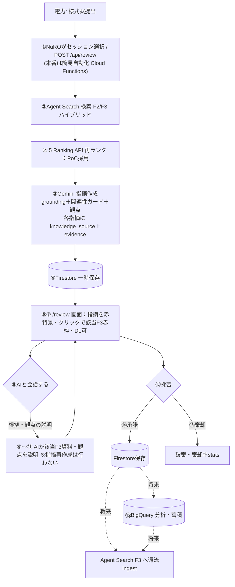

# 事前レビューRAG — 検証結果・設計判断・実装バックログ

最終更新：2026-07-06（空欄項目の指摘の番地誤爆を様式定義で決定論補正#20／Step5 Reranking#19・レビュー対応#19b／Step2#15-18・F2 grounding解禁#17／受け入れ基準の到達状況を§5に整理）

> **本書の役割（HOW/Proof）**：PoCで「現行RAGが実データで機能するか」を検証した結果と、そこで下した
> **設計判断**・**実装バックログ**を記録する。**要件・確定仕様（What/Why）の正本は `REQUIREMENTS.md §0`。**
> 仕様で迷ったら REQUIREMENTS を、根拠・経緯・残作業はここを見る。
>
> 読み方：**§0〜§3 が現在の確定内容**。**付録A は時系列の検証ログ（根拠・履歴）**で、最新仕様は §0〜§3 を優先。

---

## 0. サマリ（現在地）
- **検索（リトリーバル）は機能**：Agent Search（旧 Vertex AI Search）のハイブリッド検索で、費目の表記ゆれ
  （例 `施設解体一解体費`→`解体撤去費`）を意味的に吸収。
- **grounding（検索→根拠付き指摘の変換）も機能**：当初は実出力が全て「AI知見」で根拠付けゼロだったが、
  プロンプト改修＋費目関連性ガードで **F2/F3 根拠の指摘が安定発火**（誤grounding/ハルシネーションも抑制）。
- **PoC検証マトリクス（難易度1〜4×2軸）全PASS**。回帰テスト `test_review_e2e.py` **36 passed**。
- **スコープ**：F2/F3＋Tool5＋観点。**Tool3（類似工事）・Tool4（補足資料）はPoC範囲外**。
- 検証は既存の upload→Firestore→/review フローへ非破壊（並存）。常設ハーネス `scripts/preliminary_review/verify_rag.py` で再現可。

---

## 1. 検証で確定した設計判断（#1〜8・10〜13＝実装済み・CONFIRMED／#9＝採用方針・未実装）

| # | 判断 | 要点 | 根拠/場所 |
|---|---|---|---|
| 1 | **grounding強化** | `_build_prompt()` に「F3過去事例＝NuROが過去に求めた確認事項。本様式に不足あれば `[F3all#N]` を根拠に指摘」を追加。過剰萎縮を解除 | `_review_logic.py`／before 0/10→after 発火 |
| 2 | **誤grounding防止（難4）** | 引用F2/F3の費目が本申請の費目と**語を共有しなければ AI知見へ降格**（`apply_relevance_guard`）。費目名はハードコードしない一般則 | `_review_logic.py`／eval難4ハードゲート |
| 3 | **指摘の統合** | 同一観点が複数セルに跨る場合は1指摘に統合し対象セルを列挙（過検出抑制） | `_build_prompt()`／関東 9→2・3→2件 |
| 4 | **Tool5（計画/実績差分）現設計整合** | 総額/全体支払対象金額を MRC2 の SUM へ移管（MRC1に数値plan/actual無し）。`detect_plan_diff` は設定駆動で無変更、MRC2に計画/実績ペア定義時に自動対象化。テストを現設計に整合 | `test_review_e2e.py`／`test_sougaku_moved_to_mrc2` |
| 5 | **炉型フィルタ有効化**（2026-07-03 手段改訂） | 炉型は**該当発電所から導出**（`plant_reactor_map.yaml`・号機上書き可）＋`load_f3`で後段フィルタ。~~F3スキーマに炉型列(Z)追加~~→**Z列は廃止が正**（ver5.3様式に炉型列は無い・§1-11） | `_excel_reader.py`／`knowledge_loader.py` |
| 6 | **会社名正規化** | `normalize_utility`（株式会社等を除去）を ingest と検索の両側に適用＝表記ゆれで自社フィルタが外れる問題を解消 | `knowledge_loader.py`／`ingest_knowledge.py` |
| 7 | **検索クエリの一般化** | クエリを申請自身の **費目＋工事件名** で構成（観点語ハードコードなし）。Tool2a surfacing 10→16件 | `build_search_query`／`reviewer_agent.py` |
| 8 | **config/ 移行追従（レビュー系）** | frame config を `config/` へ移行。`load_frame_config` は config/ 優先・frames/ 後方互換 | `frame_config_loader.py` |
| 9 | **Reranking 採用方針** | Agent Search の Ranking API（semantic-ranker）を**PoC採用**（§3-2）。実装は `knowledge_loader._search()` 後段（未実装・§2） | §3 |
| 10 | **message_id の一意化**（2026-07-03 公式準拠に確定） | 旧形式 `{id}_{round}` は同一ラウンドの質問/回答で衝突し、doc_id 上書きで **silently 消失**（F3 271→158件・F2 86→44件＝各約42-49%）。**公式 ver5.3 出力用シート準拠の通し連番 `{id}_{seq:02d}`**（読み順で採番・方向は別カラム保持）に統一。F2/F3共通・下流利用なし | `_excel_reader.py`／一意性テスト |
| 11 | **炉型は発電所から導出（Z列廃止が正）**（2026-07-03 確定） | ver5.3様式に炉型列は**存在しない**（Z列削除は意図的・ユーザー確認済み）。炉型は該当発電所→炉型のドメイン知識 `plant_reactor_map.yaml`（config・号機上書きキー対応）から**平坦化時に導出**。旧Z列の行単位値は発電所と不整合な合成ノイズだった（網走1号機にPWR/BWR混在）。導出により発電所・号機単位の一貫性が構造的に保証される（一貫性テスト追加） | `_excel_reader.py`／`plant_reactor_map.yaml`／`test_f3_reactor_type_derived_and_consistent` |
| 12 | **BigQuery→Agent Search 経路の本採用**（2026-07-02・Step1） | `Excel→平坦化(ver5.3)→BigQuery→Agent Search索引` を実装し、マトリクス全PASSで本採用（measure-first・二系統フォールバック不要だった）。`_to_record` に cost_category→fee_type 互換エイリアス（relevance guard の grounding降格防止） | `ingest_knowledge.py`／`knowledge_loader.py` |
| 13 | **F2 も BigQuery平坦化に統一**（2026-07-03） | F3と同じ `Excel→平坦化(ver5.3)→BigQuery(f2_flat_ver53)→Agent Search索引(nuro-f2-bq-knowledge)`。`to_ver53_rows` を knowledge_type 駆動に一般化（`VER53_SCHEMA` レジストリ・F2固有列＝業務カテゴリ/事象概要/判断基準等）。F2 も message_id 衝突で 86→44件消失していたのが復活。`caller_role_required=NuRO` を定数付帯列としてingest時付与（load_f2 の権限フィルタ用） | `_excel_reader.py`／`ingest_knowledge.py`／`settings.py` |
| 14 | **アーキテクチャ図のファイル分割＋親玉関数化**（2026-07-03） | 上司指示により、事前レビュー(RAG)系のアーキテクチャ図を `docs/preliminary_review/ARCHITECTURE.md` に分割（様式自動作成は `docs/architecture.md` に残置）。ナレッジ供給パイプラインに親玉関数 `excel_to_bq_input()`（Excel読み取り結果→BigQueryインプットへ加工。`to_ver53_rows`＋`_apply_bq_field_defaults`＋message_id検証を束ねる）を新設し、既存の `run_review()`/`run_workflow()`/`load_f2/f3()` 等と合わせて親玉関数一覧をB-0に整理。リファクタ前後でBigQuery行の出力完全一致を確認（ゴールデン比較・F2=86行/F3=271行） | `_excel_reader.py`／`ingest_knowledge.py`／`docs/preliminary_review/ARCHITECTURE.md` |
| 15 | **ワークブック統括関数 `review_workbook()`（Step2）**（2026-07-04） | 任意の転記結果Excelを**ファイルパスだけで全シート一括レビュー**する統括関数を `reviewer_agent.py` に追加（新規.pyなし・`run_review` I/F不変で呼ぶだけ）。config のシート一覧を列挙→シート毎に「mappings復元→`run_review`」、復元不能シートはスキップ、クエリ文脈（費目・炉型・会社）は基本情報シートから申請単位で導出、Firestore保存はしない（保存はAPI層の責務のまま）。`verify_rag.py` は表示・レポート整形のみの薄ラッパ化（`--sheet` 未指定で全シート一括が既定に）。今後の開発から Docstring は Google スタイル（入出力データを明示）で記載 | `reviewer_agent.py`／`scripts/preliminary_review/verify_rag.py`／`test_review_e2e.py`（+8件） |
| 16 | **無条件ffill廃止＝捏造メッセージの根絶（真の件数 F3=209/F2=56）**（2026-07-04） | 生Excelとの全件突合で、`_read_excel_by_schema` の全列無条件 `ffill`（`merge_cell_handling: fill_down` の誤実装）が**結合と無関係な空セルに上の行の値を染み出させ、存在しないメッセージを捏造**していたことを発見（例：02_1G_0005の2往復目が別会社スレッド02_1G_0006に複製）。正本の結合セルはヘッダー行のみでデータ領域にゼロ＝ffillは害のみ。**従来の F3=271/F2=86 は水増しで、真の件数は F3=209/F2=56**（差分 62+30件が幻・誤ったID/発電所/費目メタデータ付きで索引されていた）。修正＝ffill廃止し `_expand_merged_cells()`（openpyxlの結合範囲に限定してアンカー値展開）に置換。本物のメッセージは修正前後で完全一致（message_id・内容とも差分0）。再ingest後 BigQuery=209/56 行で Excel再生成と完全一致・マトリクス全PASS。恒久検証は `scripts/preliminary_review/verify_extraction.py`（生Excelを独立実装で読み直して突合・§4） | `_excel_reader.py`／`scripts/preliminary_review/verify_extraction.py`／`test_review_e2e.py`（行独立性+3件） |
| 17 | **F2 grounding の構造的解禁（一般改善・資料非依存）**（2026-07-04） | F2根拠の指摘が実データで一度も出ない真因は入力不足でなく**関連性ガードの構造的副作用**。ガードは「引用の費目が申請費目と語を共有しなければAI知見へ降格」するが、**F2は費目列を持たない**（NuRO内共有＝費目横断）ため `fee_type=None`→`_fee_related` が必ず False→**F2根拠は100%降格＝永久にゼロ**だった。修正：`_record_relevant` を新設し、費目を持つF3は従来どおり費目トークン、**費目を持たないF2は内容語（業務カテゴリ・事象概要・メッセージ内容）の重なり**で関連性判定（`_content_tokens`・ハードコードなし）。併せてプロンプトでF2をF3と対等な根拠源に格上げ（`[F2#N]` を明記）。安全側：難4を `forbid_f2_grounded` で強化（F2の誤groundingもハードゲート）。**特定入力・特定F2に依存しない一般則**で、resolveすべきは「情報源クラスの公平性」。既知の限界＝内容語2文字トークンの稀な部分一致偽陽性（例 放射線管理⇔放射性が"放射"で一致）は決定論ガード＋難4多層で抑制、一般的堅牢化は Reranking(§3-2)。実データでは費目特化のF3が precedent を豊富に持つためF3優位は継続（＝より直接関連する源が選ばれる正しい挙動・§5） | `_review_logic.py`（`apply_relevance_guard`/`_record_relevant`/`_content_tokens`/プロンプト）／`scripts/preliminary_review/eval_review.py`／`gold_expectations.yaml` |
| 18 | **コードレビュー対応（読み込み一本化・ガード判別強化）**（2026-07-04） | high効率レビューの指摘に対応：①Excel読み込みを**openpyxl 1回読みに統一**（旧: pd.read_excel＋結合範囲取得のための再読込＝二重ロード。テスト都合の `exists()` ガードも撤去し、pd.read_excelモックのテスト2件は実ファイル生成に書き換え）②関連性ガードの内容語フォールバックは**費目フィールド（fee_type/cost_category）を持たないレコード（F2）に限定**（費目が空のF3は従来どおり不採用＝誤groundingリスク回避）③verify_rag の①検索ダンプの文脈導出を `review_workbook()` と同一の呼び方に統一（①と②の文脈食い違い解消）。等価性証明＝`verify_extraction --bigquery` でBQ（修正前出力）と**内容差分0**・回帰53 PASS・マトリクス全PASS。**F2内容語の2文字部分一致偽陽性（例: 放射線管理⇔放射性）の根本解は Step5 Reranking のスコア閾値をガード判定に使う方針で確定**（字面での根治は正当ケースまで殺すため不可・現代RAGの標準はクロスエンコーダ再ランク） | `_excel_reader.py`／`_review_logic.py`／`scripts/preliminary_review/verify_rag.py`／`test_review_e2e.py` |
| 19 | **Reranking 実装（Step5・§3-2 の採用方針を実装＋#18偽陽性の根治）**（2026-07-05） | Agent Search の **Ranking API（`semantic-ranker-default-004`・25言語/1024トークン・2025-04 GA・依存追加なし）** を `knowledge_loader._search()` 後段の `_rerank()` として実装（並べ替えのみ・件数は削らない・API失敗時は元順で素通し＝検索を止めない）。`load_f2/f3/supplement` は無変更で恩恵。**#18のF2偽陽性を意味スコアで根治**：ガード `_record_relevant` のF2分岐を「`_rerank_score >= 閾値`」に変更（スコア無し時は内容語へフォールバック）。**実測校正**：semantic-ranker は費目クエリに対し F3=0.20〜0.36（費目特化で強関連）／F2=0.04〜0.08（NuRO内知見ゆえ弱関連）と**2.5倍のギャップで分離**するため閾値を gap 中間 **0.15**（`RERANK_GUARD_F2_THRESHOLD`・env可）に設定。これにより F2は主題一致で強関連なとき（例0.37）のみ根拠採用、字面2文字の偽陽性（放射性=0.05）は確実に不採用。**F3優位は reranker スコアでも裏付け**（F3が費目に直接強関連＝正しい挙動）。設定 `RERANK_ENABLED`(既定on)/`RERANK_MODEL`/`RERANK_GUARD_F2_THRESHOLD`。回帰61 PASS・マトリクス全PASS・rerank off で従来挙動へ完全フォールバック確認 | `knowledge_loader.py`／`_review_logic.py`／`settings.py`／`adk/agents.py`(trace top_scores)／`test_review_e2e.py`（+8件） |
| 19b | **Step5 コードレビュー対応（堅牢化7件）**（2026-07-05） | high効率レビューの指摘に対応（回帰68 PASS・マトリクス全PASS）：①**ガードのスコア意味論を明文化**＝F2スコアは検索クエリ（費目＋工事件名・§1-7で意図的に広げた）への関連度であり「同一工事のNuRO内知見も関連」は意図した挙動、と `_record_relevant` docstring/コメントに明記（字面条件の再導入はしない＝#17趣旨堅持）②**F2全降格の観測ログ**＝`apply_relevance_guard` でF2が1件も関連判定されない時に warning（モデル/閾値ずれによる無音回帰の早期検知）＋降格時に info ③**`_rerank` の id 重複・負数・範囲外を採用済みindex集合で防御**（二重採用/取りこぼし防止・`query or "工事"` 死コード除去）④`_env_float` で閾値の不正env値を既定退避＝**import時クラッシュ防止**（アプリ全体停止を回避）⑤`_env_bool` で `1/yes/on` 等の真値も許容 ⑥テスト強化＝`_search`→`_rerank` 配線・スコア救済（費目と語を共有しない高スコア）・id重複/負数・caption経路 ⑦**補足資料(Tool4)は `caption` を rerank content に使用**（PoCではDS未設定で潜在だが1行で予防）。据え置き＝レガシー直接投入の空費目F3（現BQ経路では非発生）・炉型経路の過剰rerank（PoC規模で無視可・本番§3-1で最適化） | `knowledge_loader.py`／`_review_logic.py`／`settings.py`／`test_review_e2e.py`（+7件） |
| 20 | **空欄項目の指摘の番地誤爆を決定論で是正（`reanchor_review_items`）**（2026-07-06） | 空欄フィールド（値が無く mappings に載らない項目）への指摘は、LLM が正しいセル番地を知らず**可視セルへ誤爆**する（実例：実施費用低減策の指摘が工事件名 C6 に付きハイライトが誤る）。真因＝`empty_cells` は mappings 由来で空欄項目を含まず、LLM はその番地を渡されないため推測する。修正：LLM生成後に**様式定義（config）から `field_name→正しいセル` を解決して補正**する `reanchor_review_items`（`apply_relevance_guard` 後に実行）。plan_actual は計画実績区分で計画=plan列/実績=actual列を選択、複数セクション定義（炉型＝C7とG9）は候補を和集合し**有効セルは温存**、**config一覧に無い field（表・LLM言い換え）は一切触らない**（安全側・特定費目/セルのハードコードなし）。measure-first：当初 LLM へ全定義項目を渡す補完（②）も試したが**難4ハードゲートを破る過検出**が出たため撤去し、①決定論補正のみ採用（回帰74 PASS・マトリクス全PASS） | `_review_logic.py`（`reanchor_review_items`/`_field_anchor_map`）／`adk/agents.py`／`test_review_e2e.py`（+6件） |

**横断原則（最重要・誤実装防止）**：チェックの拠り所は「**様式定義（config）＋普遍的算術**」のみ。特定費目/見積書
構造/検証ケースに**ハードコード・過剰適合しない**。`run_review` / `knowledge_loader` の I/F は不変。

**データストアの役割**（詳細・DB方針は §3-3）：
- **Firestore**＝レビュー中の運用状態（リアルタイム）。
- **Agent Search(F3)**＝検索で根拠を引く本体／承諾ナレッジの還流先（将来）。
- **BigQuery＝2用途**：①F2/F3知識の置き場（PoC採用・Agent Searchが索引）／②採否結果の分析・蓄積（検索しない・将来）。
- ※①は**実装済み（2026-07-02〜03・Step1）**：`Excel→平坦化(ver5.3)→BigQuery→Agent Search索引` が **F2/F3両方**の現行経路（§1-12/13）。
  旧直接投入データストア（nuro-f2-knowledge／nuro-f3-knowledge）は比較基準として残置・検索には未使用。

---

## 2. 課題・実装バックログ（唯一の一覧）

凡例：✅解消／🟦対応済み（実装した）／🔲決定・未実装／⛔PoC範囲外

| # | 項目 | 状態 | メモ |
|---|---|---|---|
| ①a | Tool5 数値差分のMRC1対象消失（テスト整合） | ✅ | 現設計に整合（§1-4）＝**テスト・枠組みの整合のみ**。数値差分の復活は①b待ち |
| ①b | MRC2 に計画/実績ペア定義（数値差分の復活） | 🔲 | config に定義すれば `detect_plan_diff` が自動対象化（設定駆動・コード無変更）。「提出タイミング＋G/K列フィルタ」と連動 |
| ② | MRC2 review_criteria 未整備 | 🔲 | 年度整合・合計一致・単価妥当性などを観点YAML化（資料非依存） |
| ③ | Tool3 類似工事データ | ⛔ | PoC範囲外 |
| ④ | Tool4 補足資料（Phase3） | ⛔ | PoC範囲外 |
| ⑤ | reactor_type フィルタ | 🟦 | 有効化済み（§1-5） |
| ⑥ | Reranking | 🟦 | **実装済み（Step5・2026-07-05・§1-19）**＝Agent Search Ranking API（`semantic-ranker-default-004`）を `_search()` 後段の `_rerank()` に。surfacing底上げ＋F2ガードの偽陽性根治（閾値0.15） |
| ⑦ | Tool2b が自社も返す（重複表示） | 🔲(軽微) | 表示の冗長のみ |
| ⑧ | 過剰指摘 | 🟦 | 統合で抑制（§1-3）。継続は `/review/stats` 棄却率で監視 |
| ⑨ | キャプション生成モデル（Phase3） | ⛔ | Tool4範囲外につき該当なし |
| ⑩ | ゴールド指摘（NuRO正解）未確定 | 🔲 | 仮説 `gold_expectations.yaml`＋`review_annotation.py` で土台あり。NuRO承諾で `must_flag`化→`provisional:false` |
| ⑪ | 認証なし（PoC） | 🔲(本番) | Firebase Auth/JWT |
| ⑫ | 難4 誤grounding | 🟦 | 関連性ガードで対応（§1-2・ハードゲート） |
| — | 数値の妥当性チェック（**軽量版＝数式破壊検知**・2026-07-02確定） | 🔲 | **決定論・単位は円・許容0**。合計・関数セルの結果を再計算と突合し、**数式のベタ値上書き・SUM範囲ずれを検出**（金額=数量×単価／合計=Σ明細／MRC1総額=MRC2年度総額SUM）。テンプレ数式が健在なら指摘ゼロが正常（算術は数式で構造保証＝2026-06-26分析。フル独立検証はレビュー価値ゼロのため不採用）。割合Σ=100%等の未転記関係はやらない（資料依存回避）。**Tool5の乖離検出（閾値10%）とは別物**（REQUIREMENTS §0-6） |
| — | 転記の粒度感チェック | 🔲 | 様式が要求する粒度を review_criteria に宣言（数量/単価/金額が揃う・1式は内訳・単位整合） |
| — | config 移行の転記系パス追従 | 🔲 | `settings`/`form_generation_pipeline`/`test_mrc1_writer` の frames→config（レビュー系は対応済み §1-8） |
| — | F3スキーマを ver.5.3 平坦形式へ | 🟦 | **実装済み（2026-07-02・Step1）**：`VER53_COLUMNS`/`to_ver53_rows`（`_excel_reader.py`）＝正準列契約＋射影。sheet_name付与・message_id一意化（§1-10）込み |
| — | BigQuery平坦テーブル＋Agent Search索引 | 🟦 | **実装済み・本採用（2026-07-02・Step1）**：`ingest_knowledge.py --backend bigquery` → `nuro-f3-bq-knowledge`（FULL同期・id_field=message_id）。マトリクス全PASS・回帰41 PASS・切替は .env のID差し替えのみ（§1-12） |
| — | 承諾→F3 Excel追記→BigQuery反映（還流） | 🔲(本番) | **実現性確認済み**（追記=openpyxl／反映=INSERT/MERGE）。**PoCは凍結＝未実装**（再現性のため・R6/§3-3） |
| — | Reranking（Ranking API） | 🟦 | **実装済み（§1-19）**：semantic-ranker を `_search()` 後段に。F2ガードのスコア統合込み |
| — | 提出タイミング＋G/K列フィルタ | 🔲 | 区分(C8)で **RAG対象シート**(計画→計画申請時 KNI_1G_01／実績→費用請求時 KNI_1G_02)と**レビュー列**(計画=G／実績=K)を分岐。情報提供時は検索対象外。**実績の差分はTool5**＝課題①b(MRC2計画/実績ペア定義)と連動。`submission_timing` 後段フィルタ＋セルG/K選別・I/F不変・measure-first（REQUIREMENTS §0-3） |

---

## 3. 将来設計（本番スケール／Agent Search採否／フロー）

### 3-1. 本番スケール方針（多数電力会社 × 多レコード）
PoCの小規模で"たまたま動く"設計にしない。本番は N社 × 各社多件（将来1社1万件規模）。
- **検索の関連度打ち切り（surfacing低下）が悪化** → ①費目+工事名クエリ（実装済）＋ ②**Reranking で上位N高精度化**。
- **Tool2b 巨大化** → 費目・炉型で母集団を絞り、必ずランク/リランクで上位限定。
- **データ供給** → 手管理Excelはスケールしない。**記録元(DB)→Agent Search 増分ingest**、会社名正規化等をパイプラインで担保。
- **移行トリガー（要件§4-5）**：F3>1万件 ／ 棄却率50%超 → Agentic RAG本格化・DB化。
  ※Reranking は移行トリガー待ちではなく **PoCで実装する採用方針**（§3-2・課題⑥）。
- 設計原則：検索/フィルタは申請フィールド＋普遍則で構成（件数非依存）／「広く取り→Rerankで絞る」／I/F不変。

### 3-2. Agent Search（旧 Vertex AI Search）採否
- **名称**：Vertex AI Search → **Agent Search**（土台は Discovery Engine・SDKそのまま＝移行不要・既に利用中）。
- **✅ Ranking API（semantic-ranker, 1024トークン/件・日本語可・≒$1/1000）＝PoC採用・実装済み（§1-19・Step5）**。
  検索結果を関連度0–1で再ランク。低コスト・低リスク・surfacing改善に直結。実装は `knowledge_loader._search()` 後段の
  `_rerank()`（I/F不変・並べ替えのみ・API失敗時は素通し）。モデルは `semantic-ranker-default-004`（2025-04 GA・25言語）。
  スコアは関連性ガードのF2判定にも使用（§1-19・閾値0.15）。
- **⚠️ Answer API（grounded answer）＝不採用**：我々の出力はセル単位・観点駆動の構造化指摘で、汎用Q&A回答では
  表現できない（support scoreの発想のみ将来参考）。
- **❌ Gemini Enterprise/Agentspace＝不採用**：組織横断の検索UI/エージェント基盤で用途レイヤーが違う。
- 出典：Ranking API https://docs.cloud.google.com/generative-ai-app-builder/docs/ranking ／
  Answer API https://docs.cloud.google.com/generative-ai-app-builder/docs/answer ／
  Gemini Enterprise https://docs.cloud.google.com/agentspace/docs/overview ／ 料金 https://cloud.google.com/generative-ai-app-builder/pricing

### 3-3. データストア方針（2026-06-25 更新：本番想定のデータ持ち方を確定）

**役割**：Excel=正本／**BigQuery=データ置き場**／**Agent Search=検索エンジン（BigQueryを索引）**／Firestore=レビュー運用状態。
データの流れ：`Excel(正本) → 平坦化(1メッセージ=1行) → BigQuery → Agent Search索引 → RAG検索`。

- **F3知識（検索用）**：本番想定で **BigQuery（平坦テーブル）→ Agent Search が索引** する構成を**PoCでも採用**する
  （今回データはほぼ固定＝凍結のため「無限に連なる」問題は起きず、BigQuery採用に支障なし）。
  - **採用は"作って再検証してから確定"**（measure-first）。`verify_rag`/`eval_review`/マトリクスが新データストアで
    全PASSすることを確認 → 本採用。落ちる場合は**安全策＝二系統**（Agent Search直接投入＋BigQuery並列）に切替し、
    RAG検索は実証済み経路のまま維持。
  - 留意：構造化(BigQuery)データストアは「検索対象テキスト＝メッセージ内容」「フィルタ＝費目/炉型/会社/発電所等」の
    スキーマ設定が必要。同期はバッチ（PoCの凍結データでは問題なし）。
- **レビュー運用状態**：引き続き **Firestore**（採否・undo・履歴・低レイテンシ）。
- **承諾ナレッジの還流（フィードバック）**：承諾→F3 Excel追記→平坦化→DB反映→次回検索に効かせる、は **本番機能**。
  追記＝openpyxlで容易／BigQuery反映＝INSERT/MERGEで容易（実現性確認済み）。**PoCでは凍結＝未実装**（再現性のため）。
- ※「承諾ナレッジを次回検索で活かす」最終先は **Agent Search（BigQueryを索引）**。BigQuery単体は検索しない。

### 3-4. 事前レビュー フロー（PoC現状／将来目標）
ステップ別の確定：①手動起動（本番はCloud Functionsで簡易自動）／②Agent Search＋②.5 Ranking／⑤通知=スコープ外／
⑧〜⑪=AIが根拠(該当F3)・観点を**説明**（指摘再作成までは行わない）／⑮=PoCはFirestore。


---

## 4. 検証基盤・再現手順
- `scripts/preliminary_review/verify_rag.py`：疎通／検索ヒット中身／レビュー出力を実データで検証（レビュー実行本体は `review_workbook()` へ委譲する薄ラッパ）。
- `scripts/preliminary_review/verify_extraction.py`：**Excel抽出の正当性検証**。生Excelを独立実装で読み直し、①ナレッジ平坦化（行消失・message_id採番・捏造・染み出し）と②レビュー様式のmappings復元（取り逃し・値違い・動的表打ち切り）を全件突合。`--bigquery` でBQ実テーブルとも突合。問題ありなら終了コード1。
- `scripts/preliminary_review/eval_review.py` ＋ `data/review_eval/gold_expectations.yaml`：PoC検証マトリクス（難易度1〜4×2軸）を性質ベースで自動判定。
- `scripts/preliminary_review/review_annotation.py`：AI指摘一覧＋ゴールド網羅状況を Markdown 出力（NuROが○×記入）。
- 関東ダミーF3生成：`scripts/preliminary_review/generate_kanto_f3.py`（他社ダミー＝北の海電力F3は無改変・炉型列のみ非破壊追記）。
```
uv run python scripts/preliminary_review/verify_rag.py --smoke-only                          # 疎通
uv run python scripts/preliminary_review/verify_rag.py --excel <結果.xlsx> [--retrieval-only] # 検索/フル
uv run python scripts/preliminary_review/eval_review.py                                       # マトリクス
uv run python scripts/preliminary_review/review_annotation.py --excel <結果.xlsx> --sheets MRC1,MRC2
```

---

## 5. 受け入れ基準（2軸×難易度）への到達状況と留意点

事前レビューのPoC受け入れ基準（提案資料の「ナレッジ検索精度／LLMレビュー品質 × 難易度1〜4」）に対する
**実測ベース**の到達状況。各項目の**判定ロジック・かみ砕き解説・提案資料との乖離一覧は `EVAL_MATRIX.md`**（説明用・随時更新）。ここでの大前提は「**特定の資料に作り込んで通す（資料依存）のではなく、転記内容に
応じてRAGが一般に機能すること**」。数値は `scripts/preliminary_review/eval_review.py`（`gold_expectations.yaml`）の最新runより。

### 軸① ナレッジ検索精度
| 難易度 | 基準 | 状況 | 根拠／留意 |
|---|---|---|---|
| 難1 | 費目が完全一致するF2/F3が上位ヒット | ✅ PASS | eval 難1（解体撤去費で20件・費目一致） |
| 難2 | 同義語・表記ゆれでもヒット | ✅ PASS | eval 難2（"解体工事の費用 撤去"→施設解体一解体費 等）。Agent Searchのハイブリッド検索 |
| 難3 | ナレッジ件数が少ない費目/炉型がヒット | ✅ PASS | eval 難3（希少費目=処分費／希少炉型=PWRのみ） |
| 難4 | （提案資料では空欄） | — | 検索側に難4基準の定義なし |

### 軸② LLMレビュー品質
| 難易度 | 基準 | 状況 | 根拠／留意 |
|---|---|---|---|
| 難1 | 必要情報のみヒット時に正しくレビュー生成 | ✅（実測） | ノイズの少ない申請でF3根拠の適切な指摘。**専用のクリーン入力は資料依存回避のため作らず**既存データで確認 |
| 難2 | 無関係情報が混在しても選別して正しくレビュー | ✅ PASS | eval 難2/3（MRC1/MRC2・多数ヒットから関連のみ指摘） |
| 難3 | 類似だが無関係な情報が混在しても選別 | ✅ PASS | 関連性ガード（費目/内容語の重なり・一般則）で誤groundingを降格 |
| 難4 | 正解不在時に無関係資料/LLM知見で誤ったレビューを生成しない | ✅ PASS（ハードゲート） | `apply_relevance_guard`（決定論）＋eval 難4。F2根拠も禁止対象に強化（#17） |

### F2/F3 grounding の正直な現状
- **F3 grounding**：安定機能。費目一致の過去Q&Aを根拠に指摘（`[F3own#N]`/`[F3all#N]`）。
- **F2 grounding**：構造的に**解禁済み**（従来はガードで100%降格＝永久にゼロだったのを#17で修正）。ただし
  解体撤去費のような費目では**F3が費目特化の precedent を豊富に持つためF3が優位**（＝より直接関連する源が
  選ばれる正しい挙動）。F2は費目等の構造フィールドを持たず内容類似のみで検索されるため surfacing は相対的に弱い。
  **無理にF2を出させる作り込み（入力/F2データの特定化）は資料依存になるため行わない**。
- **F3の対象範囲（全電力／自社のみ）**：`f3_own_node`（提出電力）と `f3_all_node`（全電力）が既に分離済み＝
  自社のみへ絞る切替は小さな変更で対応可能（設計上ready・課題⑦とも関連）。

### PoCとして言えること（サマリ）
- **「ここまでできる」**：軸①難1〜3・軸②難1〜4は現状の実データで PASS。処理対象（電力・費目）が変わっても
  **様式定義＋普遍則に依拠し特定資料へハードコードしていない**ため挙動は安定。
- **「〇〇は△△に留意」**：
  1. **surfacing の底上げ**＝**Reranking 実装済み（Step5・§1-19）**：semantic-ranker で検索結果を関連度順に再ランク。件数増で関連レコードが押し出される問題に機構で対応（データ作り込みでない）。本番スケールでは取得上限とセットで調整（§3-1）。
  2. **F2 grounding**＝解禁済み＋Reranking スコアで関連性判定（§1-19）。実測で reranker は費目クエリに対しF3=0.2〜0.36／F2=0.04〜0.08と分離＝**費目レビューではF3が強関連でF2は弱関連＝F3優位は正しい挙動**。F2を情報源として厚くするなら**現実的なNuRO間やり取りの追記**または**F2向け検索クエリの改善**で行う（特定入力向けの作り込みはしない）。
  3. **LLMのばらつき**＝指摘件数は run ごとに変動。安全側（非ハルシネーション・誤grounding）は**決定論ガード（Rerankingスコア閾値）＋難4ハードゲート**で担保。

---

# ============================================================
# 付録A. 検証ログ（時系列・根拠・履歴）  ※最新仕様は §0〜§3 を参照
# ============================================================

### A-1. 初期検証（grounding gap の発見と解消）
- 初回：実データでretrievalは機能（F2/F3ヒット）するが、Gemini出力10件が**全て `AI知見`＝根拠付けゼロ**（grounding gap）。
  原因はプロンプト（F3を指摘に変換する具体トリガー不在＋ハルシネーション防止節の過剰萎縮）。
- 対応（§1-1）：プロンプト改修で **F3根拠の指摘が発火**（before 0/10 → after 発火）。回帰35/35→36 PASS。

### A-2. 処理対象変更（他社→関東電力）の評価
- 関東電力F3を新規作成・投入（自社=Tool2a 検証）。**MRC1/MRC2 ともに F3 根拠の指摘**が出ることを確認。
- プレースホルダー検出（target非依存）＋ナレッジ参照指摘（grounded）が対象変更後も安定発火。

### A-3. PoC検証マトリクス（難易度1〜4×2軸）
- 軸①検索精度：難1(費目一致)/難2(同義語)/難3(希少費目)/難3(希少炉型) **全PASS**。
- 軸②レビュー品質：難2/3(ノイズ選別)PASS。**難4(正解不在で非ハルシネーション)** は関連性ガードでPASS＝
  `provisional:false`（ハードゲート）に昇格。回帰36 PASS。
- 「レコードがsurfacingしても指摘として出るかはLLMのばらつき＋申請が実際に問題を持つか依存」。
  単発runのゴールド網羅率を100%に追うのは過剰適合のため避け、アノテーションでNuROが判断する運用。

### A-4. ゴールド指摘（仮説）とアノテーション・F3拡充
- 廃炉業務を想定したゴールド指摘 G1〜G12 を `gold_expectations.yaml` に定義（config外出し＝要件確定時はYAML編集のみ）。
- 検索改善（費目+工事名）で Tool2a surfacing 改善。F3はステージ拡充（号機/費目/工事/やり取りの多様化・無関係ノイズ・
  起票者名の多様化）。承諾/棄却の正解確定（課題⑩）は NuRO のアノテーションで段階的に固める。
- 留意（過剰適合回避）：件数増で検索競合が起き一部が押し出される＝本番では Reranking/取得上限調整が要る（§3-1）。

### A-5. 成果物
- ハーネス：`verify_rag.py`／`eval_review.py`＋`gold_expectations.yaml`／`review_annotation.py`／`generate_kanto_f3.py`。
- 生成レポート（gitignore）：`data/verification/`（検証）／`data/review_eval/annotations/`（アノテーション）。
